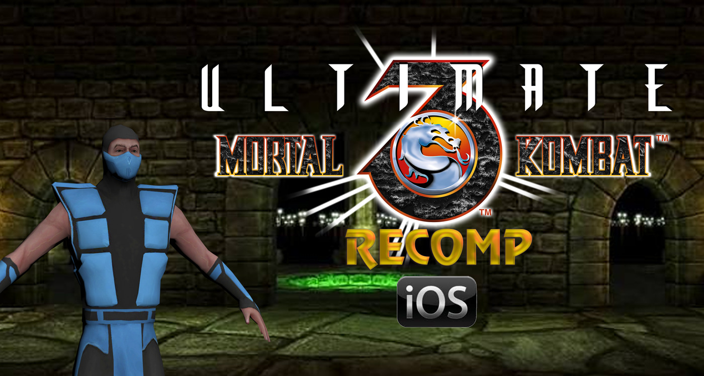
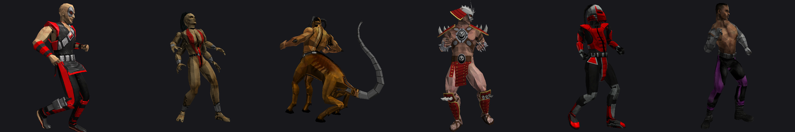
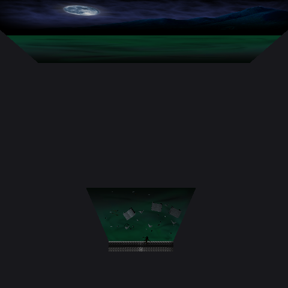
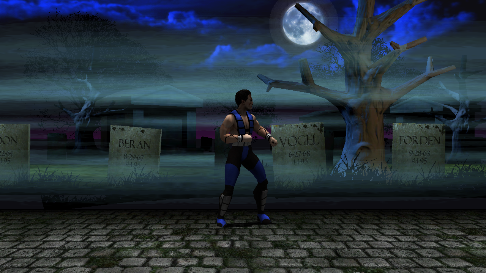
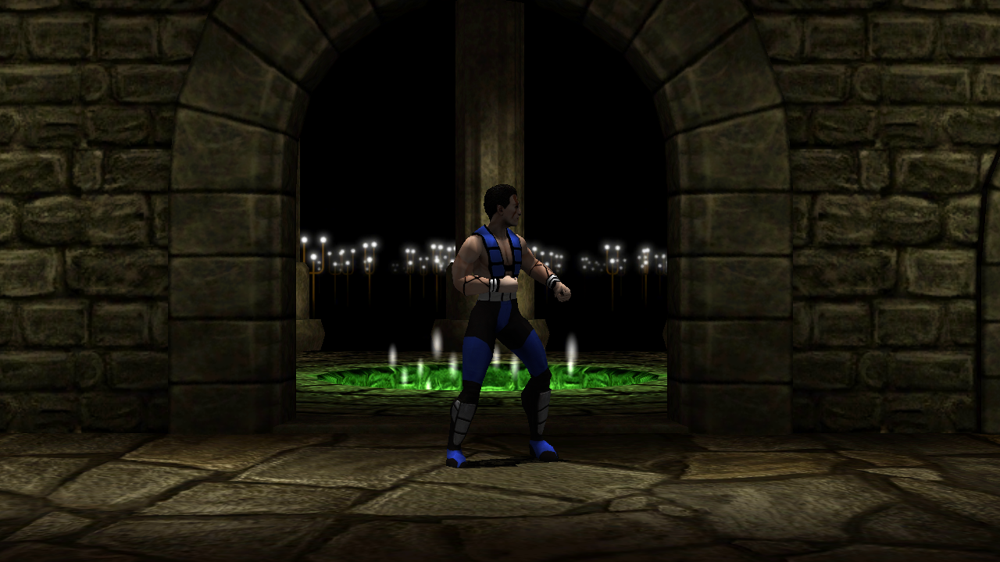

<div align="center">



# Ultimate Mortal Kombat 3 — Decompilación de iOS y port a PC

**Decompilación completa de la versión iOS de 2011 de Ultimate Mortal Kombat 3 — las 2.572 funciones del juego ya son C legible — y un port nativo para Windows y Linux que sigue en marcha.**

[Primeros pasos](docs/GETTING-STARTED.md) · [Metodología](docs/METHODOLOGY.md) · [Motor LIME](docs/LIME-ENGINE.md) · [Formatos de assets](docs/X-TABLES.md) · [Visor de mallas](docs/MESH-VIEWER.md) · [Bugs del juego](docs/GAME-BUGS.md) · [Contenido oculto](docs/HIDDEN-CONTENT.md) · [Escenarios](docs/STAGES.md) · [Plantel](docs/ROSTER.md) · [Tablas de golpes](docs/MOVES-TABLES.md) · [Iluminación](docs/LIGHTING.md) · [Formato de fuentes](docs/FONT-FORMAT.md) · [Formato .scene](docs/SCENE-FORMAT.md) · [Formato PVR](docs/PVR-FORMAT.md) · [Listas de frames](docs/FRAMELISTS.md) · [Referencia MAME](docs/MAME-ARCADE.md) · [Build de iPad](docs/IPAD-BUILD.md) · [Arquitectura](docs/ARCHITECTURE.md) · [Progreso](docs/PROGRESS.md) · [Relevo](docs/HANDOFF.md) · [Encargo original](docs/ENCARGO.md) · [Declaración sobre IA](AI-DISCLOSURE.md) · [English](README.md)

</div>

> **Nota:** la documentación de `docs/` está en inglés para que llegue a más gente. Este README es la versión completa en español, a la par con la inglesa.

---

## Aquí no se distribuye ningún contenido con derechos de autor

**Este repositorio no publica ningún archivo del juego.** Ni texturas, ni modelos, ni audio, ni código compilado — nada que puedas sacar de aquí y usar. Todo se compila contra **una copia que aportas tú**.

Conviene ser preciso con las imágenes que sí hay. El banner combina fan art del logotipo de *Ultimate Mortal Kombat 3* con **renders de los modelos del juego hechos por ermaccer**, bajo licencia CC BY 4.0 — ambos acreditados [más abajo](#el-banner). Las capturas de [la documentación del visor de mallas](docs/MESH-VIEWER.md) son nuestras, hechas con nuestras propias herramientas. En ambos casos vale lo mismo: un render representa la geometría del juego; no es un archivo de assets, no se puede desempaquetar para volver a serlo, y no forma parte de ninguna compilación. Las marcas *Mortal Kombat* y los personajes que aparecen pertenecen a Warner Bros. Entertainment.

Lo que hay es trabajo *nuestro*: herramientas de análisis, documentación de formatos de archivo, C escrito a mano y arneses de pruebas. Todo lo que toca el juego original lo lee de **una copia que aportas tú** y produce su salida en local, donde el `.gitignore` la mantiene fuera del repositorio.

Necesitas una copia obtenida legalmente de *Ultimate Mortal Kombat 3* para iOS (versión 1.2.59) para que algo de esto te sirva. Si no la tienes, nada de este repositorio te va a resultar útil.

---

## Dónde está el proyecto — 8 de octubre de 2026 (noche, alpha 0.0.3)

| | |
|---|---|
| **Decompilado** | ✅ **Todo.** Las 2.572 funciones del juego tienen C escrito a mano: el núcleo del motor LIME (109), la lógica de juego (291) y el motor de combate (2.172). No queda nada por transcribir. |
| **Verificado** | ✅ El núcleo del motor pasa tests diferenciales contra el original recompilado con cero divergencias. El motor de combate pasa un test diferencial de comportamiento fichero a fichero, con las excepciones listadas en [Verificación](#cuánto-está-verificado): todas son límites conocidos de la herramienta de test, no bugs conocidos. |
| **Funciona en nativo** | 🔄 El front end real arranca en una ventana OpenGL: menús, textos, sonidos, música y partidas guardadas en Windows y Linux. Arcade llega a la selección de personaje, que dibuja al luchador en 3D con su animación, y recorre la torre. |
| **Combate** | ✅ **Las peleas se juegan de principio a fin por el camino real.** `Task_GameInit` → `Task_GameMain` → round 1, round 2, fin del combate, `Task_GameDestroy`, pantalla de Continue y siguiente pelea, con la cámara siguiendo a los dos luchadores, voces y efectos de sonido. |
| **Jugable** | 🔄 **Alpha 0.0.3**: se puede jugar con el teclado (W A S D o flechas; U I O J K L; P pausa, M combos; teclas configurables en el launcher) o con los controles táctiles, contra la CPU. Aún incompleto: ver *Problemas conocidos*. Las 229 tablas de datos del motor de combate se extraen del binario del propio usuario al compilar y están verificadas contra él ([#46](https://github.com/MaryNCRT/Ultimate-Mortal-Kombat-3-iOS-Recomp/pull/46), [#48](https://github.com/MaryNCRT/Ultimate-Mortal-Kombat-3-iOS-Recomp/pull/48)). |

**Qué significa aquí «decompilado» y qué no.** Significa que cada función que
ejecuta el juego tiene un cuerpo escrito contra el disassembly y comprobado
contra una recompilación ARM→C independiente del mismo código. No significa que
cada función esté libre de errores: los arreglos de la 0.0.2 (abajo) son
precisamente funciones transcritas que no coincidían del todo con el binario.
La [sección de progreso](#progreso-general) pone números y dice qué dejan fuera.

---

## Cómo jugar (alpha 0.0.3, Windows)

Notas de versión: [0.0.3](docs/RELEASE-0.0.3-alpha.md) · [0.0.2](docs/RELEASE-0.0.2-alpha.md) · [0.0.1](docs/RELEASE-0.0.1-alpha.md).
Descargas en [Releases](https://github.com/MaryNCRT/Ultimate-Mortal-Kombat-3-iOS-Recomp/releases).

1. Descarga este repositorio (o la release alpha) y deja la carpeta completa.
2. Abre **`UMK3-Launcher.exe`**, elige tu propio `.ipa` de UMK3 1.2.59 para
   iPhone y pulsa **Compilar**. El launcher descarga un compilador fijado
   (llvm-mingw 20260616, comprobado por SHA-256) y Python 3.12.10 en
   `toolchain\`, verifica el binario, extrae de él las tablas del juego,
   compila `umk3-game.exe` y copia `res\` desde el `.ipa`.
3. Elige resolución 3D, pantalla completa e idioma (se guardan solos en
   `umk3.ini`) y pulsa **JUGAR**. El botón de arriba a la derecha cambia el
   launcher entre inglés y español.

**Regla de oro: el juego solo depende de su propia carpeta.** No se distribuye
ningún dato ni ejecutable del juego: el exe existe solo después de compilar el
`.ipa` del propio jugador.

**Teclas de combate:** W A S D o flechas para moverse (dos a la vez para las
diagonales); U puñetazo alto, I puñetazo bajo, O bloqueo, J patada alta,
K patada baja, L correr (o el teclado numérico 7 8 9 / 4 5 6). **P** abre la
pausa (otra vez: continuar) y **M** la lista de movimientos. Esc ya no cierra
el juego. El ratón es el dedo. Las teclas del jugador 1 se cambian en el
launcher, en «3. Controles del jugador 1» (se guardan en `umk3.ini`).

**Modo debug:** marca *Modo debug (menú con F2)* en el launcher (escribe
`debug_keys=1` en `umk3.ini`; apagado por defecto). Luego, en el juego:

| tecla | hace |
|---|---|
| **F2** | el menú debug, dibujado sobre el juego congelado: cualquier pelea (los dos luchadores, Motaro y Shao Kahn incluidos, cualquier escenario), cualquiera de las 51 pantallas del menú, el menú principal, ganar/perder el round o la pelea, teclas directas sí/no, la línea de info |
| F3 | la línea de info: tarea, pantalla, luchadores, rounds |
| F6 / F7 | pantalla anterior / siguiente del menú |
| F8 | menú principal |
| F9 / F10 | terminar el round (KO del jugador 2 / del 1) |
| F11 / F12 | ganar / perder la pelea entera (F11 salta la pelea) |

F3 y F6-F12 son las *teclas directas*; el menú F2 las apaga y enciende. Una
pelea o pantalla elegida mientras el juego carga empieza en cuanto sale el
menú principal.

**Directo a una pelea:** `umk3-game.exe --fight kitana kunglao 0` (dos
luchadores por nombre o número 0-25 y un escenario 0-15).

### Arreglado en la 0.0.3 (8 de octubre, noche)

Cada arreglo se leyó del binario armv7 original.

| Problema | Causa encontrada |
|---|---|
| **Todos los rivales de la torre salían como Jade** | `Load_Tower` (0x23314) cargaba la escalera guardada en una tabla `TowerData` que nada leía; el binario escribe directamente en `OpponentTowerList` (0x14fcb4). La torre se quedaba con el valor por defecto de la imagen (16, Jade) en todos los peldaños. Comprobado por Mary en el juego. |
| **La animación de la torre** | `FE_Task_Tower` (0x8310): los estados 2 y 4 desplazaban la cámara por `Stage` en vez de por `Destiny`; el estado 2 nunca terminaba solo (el binario pasa a la pelea al llegar, 0x8c56); el 4 no tenía la espera de 360 (0x8f6e); la entrada a la subida no colocaba la cámara ni ponía `MoveUpTower = JustWon ? 0 : 1` (0x8d98); supervivencia elige `TowerRand[abs(rand) % 22]` y los jefes fuerzan su escenario (0x932e). Comprobado por Mary. |
| **Opciones del menú de pausa invisibles** | `processString` (el motor de `usprintf`, 0xa7600) solo escribía el valor de un `%s`/`%d` cuando NO había token; en el binario los dos caminos comparten la cola de 0xa7650, que lo emite. Cada texto hecho con plantilla perdía sus valores (« : »). Arregla también los títulos de la lista de movimientos y «N/A». |
| **Lista de movimientos: páginas repetidas y nombres duplicados** | Las páginas genéricas usan la fila absoluta (`row << 6`, 0x1efb0) y pasan leyenda NULL (`movs r2, #0`); el C usaba el contador de y (repetía la página 1) y pasaba el nombre como leyenda. |
| **No se veían los botones «i» y pausa del HUD** | `DrawHUD` dibuja los dos botones en todos los modos cuando no hay pausa (0x28910, 0x2a170); el C solo lo hacía con `GameMode > 1` y dibujaba la pausa solo en un frame del pulso. El pulso del «i» es un segundo icono que crece y se desvanece (0x2ab2a). |
| **Teclas** | P = pausa, M = lista de movimientos (pulsan los botones de las esquinas como un dedo). Esc ya no cierra el juego. Las teclas del jugador 1 se configuran en el launcher (`key_*` en `umk3.ini`). |

### Arreglado en la 0.0.2 (8 de octubre)

Cada arreglo se leyó del binario armv7 original y Mary lo comprobó en el juego.

| Problema | Causa encontrada |
|---|---|
| **Ninguna pelea pasaba del round 1** | Cinco errores: el resumen del round se paraba con el texto del ganador en pantalla; el round 2 se veía negro (el fundido iba a la variable equivocada); el juego se colgaba al liberar el escenario al final (la lista de escenas quedaba en círculo); el escenario 1 se cerraba al cargar (`MeshSetLayers` sin inicializar); el texto del ganador desbordaba su buffer. Ahora: round 2, fin de pelea, Continue y siguiente pelea. |
| **La cámara se alejaba y seguía a un solo luchador** | La posición 3D de un luchador se leía con una indirección de más (`GameObjects[0]` en vez de `GameObjects`). |
| **Faltaban voces y sonaban sonidos al pulsar botones** | `get_gsound` recibía el grupo de voz y el número aleatorio intercambiados. |
| **Luchadores, el sombrero de Kung Lao y objetos en negro** | `LightPlayers` debe asignar la textura del jugador en cada frame; solo lo hacía con traje alternativo, y sin textura la malla se dibuja negra. |
| **A Sindel le faltaba la melena** | `LIME_LoadSkin` descartaba el segundo bloque de los `.skin` que tienen dos; ese segundo skin es el pelo. |
| **La palanca en pantalla no se movía** | La tabla `JoyOffset` (un `static` de función, `_JoyOffset.11128`) se generaba a ceros. |

### Problemas conocidos (alpha 0.0.3)

- **El menú no está completo**, y **algunas secciones del menú todavía provocan un crash**.
- **Siguen apareciendo varios errores de texturas.**
- El juego todavía puede cerrarse en otros sitios: abre un Issue con el archivo de `logs\`.
- En Arcade el escenario es siempre el mismo, salvo los jefes.

**Anotado por Mary después de la 0.0.3 (9 de octubre), sin investigar todavía:**

1. ~~Modo debug desde el launcher~~ -- hecho: casilla en el launcher y menú F2 (ver *Modo debug* arriba).
2. ~~Después de dos peleas seguidas el audio deja de funcionar bien~~ -- arreglado (Arcade): `UnLoadSoundList` buscaba en una tabla que no existe en el binario y nunca borraba los sonidos. Queda: el audio de la pelea con Motaro.
3. Siguen los errores de texturas en ciertos mapas y modos.
4. Errores de texturas en el menú y secciones que crashean. Los logs del 8 de octubre se cortan al entrar en `FE_Task_Treasure` (dos veces) y `FE_Task_Stats`: probablemente dos de ellas.
5. Shao Kahn podría estar provocando crashes.
6. El nombre del personaje al ganar sigue sin salir (el arreglo de `usprintf` no bastó).
7. El audio de ciertos ataques no funciona, sobre todo los proyectiles.
8. Los anuncios del juego que salían en ventanas aparte deben verse en ventanas dentro del juego, en el mismo ejecutable, para no tener que salir de pantalla completa.
9. Terminar el menú al 100 %.
10. Revisar el estado de los jefes y corregir sus errores.
11. Arreglar los modos que faltan.

**Anotado por Mary el 9 de octubre, con el menú debug:**

12. No se ve la muerte de Shao Kahn al terminar el Arcade.
13. ~~Al terminar el Arcade no lleva a la pantalla de desbloqueables~~ -- arreglado: la pantalla crasheaba (datos de los focos vacíos, `DrawAnimAsSprite` con la textura, el módulo y el tamaño mal) y el fondo salía blanco (ahora se carga el `.pvr` primero, como en el iPhone).
14. Los logros salen mal, con texto superpuesto.
15. En la pantalla de carga los iconos están mal puestos.
16. En la lista de combos los iconos siguen mal puestos.
17. Contra Motaro, Kitana se cubría todo el tiempo y actuaba raro.

- El launcher es solo para Windows (Linux/macOS: compilar desde el código con CMake).

## Qué es este proyecto

En 2011 EA Mobile publicó *Ultimate Mortal Kombat 3* para iPhone. Estaba construido sobre un motor 3D propio llamado **LIME** y, como la mayoría de los juegos de iOS de aquella época, lleva años siendo imposible de jugar: necesita un iPhone con iOS 3–6 y hace mucho que se retiró de la App Store.

Este proyecto intenta recuperarlo como es debido, en forma de **software nativo de PC** en vez de emulación: código fuente que se pueda leer, modificar y compilar para Windows y Linux.

<div align="center">





<sub>Seis del plantel en guardia de combate y el escenario Graveyard, dibujados por [`tools/pose.py`](tools/pose.py) y [`tools/meshview.py`](tools/meshview.py). El árbol de huesos, la pose, los pesos de skinning, la topología, las UVs, la decodificación PVRTC y la matriz de proyección salen todos de los parsers y el código decompilado de este proyecto. Sin emulador y sin binario del motor. [Cómo funciona](docs/MESH-VIEWER.md).</sub>





<sub>**La demo nativa** — [`runtime/demo.c`](runtime/demo.c): una ventana OpenGL de verdad movida por el C de este proyecto, sin Python y sin emulador por ningún lado. **Dibuja los 18 escenarios**, cada uno con el efecto que declaran sus propios ficheros: las siete bandas de niebla de Graveyard, las dieciséis antorchas de Balcony, las siete cuchillas del Pit. Sub-Zero sale skinneado y animado desde `.bones`, `.skin` y `.skinanim`; el escenario se monta recorriendo el grafo del `.scene` y colocando cada objeto con la paleta de matrices que trae el fichero, a su tamaño real según su propio `boundsRadius`. El modo de mezcla de cada malla lo decide su **nombre** — `ATST_*` significa alpha test, que es justo lo que hace el motor. Ver [formato .scene](docs/SCENE-FORMAT.md).</sub>

</div>

Los objetivos a largo plazo, en orden:

| Objetivo | Estado |
|---|---|
| Entender el binario y sus formatos de archivo | ✅ hecho — todos los formatos de assets de LIME están especificados |
| Recuperar C legible, función a función | ✅ **hecho** — 2.572 de 2.572, con test de comportamiento |
| Sustituir la capa de plataforma iOS por una nativa de PC | 🔄 empezada — ventana, GL, texturas, ficheros, sonido, música, partidas guardadas y pausa al perder el foco funcionan en nativo; el control del combate espera al runtime de combate |
| Datos del combate: las 229 tablas | ✅ **extraídas y verificadas** ([#46](https://github.com/MaryNCRT/Ultimate-Mortal-Kombat-3-iOS-Recomp/pull/46), [#48](https://github.com/MaryNCRT/Ultimate-Mortal-Kombat-3-iOS-Recomp/pull/48)) — 1.118 objetos, idénticos byte a byte, comprobados por `ctest` en cada build |
| Hacer funcionar el combate: el paso del menú al motor | 🔄 **lo siguiente** — el motor corre sin ventana ([#46](https://github.com/MaryNCRT/Ultimate-Mortal-Kombat-3-iOS-Recomp/pull/46)), el arranque hasta la selección de personaje está en la PR abierta [#43](https://github.com/MaryNCRT/Ultimate-Mortal-Kombat-3-iOS-Recomp/pull/43)/[#50](https://github.com/MaryNCRT/Ultimate-Mortal-Kombat-3-iOS-Recomp/pull/50) |
| Widescreen, soporte de mando, mods | ⬜ planeado |
| **Dos jugadores locales en una máquina** | ⬜ planeado — [la build de iPad lo trae](docs/IPAD-BUILD.md) |
| Restaurar contenido oculto e inalcanzable | ⬜ tras tener build jugable |
| 60 fps, netcode moderno | ⬜ a largo plazo |

**Aquí todavía no hay nada jugable.** Lo que sí hay es el juego entero como C legible y comprobado, un método que funciona, mucho conocimiento verificado y herramientas que hacen abordable el trabajo que queda. Lo que falta ya no es decompilar sino integrar: un runtime para el motor de combate, sus tablas de datos y el resto de la capa de plataforma.

---

## Por qué este caso es inusualmente abordable

La mayoría de los proyectos de decompilación empiezan invirtiendo años en responder a una sola pregunta: *¿dónde empieza y acaba cada función, y cómo se llamaba?* Los binarios comerciales vienen sin símbolos; te dan direcciones y nada más.

**Este binario no fue stripped y conserva su tabla de depuración STABS.** Ese único hecho cambia la naturaleza del proyecto:

- **4.342 funciones con nombre** — sobreviven los nombres originales de C y C++
- **135 unidades de traducción** en 19 directorios — el árbol de fuentes original de EA, recuperable
- Cada función está **atribuida al archivo `.cpp` o `.c` del que salió**
- La ruta de compilación está incrustada en el binario:
  `/BuildServerX/reactive/mortalkombat_iphone/xcode/umk3_iphone_en/../../src/`
- **`cryptid = 0`** — sin DRM de FairPlay. El código se lee de principio a fin.

O sea, que no estamos decompilando a ciegas. Sabemos que `RenderMesh.cpp` tenía 19 funciones y cómo se llamaban; sabemos que `mkdrone.c` tenía 394. Ese es el punto de partida al que la mayoría de proyectos tardan años en llegar.

---

## Cómo se reparte el trabajo

Las 4.342 funciones del binario se dividen en cuatro grupos muy distintos:

| Parte | Funciones | Qué se hace con ella |
|---|---|---|
| SDK comercial y social de EA (tienda, Facebook, analítica, JSON) | ~1.412 (33%) | **Borrar / stubear** — nada de eso hace falta sin conexión |
| Capa de plataforma iOS (`lime/iphone`, audio) | 229 (5%) | **Reescribir nativa** — código nuevo, sin ingeniería inversa |
| Multijugador en red (GameKit) | 126 (3%) | Stubear |
| **El juego de verdad** (`lime/common`, `gamecode`, lógica de combate) | **2.572 (59%)** | **Decompilar** |

Un tercio del binario es andamiaje comercial que se tira. Solo la última fila es trabajo real.

---

## El método: no fiarse nunca de un decompilador

La decisión técnica central de este proyecto —y la que merece la pena copiar si estás haciendo algo parecido— es que **la salida del decompilador se trata como un borrador, nunca como la verdad.**

Construimos un segundo camino independiente desde el mismo código máquina:

- **`tools/armrecomp/recomp.py`** — un recompilador estático que traduce ARM/Thumb a C *literalmente*, instrucción a instrucción, con el estado de la CPU en un struct `arm_ctx` explícito. No interpreta: transcribe. La salida es ilegible, y está bien que lo sea: es fiel por construcción.
- Ghidra produce C **legible**, que es lo que de verdad queremos publicar.
- Una versión limpia escrita a mano de cada función solo se acepta cuando un **test diferencial** demuestra que se comporta igual que la recompilada a lo largo de miles de entradas.

Esto no es paranoia. Detectó un fallo real y silencioso casi de inmediato:

```c
/* Lo que Ghidra produjo para _Len() — INCORRECTO */
float _Len(float *v)
{
  float in_s0;                    /* nunca se asigna */
  FloatVectorMult(uVar1, uVar1, 2, 0x20);
  FloatVectorAdd(uVar1, uVar2, 2);
  return in_s0;                   /* devuelve basura */
}
```

Compila. Parece plausible. Devuelve una variable sin inicializar, porque el compilador de EA usó **instrucciones NEON de 2 carriles para hacer matemática escalar**, y Ghidra las modela como operaciones vectoriales opacas, perdiendo el `vsqrt` por completo.

**Hay 153 funciones afectadas en todo el binario**, un 23% del núcleo del motor — y, medido como es debido, hay más en `FrontEnd.cpp` y `GameCode.cpp` que en el motor. Sin una segunda fuente de verdad, ese fallo —y los que hubiera como él— habría aflorado un año después como «los modelos se ven raros», sin forma de rastrear el origen.

El razonamiento completo está en [docs/METHODOLOGY.md](docs/METHODOLOGY.md).

---

## Progreso general

```
███████████████████████████████████░░░░░  87,59%
```

| Área | Peso | Hecho | |
|---|---:|---:|---|
| Análisis del binario y mapeo del árbol de fuentes | 4% | 100% | `██████████` |
| Herramientas y el oráculo de verificación | 8% | 100% | `██████████` |
| Especificaciones de los formatos de assets | 8% | 100% | `██████████` |
| `lime/common` — núcleo del motor (109 fn) | 12% | **100%** | `██████████` |
| `gamecode` — lógica de juego (291 fn) | 18% | **100%** | `██████████` |
| `gamecode/logic` — motor de combate (2.172 fn) | 28% | **100%** | `██████████` |
| Capa de plataforma PC nativa (161 fn a reescribir) | 17% | 27% | `███░░░░░░░` |
| Stubs del EA SDK (27 fn que llama el juego) | 5% | 100% | `██████████` |

**87,59% del esfuerzo total estimado. La alpha 0.0.3 es jugable:** peleas
completas por el camino real, con los problemas conocidos de arriba.

**Hay que leer esa cifra por lo que mide y por lo que deja fuera.** Pondera las
ocho áreas de la tabla, y hay dos trabajos que no están en ninguna:

- **El runtime del combate.** La tabla cuenta las 2.172 funciones del motor de
  combate como escritas; nada cuenta el bucle, el planificador de hilos y el
  pegamento que las hacen correr frame a frame en un PC. **Ese runtime ya
  existe y mueve el juego real** (alpha 0.0.2 y 0.0.3): front end, torre,
  carga de la pelea, los dos rounds, el final, Continue y la siguiente pelea.
- **229 tablas de datos.** Al enlazar el motor de combate por primera vez
  quedaron 423 símbolos sin definir, y 229 no son código sino arrays del
  binario: las listas de comandos de golpes especiales (`sm_*`), parámetros
  por personaje (`ochar_*`), scripts de animación (`a_*`) y tablas del motor
  como `reaction_table`. Sin ellas un luchador no puede lanzar un especial,
  reaccionar a un golpe ni animarse. **Las 229 ya están extraídas y verificadas** ([#46](https://github.com/MaryNCRT/Ultimate-Mortal-Kombat-3-iOS-Recomp/pull/46), [#48](https://github.com/MaryNCRT/Ultimate-Mortal-Kombat-3-iOS-Recomp/pull/48)). Se extraen de la
  copia de cada usuario al compilar, nunca se suben al repositorio — ver
  [docs/PROGRESS.md](docs/PROGRESS.md#the-other-axis-229-data-tables-nobody-has-counted).

Así que el porcentaje es honesto sobre funciones y formatos, y **calla sobre
las dos cosas que convirtieron el motor en un combate jugable.** Las dos ya están
hechas, y los pesos nunca se reajustaron para hacerles sitio: la barra mide la
decompilación y la capa de plataforma, no lo jugable que es el juego. Lo que ve
un jugador está en *Problemas conocidos* y en las notas de versión.

**Las tres filas del medio se cuentan; el resto son estimaciones.**
`tools/progress.py` lee el árbol en cada ejecución para `lime/common`,
`gamecode` y `gamecode/logic`; las otras cinco son juicios que mantiene una
persona.

Esas tres también estaban escritas a mano en el script, y se notó: `gamecode`
figuraba en 0% y `gamecode/logic` en 4% mucho después de que ambos tuvieran
cuerpos verificados en el repo. El global que producía era 34,82% frente a un
35,04% real — **acertado por casualidad**, porque un número estaba siete puntos
bajo y el otro cuatro alto, y los pesos casi los cancelaban. Un contador de
progreso que hay que editar a mano para reflejar el progreso va a estar mal; que
estuviera mal en una dirección favorecedora es lo que lo mantuvo con vida.

**Por qué las áreas de base cuentan.** Las tres primeras filas están terminadas y
son lo que hace tratable el resto: el árbol de fuentes está recuperado, todos los
formatos de assets están especificados, y cada función tiene ya un camino
automatizado desde el código máquina hasta un test diferencial. Eso es progreso
real aunque no renderice un solo píxel.

**El núcleo del motor es la cuarta fila, y está terminado.** Las 109 funciones
tienen cuerpo; los nueve ficheros están además verificados contra el
original recompilado.

**Todas las funciones tienen cuerpo.** Las 2.172 funciones del motor de
combate están escritas, incluido `mkdrone.c` (el oponente controlado por la
máquina, 394 funciones), el último fichero en cerrarse. Lo que queda ya no es
decompilación: el runtime del combate, las 229 tablas de arriba y la capa de
plataforma. Las tablas están extraídas y verificadas ([#46](https://github.com/MaryNCRT/Ultimate-Mortal-Kombat-3-iOS-Recomp/pull/46), [#48](https://github.com/MaryNCRT/Ultimate-Mortal-Kombat-3-iOS-Recomp/pull/48)), y el
runtime juega peleas completas en el juego con ventana (alpha 0.0.3). Lo que
queda es corregir las funciones cuya transcripción no coincide del todo con el
binario, a medida que aparece cada síntoma. Los stubs del EA SDK ya están: el juego solo llama a 27 funciones
del SDK (más el constructor de `LocaleManager`), todas en
`runtime/gamecode_stubs.c`; las ~1.385 restantes son internas del SDK y no se
enlazan.

### Cuánto está verificado

Dos comprobaciones independientes contra el binario, que ven cosas distintas.

- **`tools/factdiff.py`, estática.** Para cada función de la lógica compara las
  escrituras, los handlers instalados, los tokens de estado y las llamadas del C
  con el original recompilado. Todos los ficheros de lógica la pasan, con las
  excepciones de `tools/factdiff_waivers.txt`. No ve qué constante devuelve cada
  camino, ni un handler leído a través de un slot de punteros.
- **`tools/difftest/`, de comportamiento.** Cada función decompilada y su
  original recompilado se ejecutan desde el mismo estado aleatorio en un proceso
  de 32 bits, y después se comparan el valor de retorno y **toda la imagen de
  datos**. Esta es la comprobación que encontró unos 80 bugs reales de
  transcripción en el motor de combate (un token leído del registro
  equivocado, una rama perdida, un slot de punteros resuelto a la rutina
  equivocada) y varios bugs del propio recompilador.

| Fichero | Funciones | Probadas | Fallan | Cuáles |
|---|---:|---:|---:|---|
| `other.c` | 333 | 260 | 0 |  |
| `mkdrone.c` | 394 | 393 | 1 | `t_fatality_align` (límite de la herramienta) |
| `moves.c` | 357 | 193 | 0 |  |
| `mkreact.c` | 207 | 207 | 0 |  |
| `mkzap.c` | 174 | 172 | 3 | `t_summon_spawn`, `t_summon_proc`, `t_sky_ice_proc` (límites de la herramienta) |
| `mkfatal.c` | 149 | 149 | 0 |  |
| `mkboss.c` | 104 | 103 | 0 |  |
| `mkprop.c` | 80 | 80 | 0 |  |
| `joy.c` | 73 | 72 | 0 |  |
| `mkanimal.c` | 63 | 61 | 0 |  |
| `mkstat.c` | 62 | 62 | 0 |  |
| `mkslam.c` | 60 | 60 | 0 |  |
| `mkfriend.c` | 45 | 45 | 0 |  |
| `mkcanned.c` | 20 | 20 | 0 |  |
| `mkcombo.c` | 16 | 16 | 0 |  |
| `mkbonus.c` | 8 | 6 | 0 |  |
| `mk3.c` | 19 | 2 | 0 |  |
| `playback.c` | 4 | 0 | 0 | nada que cubra el oráculo |
| `mkrepell.c` | 1 | 0 | 0 | nada que cubra el oráculo |
| **Total del motor de combate** | **2.172** | **1.901** | **4** | todos límites de la herramienta |

Una pasada completa el 2 de octubre de 2026, con los oráculos regenerados desde el `recomp.py` corregido. `mkzap.c` dio 4 en esa pasada; el cuarto, `tl_bomb33`, era un bug real (un slot de punteros cruzado) y está corregido y vuelto a probar desde entonces. Los demás ficheros de la tabla (`training.c` y compañía, 3 funciones) no tienen tests.

«Probadas» son las funciones que cubre el oráculo en ese fichero; el resto solo
se alcanza a través de quien las llama (despacho por datos, o funciones que el
recompilador deja a una tabla de saltos). Los fallos que quedan son **límites de
la herramienta, comprobados uno a uno a mano contra el disassembly**: un campo
que la herramienta siembra con la dirección de un handler, y que el código luego
suma o trunca, no puede valer lo mismo en su forma ARM y en la nativa. Están en
[docs/VERIFICATION.md](docs/VERIFICATION.md).

### `lime/common` está completo — y esto es lo que significa y lo que no

Las **109 de 109** funciones del núcleo del motor tienen cuerpo. Todas compilan,
todas pasan la verja estructural, y el módulo entero construye limpio con
`-Wall -Wextra`.

**Y los nueve ficheros tienen test diferencial** contra el original
recompilado: unos 84.000 casos sintéticos más 590 ficheros y 7.327 mallas de
datos reales, con **0 divergencias**. La salvedad: el test de `RenderScene.cpp`
cubre sus helpers (lista de transparentes, paleta, búsqueda de mallas) y **no**
los dos renderizadores de escena, cuyos cuerpos están marcados como
*estructurales*.

Varios cuerpos son **estructurales**: la secuencia de llamadas y los accesos a
campos están recuperados, y alguna condición de rama o algún enum de GL queda
marcado en el comentario como no fijado en vez de adivinado. Esas marcas son la
parte interesante del fichero — son por donde debe mirar quien siga, y están ahí
a propósito.

La regla que ha llevado hasta aquí está escrita en [ENCARGO.md](docs/ENCARGO.md):
un cuerpo sobre un layout sin confirmar es peor que ningún cuerpo. Se puso a
prueba dos veces. `symcheck` rechazó un `LIME_RenderSceneOverrideTextures`
construido sobre dos accesores inventados, y el contador fue **hacia atrás** de
104 a 103 antes de encontrar el layout real. Y `LIME_UpdateEvents` tenía un
cuerpo escrito con confianza y equivocado que solo destapó un test diferencial.

---

## Estado actual

| Módulo | Cuerpo escrito | Test diferencial |
|---|---|---|
| `Matrix.cpp` (11 fn) | ✅ | **40.006 casos, 0 divergencias** |
| `limeVector.cpp` (2 fn) | ✅ | **20.013 casos, 0 divergencias** |
| `LIMEDS_Misc.cpp` (8 fn) | ✅ | **21.950 casos, 0 divergencias** |
| `RenderSkinned.cpp` (20 fn) | ✅ | **18.780 casos, 0 divergencias** |
| `Events.cpp` (22 fn) | ✅ | **2.224 casos, 0 divergencias** |
| `limeFont.cpp` (6 fn) | ✅ | **896 casos, 0 divergencias** |
| `RenderScene.cpp` (14 fn) | ✅ | **80 casos, 0 divergencias** — solo helpers |
| `DS_DebugWin.c` (7 fn) | ✅ | **58 casos, 0 divergencias** |
| `RenderMesh.cpp` (19 fn) | ✅ | **590 archivos, 7.327 mallas, 0 divergencias** |
| `other.c` — `SwitchQueue` (1 de 333 fn) | ✅ | **500 pushes, 0 divergencias** |

Las 2.572 funciones decompiladas tienen cuerpo. La lógica de combate se
verifica además con `tools/difftest/` (ver arriba); ese triaje es el trabajo en
curso.

Estado detallado, decisiones y deuda técnica conocida: [docs/PROGRESS.md](docs/PROGRESS.md).

---

## Cosas descubiertas por el camino

**Un archivo que no parsea suele ser una variante, no corrupcion.** Tres formatos resultaron tener mas de un layout, y en los tres el indicio fue el mismo: la lectura alternativa divide *exacto*, no casi. `.meshset` tiene tres variantes; `.bones` tiene dos, de 24 y 25 bytes por hueso; y `SINDEL_STANDARD.skinanim` usa una cabecera de 16 bytes donde los otros 28 usan 12 — su contador leia `1065353216`, que es `0x3F800000`, el float 1.0 confundido con un entero. `.bones` y `.skinanim` recorren ahora **29 de 29** archivos.

El mismo razonamiento colapso cuatro "excepciones conocidas" en una. `ROBO1` y `ROBO2` fallaban en `.bones`, `.skin`, `.scene` y por no tener `.events` — son simplemente **otra exportacion**. `ROBO2_STANDARD.skin` mide exactamente cuatro bytes menos que `SEKTOR_STANDARD.skin`, el blockCount que falta, y sus primeros 1.276 bytes son identicos byte a byte.

**Todos los formatos de assets de LIME estan resueltos.** `.scene` fue el ultimo, y es el que mejor muestra por que el proyecto rechaza los casi-aciertos: un intento anterior ajusto una formula que acertaba en **71 de 92** archivos de un solo objeto, y se descarto en vez de publicarse. Estaba mal — cada objeto lleva sus propias pistas de animacion, y un tercer array viene despues de todos. Leer el loader da los tres strides directamente, y la pieza que faltaba se escondia en un modo de direccionamiento: `ldr r3, [r1, #0x28]!`, una carga pre-indexada *con escritura*, que avanza el cursor 40 bytes como efecto secundario de leer. **545 de 547 archivos** aterrizan ahora en su ultimo byte exacto, y el recorrido depende de tres contadores que varian de forma independiente en 63, 74 y 175 valores distintos.

Los dos que no parsean son `ROBO1` y `ROBO2` — **el mismo par que rompe todos los demas formatos**, con un hueso de 24 bytes en vez de 25 en `.bones` y la variante sin indexar de `.meshset`. Cuatro formatos, una anomalia consistente.

**El decodificador PVRTC funciona — y el fallo estaba en los datos de prueba.** El juego publica 38 texturas dos veces, como `NAME.PNG` *y* `NAME.pvr`, lo que es una implementacion de referencia gratis que hizo innecesario descargar ningun conversor. Contra ella el decodificador saca **1,5% de error medio** —0,6% en 2bpp, 2,4% en 4bpp— y el residuo esta *demostrado* que es compresion y no un bug: sube con el gradiente local de la imagen (4,75 en zonas planas, 30–51 en bordes duros) y es plano segun la posicion del bloque. Un bloque de 4×4 que mezcla dos colores no puede contener un borde dentro de si mismo; asi es exactamente como falla la compresion por bloques.

Llegar ahi costo tres rondas perdidas. El decodificador marcaba 5,5% y catorce hipotesis cuidadosas lo empeoraban todas — porque **tres de los trece pares PNG/PVR son assets distintos que comparten nombre**. El PNG de `FE_METAL_BG` enmarca el arte de otra forma; el de `MYBLOOD` es la fuente sin procesar con clave cromatica magenta. Ese solo archivo inflaba la nota de 3,83 a 14,00. Poner las imagenes lado a lado lo resolvio de una mirada, y es la tercera vez que este proyecto paga por no mirar la imagen.

**Los renderizadores son codigo de ejemplo de Apple, y con ellos un tercio de la capa de plataforma.** `ES1Renderer.m` tiene exactamente los cuatro metodos de la plantilla `GLES2Sample` de Apple — `init`, `render`, `resizeFromLayer:`, `dealloc` — y `ES2Renderer.m` anade exactamente los cuatro de shaders. Junto con `Finch/`, **68 de las 229 funciones de la capa de plataforma (30%) no hay que decompilar**. Ademas explica por que el binario importa `glGenFramebuffers` *y* `glGenFramebuffersOES`: la plantilla de ES 1.1 usa los nombres de extension y la de ES 2.0 los core, un juego por renderizador.

**Lo del NEON era lo normal de la epoca, no una rareza de EA.** En el Cortex-A8 del iPhone 3GS y el 4, la unidad VFP escalar no esta segmentada y NEON si — asi que hacer matematica escalar con NEON de 2 carriles era *mas rapido*, aun desperdiciando un carril. Era practica estandar en 2010. Y explica por que la slice armv6 sale limpia: NEON llego con armv7, y los ARM11 a los que apunta armv6 no lo tienen. El `Info.plist` fija el toolchain exacto: GCC 4.2 (no clang), Xcode 4.0, SDK 4.3, compilado en Snow Leopard.

**La otra slice del binario decompila limpia donde la nuestra no.** El binario fat trae armv6 y armv7; el proyecto siempre uso armv7, que es donde el compilador de EA emitio NEON empaquetado de 2 carriles para matematica escalar — el patron que hace que Ghidra pierda el calculo en silencio. ARMv6 no tiene NEON, asi que su slice es una compilacion independiente del mismo codigo en VFP escalar. Ahi `_Len` son nueve instrucciones obvias que calculan `sqrtf(x*x+y*y+z*z)`. **107 funciones estan afectadas en armv7 y no en armv6**, y mas de la mitad estan en `FrontEnd.cpp` y `GameCode.cpp`, no en el motor: el famoso "27% de `lime/common`" exageraba el motor (mide 23%) y ademas miraba donde no era. `tools/slices.py`.

**El motor de audio nunca fue de EA.** `lime/iphone/Finch/` es una copia vendorizada de [zoul/Finch](https://github.com/zoul/Finch), un motor de sonido OpenAL con licencia MIT — las siete clases estan presentes con sus nombres previos al refactor. Son **56 de las 229 funciones de la capa de plataforma, un 24%, que no hay que decompilar**. La leccion general sale mas barata que el hallazgo: antes de decompilar cualquier modulo de plataforma, comprobar si el nombre de clase pertenece a una libreria de terceros conocida de la epoca. `GBMusicTrack.m` se comprobo igual y **no** se pudo confirmar, asi que sigue en la lista.

**Todos los formatos de assets necesarios para dibujar un personaje animado están resueltos.** `.meshset` (geometría), `.skin` (pesos de skinning), `.bones` (esqueleto), `.skinanim` (animación) y `.events` (pistas de efectos) se leen correctamente contra los datos publicados. `.scene` es el último que queda, aunque `LIME_LoadScene` ya ha soltado su mapa de campos y la regla que ata los ficheros entre sí: **una escena es una familia de hermanos derivada sustituyendo los últimos seis caracteres del nombre**, sin índice ni manifiesto en ninguna parte. Ver [MESHSET-FORMAT.md](docs/MESHSET-FORMAT.md), [SKIN-FORMAT.md](docs/SKIN-FORMAT.md) y [EVENTS-FORMAT.md](docs/EVENTS-FORMAT.md).

**Aterrizar en el último byte de un archivo puede no demostrar nada.** Si todos los registros miden lo mismo, *cualquier* división de ese tamaño recorre el archivo a la perfección: 324 bytes se leen igual de bien como 268+56 que como 324+0. A `.events` se le audito exactamente esa circularidad, porque `numEntries` parecia constante a 1. Sobre el corpus completo de 1.547 pistas toma diez valores distintos y 103 pistas no valen 1, asi que el recorrido si era evidencia real. Una constante deja el recorrido sin valor; y una constante vista sobre parte de los datos puede no ser constante. Importan las dos mitades, y la estructura ahora se deriva de la aritmetica de punteros del propio loader, para no depender del recorrido en ningun caso.

**Las tablas de golpes estaban en el binario, con su nombre.** La lista de movimientos reimprime cada frame la primera entrada del movimiento mostrado, y durante un tiempo el plan fue recuperar las tablas recorriendo esa lista con un log abierto ([issue #5](https://github.com/MaryNCRT/Ultimate-Mortal-Kombat-3-iOS-Recomp/issues/5)). Decompilar `MovesList` lo hizo innecesario: las tablas son datos estáticos en `__DATA` con símbolos — `_Kano_Moves5`, `_Kano_Moves6`, etc., 48 tablas y 673 filas — y `tools/moves.py` las lee directamente. Ver [docs/MOVES-TABLES.md](docs/MOVES-TABLES.md).

**El formato de modelos `.meshset` está resuelto y verificado.** No adivinando, sino ejecutando el propio `LIME_LoadMeshSet` de EA, recompilado, contra los datos reales del juego y comparando lo que deja en memoria con nuestra especificación: **590 archivos, 7.326 mallas, 2,9 M de vértices, coincidencia byte a byte** en índices, vértices y volúmenes envolventes. Una sola discrepancia, en un buffer de iluminación. Ver [docs/MESHSET-FORMAT.md](docs/MESHSET-FORMAT.md).

**La versión 1.2.59 ya corre en touchHLE, con un parche de 2 bytes.** La base de datos de compatibilidad solo listaba la 1.0.4; hasta donde sabemos, nadie tenía funcionando la versión final. La causa resultó ser un fallo en dos partes: touchHLE reporta los idiomas preferidos como códigos cortos (`["es","en"]`), la tabla de locales de EA solo reconoce los largos, `getLocaleIndex` devuelve −1 y salta un `assert(false)` — que mata el emulador en el acto, porque **touchHLE no implementa `___assert_rtn`**. Basta con parchear `LocaleManager::setLocale` para que retorne de inmediato. Análisis completo: [docs/TOUCHHLE-PATCH.md](docs/TOUCHHLE-PATCH.md).

Ese parche importa más allá de la comodidad: una copia del juego en ejecución es una **referencia de comportamiento** para la decompilación, y es la única que va a servir para la lógica de combate, donde la recompilación estática choca con tablas de punteros a función.

**El SDK de EA no hace falta neutralizarlo.** La suposición de partida era que habría que desactivar ~1.412 funciones de comercio y analítica. En la práctica, exactamente una función bloqueaba el arranque. `Mayhem`, `EASDK_Handler` e incluso el sistema de logros se inicializaron sin problema. La regla operativa que salió de ahí, y que ahora gobierna todo el port: **ningún stub debe llamar nunca a `assert()`** — el código de EA comprueba invariantes que un port no puede cumplir.

---

## Estructura del repositorio

```
tools/
  armrecomp/recomp.py    recompilador estático ARM/Thumb → C (el oráculo de verificación)
  patch_ipa.py           aplica parches al binario y reempaqueta un .ipa
  decomp_driver.py       ordena funciones por dificultad, dirige Ghidra, verifica
  macho.py               parser Mach-O: slices, símbolos, secciones, resolución de stubs
  stabs.py               reconstruye el árbol de fuentes original desde la tabla STABS
  disasm.py              desensambla una función concreta por nombre
  archstats.py           proporción ARM/Thumb e inventario de mnemónicos
  rank.py                puntúa funciones por dificultad
  meshset.py             lector de .meshset (las tres variantes)
  umk3paths.py           resolución de rutas compartida por todas las herramientas
  xref.py                localiza llamadas a un símbolo importado; recupera argumentos de assert()
  ghidra/                scripts de decompilación headless
  signatures/            firmas de funciones y layouts de structs que se le dan a Ghidra

decomp/                  el C escrito a mano -- el producto de verdad
  lime/                  el núcleo del motor LIME (109 funciones)
  gamecode/              el juego: front end, jugadores, sangre, HUD (291 funciones)
  gamecode/logic/        el motor de combate: golpes, reacciones, IA, fatalities (2.172)
runtime/                 el port nativo alrededor del código decompilado
  platform/              la frontera con el SO: ventanas Win32 y SDL2, GL, audio, input
  lime_menu.c, draw_gl.c la capa de plataforma de iOS reescrita (sonido, partidas, sprites)
  lime_app.c             el ciclo de vida de la app (foco = primer plano de iOS)
  menu_main.c            umk3-menu: el front end real en una ventana
  fight_*.c, test_main.c umk3-fight / umk3-test: la escena de prueba de arena y luchador
  arm_runtime.c          runtime de CPU/memoria contra el que corre el oráculo recompilado
tests/                   arneses de pruebas diferenciales
docs/                    especificaciones de formatos, metodología, progreso
```

Todo lo derivado del binario comercial —C recompilado, salida cruda de Ghidra, volcados de símbolos— se genera en local y queda excluido por el `.gitignore`.

---

## Primeros pasos

Si nunca has trabajado en algo así, lee **[docs/GETTING-STARTED.md](docs/GETTING-STARTED.md)**. No da por supuesto ningún conocimiento previo de ingeniería inversa y explica para qué sirve cada pieza, por qué existe y qué harías tú primero.

La versión corta, para impacientes:

```bash
# 1. Requisitos: Python 3.10+, un compilador de C (MinGW-w64 o gcc), Ghidra 11+, JDK 21+
pip install capstone

# 2. Extrae la slice armv7 de TU PROPIA copia del juego.
#    Un .ipa es un ZIP; el ejecutable está en Payload/UMK3.app/UMK3
python tools/macho.py thin ruta/a/UMK3 armv7 work/UMK3.armv7

# 3. Vuelca los símbolos y reconstruye el árbol de fuentes original de EA
python tools/macho.py syms  work/UMK3.armv7 work/symbols.txt
python tools/macho.py funcs work/UMK3.armv7 work/functions.txt
python tools/stabs.py work/UMK3.armv7 work

# 4. Mira qué funciones de un módulo son las más fáciles de atacar primero
python tools/rank.py work/UMK3.armv7 Matrix.cpp

# 5. Genera la implementación de referencia — el oráculo — de ese módulo
python tools/armrecomp/recomp.py work/UMK3.armv7 \
    --file Matrix.cpp --out recompiled --name matrix --with-deps

# 6. Compila y ejecuta su test diferencial
gcc -std=c11 -O1 -I runtime -I recompiled \
    tests/test_matrix_diff.c decomp/lime/Matrix.c recompiled/matrix.c runtime/arm_runtime.c \
    -o build/test_matrix_diff -lm
./build/test_matrix_diff
```

Todo lo derivado del binario acaba en `work/`, que está ignorado por git. Usa `UMK3_WORK` para ponerlo en otro sitio, y `GHIDRA_HOME` antes de usar `tools/decomp_driver.py`. Todas las rutas las resuelve `tools/umk3paths.py`.

### Compilar y ejecutar el port nativo

```bash
# Windows (MinGW-w64 + Ninja) usa Win32; Linux usa SDL2 y SDL2_mixer.
# En Ubuntu/Debian: sudo apt install libsdl2-dev libsdl2-mixer-dev libgl-dev
cmake -S . -B build -G Ninja
cmake --build build

# El front end real, en una ventana. Apúntalo a res/ dentro de TU .ipa extraído.
build/umk3-menu  ruta/a/Payload/UMK3.app/res

# La escena de prueba de arena y luchador: umk3-fight <res> [personaje] [escenario]
# (de momento solo con el backend de Windows, igual que umk3-test)
build/umk3-fight ruta/a/Payload/UMK3.app/res

# Los dos en un programa: F2 entra en la escena de prueba, F3 vuelve al menú.
build/umk3-test  ruta/a/Payload/UMK3.app/res
```

El ratón hace de dedo. Las partidas se guardan en `save/` junto al exe en Windows y
en `~/.local/share/umk3` en Linux (`UMK3_SAVE_DIR` cambia las dos).
`UMK3_SHOT=<n>` ejecuta n frames, guarda una captura y sale.

---

## Contribuir

Las contribuciones son bienvenidas, y el proyecto está estructurado para que se pueda trabajar en paralelo sin pisarse: cada módulo es independiente y el criterio de aceptación es objetivo.

**Una regla importa más que las demás: nada está terminado hasta comprobarlo contra el binario.** Código legible que se comporta *casi* como el original es peor que no tener código, porque falla en silencio y mucho más tarde.

La decompilación está terminada, así que el trabajo abierto ha cambiado de forma. Donde más ayuda hace falta ahora:

- **El runtime del combate** — hacer correr frame a frame el motor de combate decompilado: su planificador de hilos, la lógica por frame y el puente desde `Task_GameInit`. En [#46](https://github.com/MaryNCRT/Ultimate-Mortal-Kombat-3-iOS-Recomp/pull/46) ya lo ejecuta un driver sin ventana, y la PR abierta [#43](https://github.com/MaryNCRT/Ultimate-Mortal-Kombat-3-iOS-Recomp/pull/43) arranca el juego hasta la selección de personaje. Falta el paso del menú a `Task_GameInit`/`Task_GameMain`.
- **Las 229 tablas de datos** — ✅ hecho en [#46](https://github.com/MaryNCRT/Ultimate-Mortal-Kombat-3-iOS-Recomp/pull/46) y [#48](https://github.com/MaryNCRT/Ultimate-Mortal-Kombat-3-iOS-Recomp/pull/48). `tools/logic_tables.py` extrae 1.118 objetos (4.291 palabras reubicadas) del binario del usuario al compilar; `tools/check_logic_tables.py` los comprueba contra él: ida y vuelta exacta byte a byte, el destino de cada reubicación, ningún puntero en una tabla `int16_t`, ningún puntero perdido y la disposición del binario respetada en el programa enlazado. Un segundo generador, escrito por separado, coincidió en todas las palabras comunes salvo 53, todas resueltas mirando el código que las lee. Se ejecuta con `cmake -DUMK3_BINARY=...` + `ctest -R logic` ([docs/PROGRESS.md](docs/PROGRESS.md#fight-data-tables-how-they-were-verified-2026-10-08)).
- **La capa de plataforma** — música MP3 en el backend SDL2, y el control del combate con teclado y mando.
- **Decisiones de port ya documentadas** en las issues abiertas: widescreen ([#22](https://github.com/MaryNCRT/Ultimate-Mortal-Kombat-3-iOS-Recomp/issues/22), [#24](https://github.com/MaryNCRT/Ultimate-Mortal-Kombat-3-iOS-Recomp/issues/24)), frame rate ([#23](https://github.com/MaryNCRT/Ultimate-Mortal-Kombat-3-iOS-Recomp/issues/23)), mods ([#29](https://github.com/MaryNCRT/Ultimate-Mortal-Kombat-3-iOS-Recomp/issues/29)).

Mira [CONTRIBUTING.md](CONTRIBUTING.md) para las reglas de trabajo, y [docs/PROGRESS.md](docs/PROGRESS.md) para el detalle.

---

## Declaración sobre el uso de IA

**Buena parte de este proyecto se produjo con asistencia de IA** — en concreto Claude, de Anthropic, a través de Claude Code. Eso incluye el análisis, las herramientas, el trabajo de decompilación, la documentación y este mismo README.

Lo decimos claramente porque la comunidad de ingeniería inversa tiene opiniones dispares y firmes sobre la decompilación asistida por IA, y porque tienes derecho a saber cómo llegó a existir el código que estás leyendo. Los detalles —qué generó la IA, qué dirigió una persona y cómo se estableció la corrección al margen de eso— están en [AI-DISCLOSURE.md](AI-DISCLOSURE.md).

La versión corta: toda afirmación de este repositorio que se pudiera verificar, se verificó mecánicamente contra el comportamiento real del binario original. Los tests diferenciales existen precisamente porque ni un decompilador ni un modelo de lenguaje merecen que se les crea sin más.

---

## Créditos

**El juego lo hicieron otras personas, y ninguna somos nosotros.**

*Ultimate Mortal Kombat 3* lo creó **Midway Games** en 1995, con diseño de Ed Boon y John Tobias. La conversión para iPhone de 2011 que estudia este proyecto la construyó **EA Mobile**, sobre un motor 3D propio que su código llama **LIME**. Los ingenieros que lo escribieron dejaron su rastro en el trabajo sin querer: la tabla de depuración que publicaron es lo que hace posible este proyecto. A quien se olvidó de hacer strip a ese binario: gracias.

Este repositorio no contiene nada de su código. Contiene nuestra descripción de lo que hace su código, y nuestra propia reimplementación.

**Este proyecto** lo mantiene [MaryNCRT](https://github.com/MaryNCRT), que marca la dirección, toma las decisiones de alcance y aporta la copia obtenida legalmente del juego contra la que corre todo el análisis.

Las herramientas, el análisis, la decompilación y la documentación se produjeron con **Claude, de Anthropic**, vía Claude Code, bajo esa dirección. Los commits llevan el trailer `Co-Authored-By:` donde corresponde. Ver [AI-DISCLOSURE.md](AI-DISCLOSURE.md) para el relato completo de lo que eso significa y de cómo se estableció la corrección de forma independiente.

### El banner

El logotipo de *Ultimate Mortal Kombat 3* lo **rehízo en UHD [u/JuananoLaGarza](https://www.reddit.com/user/JuananoLaGarza/)** y lo publicó en r/MortalKombat como *[Ultimate Mortal Kombat 3 logo redone in UHD](https://www.reddit.com/r/MortalKombat/comments/mvm4uo/ultimate_mortal_kombat_3_logo_redone_in_uhd/)*. Se usa aquí con crédito. Si eres el autor y prefieres que este proyecto no lo use, abre un issue y se retira.

La figura de Sub-Zero y el escenario del fondo son **renders de [ermaccer](https://github.com/ermaccer)**, sacados de *[UMK3 iOS MeshSet Tool](https://ermaccer.github.io/posts/umk3iosmeshsettool/)* (los archivos `csubzero.png` y `m_balcony.jpg`), usados bajo **[CC BY 4.0](https://creativecommons.org/licenses/by/4.0/)**, que es la licencia de ese post. Son salida de su propio conversor, que además es la herramienta contra la que se contrastó en su día nuestro parser de `.meshset`: el banner está hecho, literalmente, de aquello que este proyecto estudia.

La palabra "RECOMP", la insignia de iOS y la composición son de [MaryNCRT](https://github.com/MaryNCRT).

**Sí, parece el banner de una aplicacion pirata del 2011, es la idea.**

Está hecho rápido y a propósito en el lenguaje visual de aquello de lo que trata: un port móvil de la época en que el arte promocional de cada juego era un personaje plantado delante de un escenario, el logo encima y la insignia de la plataforma en una esquina. Algo más pulido habría parecido de otro juego. Esto parece de **este** — una conversión para iPhone de 2011 de un arcade de 1995, que es exactamente lo que se está desmontando aquí.

Es provisional y a nadie le duele cambiarlo. Pero un proyecto sin cara ninguna es más difícil de querer que uno con una cara un poco tonta, y este va a durar un año o más. La identidad no es el trabajo, pero ayuda a que el trabajo se termine.

Si algún día se sustituye, lo suyo sería una marca que no se apoye en absoluto en la registrada: cuanto más visible se haga el proyecto, mejor le vendrá.

---

## Trabajo previo y agradecimientos

Este proyecto se apoya en el trabajo de otras personas:

- **[touchHLE](https://github.com/touchHLE/touchHLE)** — emulador de alto nivel para aplicaciones de iPhone OS. Usado como referencia de comportamiento, y objetivo de nuestro parche de compatibilidad.
- **[N64Recomp](https://github.com/N64Recomp/N64Recomp)** y **[Zelda64Recomp](https://github.com/Zelda64Recomp/Zelda64Recomp)** — el enfoque de recompilación estática en el que se inspira `recomp.py`.
- **[BattleShip](https://github.com/JRickey/BattleShip)** — un port a PC de Super Smash Bros. 64 cuya estructura de repositorio y modelo legal sigue este proyecto.
- **[ermaccer](https://github.com/ermaccer)** — [UMK3IOS.MeshSetTool](https://github.com/ermaccer/UMK3IOS.MeshSetTool), la primera herramienta pública para el formato de mallas de este juego y la referencia contra la que se contrastó nuestro parser. Los renders del banner de esta página también son suyos, sacados de [su artículo](https://ermaccer.github.io/posts/umk3iosmeshsettool/), usados bajo [CC BY 4.0](https://creativecommons.org/licenses/by/4.0/).
- **[Ghidra](https://ghidra-sre.org/)**, **[Capstone](https://www.capstone-engine.org/)** y **[GhidraMCP](https://github.com/13bm/GhidraMCP)**.

---

## Legal

*Ultimate Mortal Kombat 3* y todos sus contenidos son propiedad de sus respectivos titulares de derechos. Este proyecto no está afiliado, respaldado ni conectado con Electronic Arts, Warner Bros. Interactive Entertainment, NetherRealm Studios ni Midway Games.

El trabajo que hay aquí es ingeniería inversa realizada con fines de **interoperabilidad y preservación**: conseguir que un software que ya no funciona en ninguna plataforma actual vuelva a funcionar, en hardware que sus dueños ya tienen. No se redistribuye ningún código ni dato del juego. Todas las herramientas operan sobre una copia que el usuario ya posee.

El código propio del proyecto se publica bajo la [Licencia MIT](LICENSE).
