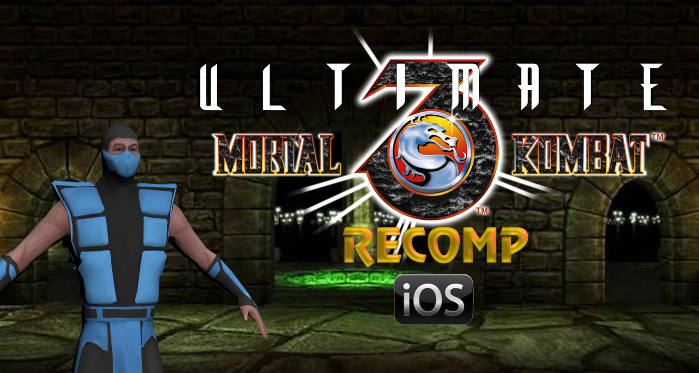
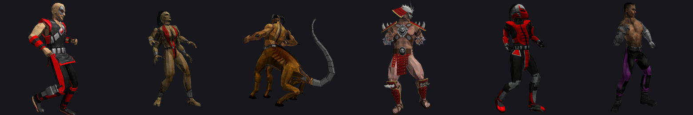

<div align="center">



# Ultimate Mortal Kombat 3 — iOS Decompilation & PC Port

**A work-in-progress decompilation of the 2011 iOS release of Ultimate Mortal Kombat 3, aiming at a native PC port for Windows and Linux.**

[Getting started](docs/GETTING-STARTED.md) · [Methodology](docs/METHODOLOGY.md) · [LIME engine](docs/LIME-ENGINE.md) · [Asset formats](docs/X-TABLES.md) · [Mesh viewer](docs/MESH-VIEWER.md) · [Game bugs](docs/GAME-BUGS.md) · [Hidden content](docs/HIDDEN-CONTENT.md) · [Stages](docs/STAGES.md) · [Architecture](docs/ARCHITECTURE.md) · [Progress](docs/PROGRESS.md) · [Handoff](docs/HANDOFF.md) · [AI disclosure](AI-DISCLOSURE.md) · [Español](README.es.md)

</div>

---

## No copyrighted assets are distributed here

**This repository ships no game files.** No textures, no models, no audio, no compiled code — nothing you could extract from here and use. Every release is built against **a copy you supply yourself**.

The imagery here is worth being precise about. The banner combines fan art of the *Ultimate Mortal Kombat 3* wordmark with **renders of the game's models made by ermaccer**, licensed CC BY 4.0 — both credited [below](#the-banner). The screenshots in [the mesh viewer's documentation](docs/MESH-VIEWER.md) are our own, produced by our own tools. In both cases the same thing is true: a render depicts the game's geometry; it is not an asset file, it cannot be unpacked back into one, and it is not part of any build. The *Mortal Kombat* marks and the characters depicted belong to Warner Bros. Entertainment.

What lives here is *our own* work: analysis tools, documentation of file formats, hand-written C, and test harnesses. Everything that touches the original game reads it from **a copy you supply yourself** and produces its output locally, where `.gitignore` keeps it out of the repository.

You need a legally obtained copy of *Ultimate Mortal Kombat 3* for iOS (version 1.2.59) to use any of this. If you don't have one, nothing in this repository will do anything useful for you.

---

## What this project is

In 2011, EA Mobile released *Ultimate Mortal Kombat 3* for iPhone. It was built on an in-house 3D engine called **LIME**, and — like most iOS games of that era — it has been effectively unplayable for years: it requires an iPhone running iOS 3–6, and it was pulled from the App Store long ago.

This project is an attempt to bring it back properly, as **native PC software** rather than emulation: source code you can read, modify, and compile for Windows and Linux.

<div align="center">




<sub>Six of the roster in their fighting stances, and the Graveyard stage — drawn by [`tools/pose.py`](tools/pose.py) and [`tools/meshview.py`](tools/meshview.py). Bone tree, pose, skin weights, topology, UVs, PVRTC texture decoding and the projection matrix all come from this project's own parsers and decompiled code. No emulator, no engine binary. [How it works](docs/MESH-VIEWER.md).</sub>

</div>

The long-term goals, in order:

| Goal | Status |
|---|---|
| Understand the binary and its file formats | ✅ largely done |
| Recover readable C source, function by function | 🔄 in progress |
| Replace the iOS platform layer with a native PC one | ⬜ not started |
| Widescreen, gamepad support, modding | ⬜ planned |
| Restore hidden and unreachable content | ⬜ after a playable build |
| 60 fps, modern netcode | ⬜ long term |

**This is a long project.** Realistically it is a year or more of work. Nothing here is playable yet. What *is* here is a working method, a large amount of verified knowledge, and tooling that makes the remaining work tractable.

---

## Why this one is unusually tractable

Most decompilation projects begin by spending years answering a single question: *where does each function start and end, and what was it called?* Retail binaries are stripped; you get addresses and nothing else.

**This binary is not stripped, and it still carries its STABS debugging table.** That single fact changes the nature of the project:

- **4,342 named functions** — the original C and C++ symbol names survive
- **135 translation units** across 19 directories — the original source tree of EA's build, recoverable
- Every function is **attributed to the `.cpp` or `.c` file it came from**
- The original build path is embedded in the binary:
  `/BuildServerX/reactive/mortalkombat_iphone/xcode/umk3_iphone_en/../../src/`
- **`cryptid = 0`** — no FairPlay DRM. The code is readable end to end.

So we are not decompiling in the dark. We know that `RenderMesh.cpp` had 19 functions and what they were called; we know `mkdrone.c` had 394. That is the starting point most projects need years to reach.

---

## How the work is divided

The binary's 4,342 functions split into four very different piles:

| Part | Functions | What happens to it |
|---|---|---|
| EA commerce & social SDK (store, Facebook, analytics, JSON) | ~1,412 (33%) | **Deleted / stubbed** — none of it is needed offline |
| iOS platform layer (`lime/iphone`, audio) | 229 (5%) | **Rewritten natively** — new code, no reverse engineering |
| Networked multiplayer (GameKit) | 126 (3%) | Stubbed |
| **The actual game** (`lime/common`, `gamecode`, fight logic) | **2,572 (59%)** | **Decompiled** |

A third of the binary is commercial scaffolding that gets thrown away. Only the last row is real work.

---

## The method: never trust a decompiler

The central technical decision of this project — and the one worth stealing if you are doing something similar — is that **decompiler output is treated as a draft, never as truth.**

We built a second, independent path from the same machine code:

- **`tools/armrecomp/recomp.py`** — a static recompiler that translates ARM/Thumb to C *literally*, one instruction at a time, with CPU state in an explicit `arm_ctx` struct. It doesn't interpret; it transcribes. The output is unreadable, and that's fine: it is faithful by construction.
- Ghidra produces **readable** C, which is what we actually want to ship.
- A human-written clean version of each function is only accepted once a **differential test** proves it behaves identically to the recompiled one across thousands of inputs.

This is not paranoia. It caught a real, silent failure almost immediately:

```c
/* What Ghidra produced for _Len() — WRONG */
float _Len(float *v)
{
  float in_s0;                    /* never assigned */
  FloatVectorMult(uVar1, uVar1, 2, 0x20);
  FloatVectorAdd(uVar1, uVar2, 2);
  return in_s0;                   /* returns garbage */
}
```

It compiles. It looks plausible. It returns an uninitialized variable, because EA's compiler used **2-lane NEON instructions to do scalar math**, and Ghidra models those as opaque vector operations, losing the `vsqrt` entirely.

**153 functions across the binary are affected**, 23% of the engine core — and, measured properly, more of them are in `FrontEnd.cpp` and `GameCode.cpp` than in the engine at all. Without a second source of truth, that bug — and however many like it — would have surfaced a year later as "the models look wrong," with no way to trace it back.

The full reasoning is in [docs/METHODOLOGY.md](docs/METHODOLOGY.md).

---

## Overall progress

```
██████████░░░░░░░░░░░░░░░░░░░░░░░░░░░░░░  25%
```

**Roughly 25% of the total estimated effort. Nothing is playable yet.**

Solving the character formats and rendering Kano did not move this bar, and it
would be dishonest to nudge it because the week felt productive. `lime/common`
went from 15% to 19% — 21 of 109 functions — and that is the whole change. The
formats row was already at 100%; what happened is that it is now *demonstrated*
rather than asserted, which is worth a great deal and worth no percentage points.

That number is an estimate, so here is the arithmetic behind it rather than a
figure you have to take on faith. Weights are our judgement of how much of the
total work each area represents; disagree with the weighting if you like, but
the completion figures are measured.

| Area | Weight | Done | |
|---|---:|---:|---|
| Binary analysis and source-tree mapping | 4% | 100% | `██████████` |
| Tooling and the verification oracle | 8% | 100% | `██████████` |
| Asset format specifications | 8% | 100% | `██████████` |
| `lime/common` — engine core (109 fn) | 12% | 19% | `██░░░░░░░░` |
| `gamecode` — game logic (291 fn) | 18% | 0% | `░░░░░░░░░░` |
| `gamecode/logic` — fight engine (2,172 fn) | 28% | 4% | `░░░░░░░░░░` |
| Native PC platform layer (161 fn to rewrite) | 17% | 10% | `█░░░░░░░░░` |
| EA SDK stubs (~1,412 fn) | 5% | 0% | `░░░░░░░░░░` |

**Why the foundational areas count for something.** The first two rows are
finished or nearly so, and they are what makes the rest tractable: the source
tree is recovered, and every function now has an automated path from machine
code to a differential test. That is real progress even though it renders no
pixels.

**Why the number is still low.** Seventeen functions of 2,572 are genuinely
finished. The fight engine alone is 2,172 functions and has not been started.
Realistically this is a year or more of work.

**How to read the milestones:**

| Milestone | Status |
|---|---|
| The binary is understood and mapped | ✅ done |
| A verification method exists and is proven | ✅ done |
| The game runs somewhere as a behavioural reference | ✅ done (touchHLE) |
| Model format readable | ✅ done |
| Animation formats readable | ✅ `.skin`, `.bones` and `.skinanim` done |
| Something renders on a PC screen | ⬜ not started |
| The game boots natively | ⬜ far off |
| The game is playable natively | ⬜ far off |

---

## Current status

| Module | Decompiled | Verified | Clean C | Differential test |
|---|---|---|---|---|
| `Matrix.cpp` (11 fn) | ✅ | ✅ | ✅ | **40,006 cases, 0 divergences** |
| `limeVector.cpp` (2 fn) | ✅ | ✅ | ✅ | **20,013 cases, 0 divergences** |
| `RenderMesh.cpp` — loader (3 of 19 fn) | ✅ | ✅ | ✅ | **590 files, 7,327 meshes, 0 divergences** |
| `other.c` — `SwitchQueue` (1 of 333 fn) | ✅ | ✅ | ✅ | **500 pushes, 0 divergences** |
| `RenderScene.cpp` (14 fn) | ✅ | ⬜ | ⬜ | ⬜ |
| `RenderSkinned.cpp` (20 fn) | ✅ | ⬜ | ⬜ | ⬜ |
| `Events.cpp` (22 fn) | ✅ | ⬜ | ⬜ | ⬜ |
| `limeFont.cpp` (6 fn) | ✅ | ⬜ | ⬜ | ⬜ |
| `LIMEDS_Misc.cpp` (8 fn) | ✅ | ⬜ | ⬜ | ⬜ |
| `DS_DebugWin.c` (7 fn) | ✅ | ⬜ | ⬜ | ⬜ |

Two and a half modules are genuinely finished — decompiled, verified, rewritten by hand, and proven equivalent. That is 16 functions out of 2,572. The percentage is small; the *pipeline* that produced them is the actual asset, and it now runs unattended.

The `RenderMesh.cpp` row is the loader specifically — `LIME_LoadMeshSet`, `LIME_FreeMeshSet` and `LIME_FindMeshByName`. The remaining 16 functions in that file are the rendering path, which needs a graphics backend before it can be verified.

Detailed status, decisions and known technical debt: [docs/PROGRESS.md](docs/PROGRESS.md).

---

## Things discovered along the way

**A file that will not parse is usually a variant, not corruption.** Three formats turned out to have more than one layout, and in each case the giveaway was the same: the alternative reading divides *exactly* rather than nearly. `.meshset` has three variants; `.bones` has two, at 24 and 25 bytes per bone; and `SINDEL_STANDARD.skinanim` uses a 16-byte header where the other 28 files use 12 — its count field read `1065353216`, which is `0x3F800000`, the float 1.0 being mistaken for an integer. `.bones` and `.skinanim` both now walk **29 of 29** files.

The same reasoning collapsed four separate "known exceptions" into one. `ROBO1` and `ROBO2` were failing in `.bones`, `.skin`, `.scene` and by having no `.events` — they are simply **a different export**. `ROBO2_STANDARD.skin` is exactly four bytes shorter than `SEKTOR_STANDARD.skin`, the missing block count, and their first 1,276 bytes are byte-identical.

**Every LIME asset format is now solved.** `.scene` was the last, and it is the one that shows why the project refuses near-misses: an earlier attempt fitted a formula matching **71 of 92** single-object files and was rejected rather than published. It was wrong — each object carries its own animation tracks, and a third array follows them all. Reading the loader instead gives all three strides directly, and the piece that had been missing was hiding in an addressing mode: `ldr r3, [r1, #0x28]!`, a pre-indexed load *with writeback*, which advances the cursor 40 bytes as a side effect of reading. **545 of 547 files** now walk to their exact last byte, and the walk depends on three counts that vary independently across 63, 74 and 175 distinct values.

The two that do not parse are `ROBO1` and `ROBO2` — **the same pair that breaks every other format**, reading a 24-byte bone rather than 25 in `.bones` and using the unindexed `.meshset` variant. Four formats, one consistent anomaly.

**The PVRTC decoder works — and the bug was in the test data.** The game ships 38 textures twice, as `NAME.PNG` *and* `NAME.pvr`, which is a free reference implementation that made downloading a third-party converter unnecessary. Against it the decoder scores **1.5% mean error** — 0.6% on 2bpp, 2.4% on 4bpp — and the residual is *proven* to be compression rather than a bug: it rises with the image's local gradient (4.75 in flat areas, 30–51 at hard edges) and is flat across block position. A 4×4 block blending two colours cannot hold an edge inside itself; that is exactly how block compression fails.

Getting there cost three wasted rounds. The decoder scored 5.5% and fourteen careful hypotheses all made it worse — because **three of the thirteen PNG/PVR pairs are different assets sharing a name**. `FE_METAL_BG`'s PNG frames the art differently; `MYBLOOD`'s is the unprocessed source with a magenta chroma key. That one file inflated the score from 3.83 to 14.00. Rendering the images side by side ended it in a single glance, and it is the third time this project has paid for not looking at the picture.

**The renderers are Apple's sample code, and so is a third of the platform layer.** `ES1Renderer.m` has exactly the four methods of Apple's `GLES2Sample` template — `init`, `render`, `resizeFromLayer:`, `dealloc` — and `ES2Renderer.m` adds exactly the four shader ones. Together with `Finch/`, **68 of the 229 platform-layer functions (30%) need no reverse engineering at all**. It also explains why the binary imports both `glGenFramebuffers` *and* `glGenFramebuffersOES`: the ES 1.1 template uses the extension names and the ES 2.0 path uses the core ones, one set per renderer.

**The NEON problem is period-normal, not an EA quirk.** On the Cortex-A8 that shipped in the iPhone 3GS and 4, the scalar VFP unit is not pipelined and NEON is — so doing scalar float maths with 2-lane NEON was *faster*, even wasting a lane. That was standard practice in 2010. It also explains why the armv6 slice is clean: NEON arrived with armv7, and the ARM11 chips armv6 targets have none. `Info.plist` pins the toolchain exactly: GCC 4.2 (not clang), Xcode 4.0, SDK 4.3, built on Snow Leopard.

**The other slice of the binary decompiles cleanly where ours does not.** The fat binary ships armv6 and armv7; the project always used armv7, which is where EA's compiler emitted 2-lane packed NEON for scalar float maths — the pattern that makes Ghidra silently drop the arithmetic. ARMv6 has no NEON, so the armv6 slice is an independent compilation of the same source in plain scalar VFP. `_Len` reads there as nine obvious instructions computing `sqrtf(x*x+y*y+z*z)`. **107 functions are affected in armv7 and not in armv6**, and more than half of them are in `FrontEnd.cpp` and `GameCode.cpp` rather than the engine — so the long-quoted "27% of `lime/common`" both overstated the engine (it measures 23%) and looked in the wrong place. `tools/slices.py`.

**The audio engine was never EA's to begin with.** `lime/iphone/Finch/` is a vendored copy of [zoul/Finch](https://github.com/zoul/Finch), an OpenAL sound engine under the MIT licence — all seven classes present with their pre-refactor names. That is **56 of the 229 platform-layer functions, 24%, that need no reverse engineering at all**. The general lesson is cheaper than the finding: before decompiling any platform module, check whether the class name belongs to a known third-party library of the era. `GBMusicTrack.m` was checked the same way and could *not* be confirmed, so it stays on the list.

**Every asset format needed to draw an animated character is solved.** `.meshset` (geometry), `.skin` (skinning weights), `.bones` (skeleton), `.skinanim` (animation) and `.events` (effect tracks) all read correctly against the shipped data. `.scene` is the last one open. See [MESHSET-FORMAT.md](docs/MESHSET-FORMAT.md), [SKIN-FORMAT.md](docs/SKIN-FORMAT.md) and [EVENTS-FORMAT.md](docs/EVENTS-FORMAT.md).

**Landing on a file's last byte can prove nothing at all.** If every record is the same size, *any* split of that size walks the file perfectly — 324 bytes reads equally well as 268+56 or 324+0. `.events` was audited as resting on exactly that circularity, because `numEntries` looked constant at 1. Across the full corpus of 1,547 tracks it takes ten distinct values and 103 tracks are not 1, so the walk was real evidence after all. A constant makes a walk worthless; a constant seen on part of the data may not be a constant. Both halves matter, and the layout is now derived from the loader's own pointer arithmetic so it does not depend on the walk either way.

**The game prints its own move input tables.** The in-game moves list reprints the displayed move's input sequence every frame, one integer per line. The period of the repetition is the number of inputs in the move. That makes the move tables — the fight-engine data static analysis handles worst — recoverable by scrolling through the list with a log running, no decompilation involved. [Issue #5](https://github.com/MaryNCRT/Ultimate-Mortal-Kombat-3-iOS-Recomp/issues/5).

**The `.meshset` model format is solved and verified.** Not by guessing — by running EA's own `LIME_LoadMeshSet`, recompiled, against the game's real data and comparing what it leaves in memory to our specification: **590 files, 7,327 meshes, 2.9M vertices, byte-for-byte agreement** on indices, vertices, bounds and per-vertex lighting. See [docs/MESHSET-FORMAT.md](docs/MESHSET-FORMAT.md).

**We found a bug in a shipped asset.** One file, `KANO_STANDARD.lighting`, is exactly one byte shorter than its mesh set needs — 42,867 bytes for 42,868 vertices. The retail game reads one byte past the end of that buffer every time it loads Kano. Every other lighting file in the game matches its vertex count exactly. It took running EA's loader and our own side by side to tell "we misread the format" apart from "the data is wrong."

**Version 1.2.59 now runs in touchHLE, with a 2-byte patch.** The compatibility database only ever listed 1.0.4; as far as we know nobody had the final version working. The cause turned out to be a two-part failure: touchHLE reports preferred languages as short codes (`["es","en"]`), EA's locale table only recognises long ones, `getLocaleIndex` returns −1, and an `assert(false)` fires — which kills the emulator outright, because **touchHLE does not implement `___assert_rtn`**. Patching `LocaleManager::setLocale` to return immediately is enough. Full write-up: [docs/TOUCHHLE-PATCH.md](docs/TOUCHHLE-PATCH.md).

That patch matters beyond convenience: a running copy of the game is a **behavioural reference** for the decompilation, and it is the only one that will work for the fight logic, where static recompilation runs into function-pointer tables.

**The EA SDK does not need to be neutralised.** The original assumption was that ~1,412 functions of commerce and analytics would have to be disabled. In practice exactly one function blocked startup. `Mayhem`, `EASDK_Handler` and even the achievement system initialised fine. The operational rule that came out of it, which now governs the whole port: **no stub may ever call `assert()`** — EA's code checks invariants that a port cannot satisfy.

---

## Repository layout

```
tools/
  armrecomp/recomp.py    ARM/Thumb → C static recompiler (the verification oracle)
  patch_ipa.py           applies binary patches and repackages an .ipa
  decomp_driver.py       ranks functions by difficulty, drives Ghidra, verifies
  macho.py               Mach-O parser: slices, symbols, sections, stub resolution
  stabs.py               rebuilds the original source tree from the STABS table
  disasm.py              disassembles a single function by name
  archstats.py           ARM/Thumb ratio and mnemonic inventory
  rank.py                scores functions by difficulty
  meshset.py             .meshset reader (all three variants)
  skin.py                .skin, .bones and .skinanim reader and validator
  events.py              .events reader and validator
  pvr.py                 .pvr header reader and block-geometry validator
  pvrtc.py               PVRTC decoder to RGBA (1.5% mean error vs EA's PNGs)
  pvrtc_diff.py          diffs the decoder against EA's own shipped PNGs
  slices.py              extracts armv6/armv7 and finds NEON-affected functions
  scene.py               .scene reader and validator
  meshview.py            renders a .meshset to a PNG -- software rasteriser
  pose.py                poses a character from .bones/.skinanim/.skin
  glsurface.py           inventories every GL entry point the engine calls
  finishers.py           extracts the fatality/babality catalogue with frame indices
  thumb_scan.py          finds ARM/Thumb boundaries
  umk3paths.py           locates an extracted IPA's res/ directory
  xref.py                finds calls to an imported symbol; recovers assert() arguments
  ghidra/                headless decompilation scripts
  signatures/            function signatures and struct layouts fed to Ghidra

decomp/lime/             verified, hand-written C — the actual product
runtime/                 CPU/memory runtime the recompiled code executes against
tests/                   differential test harnesses
docs/                    format specifications, methodology, progress
```

Anything derived from the retail binary — recompiled C, raw Ghidra output, symbol dumps — is generated locally and excluded by `.gitignore`.

---

## Getting started

If you have never worked on something like this before, read **[docs/GETTING-STARTED.md](docs/GETTING-STARTED.md)**. It assumes no prior knowledge of reverse engineering and explains what each piece is for, why it exists, and what you would actually do first.

The short version, for the impatient:

```bash
# 1. Prerequisites: Python 3.10+, a C compiler (MinGW-w64 or gcc), Ghidra 11+, JDK 21+
pip install capstone

# 2. Extract the armv7 slice from YOUR OWN copy of the game.
#    An .ipa is a ZIP archive; the executable is at Payload/UMK3.app/UMK3
python tools/macho.py thin path/to/UMK3 armv7 work/UMK3.armv7

# 3. Dump the symbols and rebuild EA's original source tree from the debug table
python tools/macho.py syms  work/UMK3.armv7 work/symbols.txt
python tools/macho.py funcs work/UMK3.armv7 work/functions.txt
python tools/stabs.py work/UMK3.armv7 work

# 4. See which functions of a module are easiest to attack first
python tools/rank.py work/UMK3.armv7 Matrix.cpp

# 5. Generate the reference implementation — the oracle — for that module
python tools/armrecomp/recomp.py work/UMK3.armv7 \
    --file Matrix.cpp --out recompiled --name matrix --with-deps

# 6. Build and run its differential test
gcc -std=c11 -O1 -I runtime -I recompiled \
    tests/test_matrix_diff.c decomp/lime/Matrix.c recompiled/matrix.c runtime/arm_runtime.c \
    -o build/test_matrix_diff -lm
./build/test_matrix_diff
```

Everything derived from the binary lands in `work/`, which is git-ignored. Set
`UMK3_WORK` to put it elsewhere, and `GHIDRA_HOME` before using
`tools/decomp_driver.py`. All paths are resolved by `tools/umk3paths.py`.

---

## Contributing

Contributions are welcome, and the project is structured so that people can work in parallel without stepping on each other — each module is independent, and the acceptance criterion is objective.

**One rule matters more than the rest: a function is not done until its differential test passes with zero divergences.** Readable code that behaves *almost* like the original is worse than no code at all, because it fails silently and much later.

See [CONTRIBUTING.md](CONTRIBUTING.md) for how to pick up a module, and [docs/PROGRESS.md](docs/PROGRESS.md) for what is currently unclaimed.

---

## AI disclosure

**Large parts of this project were produced with AI assistance** — specifically Anthropic's Claude, working through Claude Code. This includes analysis, tooling, decompilation work, documentation, and this README.

We state this plainly because the reverse-engineering community holds differing and strongly-held views on AI-assisted decompilation, and because you deserve to know how the code you are reading came to exist. The details — what was AI-generated, what was human-directed, and how correctness was established regardless — are in [AI-DISCLOSURE.md](AI-DISCLOSURE.md).

The short version: every claim in this repository that could be verified, was verified, mechanically, against the original binary's actual behaviour. The differential tests exist precisely because neither a decompiler nor a language model can be taken at its word.

---

## Credits

**The game itself was made by other people, and none of them are us.**

*Ultimate Mortal Kombat 3* was created by **Midway Games** in 1995, designed by
Ed Boon and John Tobias. The 2011 iPhone conversion that this project studies was
built by **EA Mobile**, on an in-house 3D engine their code calls **LIME**. The
engineers who wrote it left their names on the work by accident — the debug table
they shipped is what makes this project possible at all. Whoever forgot to strip
that binary: thank you.

This repository contains none of their code. It contains our description of what
their code does, and our own reimplementation of it.

**This project** is maintained by [MaryNCRT](https://github.com/MaryNCRT), who
sets the direction, makes the scope decisions, and supplies the legally obtained
copy of the game that all the analysis runs against.

The tooling, analysis, decompilation and documentation were produced with
**Anthropic's Claude**, via Claude Code, under that direction. Commits carry a
`Co-Authored-By:` trailer where that applies. See [AI-DISCLOSURE.md](AI-DISCLOSURE.md)
for the full account of what that means and how correctness was established
independently of it.

### The banner

The *Ultimate Mortal Kombat 3* wordmark was **redrawn in UHD by
[u/JuananoLaGarza](https://www.reddit.com/user/JuananoLaGarza/)** and posted to
r/MortalKombat as
*[Ultimate Mortal Kombat 3 logo redone in UHD](https://www.reddit.com/r/MortalKombat/comments/mvm4uo/ultimate_mortal_kombat_3_logo_redone_in_uhd/)*.
It is used here with credit. If you are the artist and would rather this project
did not use it, open an issue and it comes down.

The Sub-Zero figure and the stage behind him are **renders by
[ermaccer](https://github.com/ermaccer)**, from
*[UMK3 iOS MeshSet Tool](https://ermaccer.github.io/posts/umk3iosmeshsettool/)*
(the files `csubzero.png` and `m_balcony.jpg`), used under
**[CC BY 4.0](https://creativecommons.org/licenses/by/4.0/)** — the licence that
post is published under. They are output from ermaccer's own converter, which is
also the tool our `.meshset` parser was originally checked against, so the
banner is quite literally made of the thing this project studies.

The "RECOMP" word, the iOS badge and the composition are by
[MaryNCRT](https://github.com/MaryNCRT).

**Yes, It looks like a cheap, ugly 2011 design for a pirate app.**

It was put together quickly and on purpose in the visual language of the thing
it is about: a mobile port from the era when every game's key art was a
character standing in front of a stage with the logo dropped on top and a
platform badge in the corner. Something slicker would have looked like it
belonged to a different game. This looks like it belongs to *this* one — a 2011
iPhone conversion of a 1995 arcade game, which is exactly what is being taken
apart here.

It is a placeholder and nobody is precious about it. But a project with no face
at all is harder to care about than one with a slightly silly face, and this one
is going to run for a year or more. Identity is not the work, but it helps the
work get finished.

If it is ever replaced, the thing to reach for is a mark that does not lean on
the trademark at all — that would serve the project better the more visible it
becomes.

---

## Prior work and acknowledgements

This project stands on other people's work:

- **[touchHLE](https://github.com/touchHLE/touchHLE)** — high-level emulator for iPhone OS applications. Used as a behavioural reference, and the target of our compatibility patch.
- **[N64Recomp](https://github.com/N64Recomp/N64Recomp)** and **[Zelda64Recomp](https://github.com/Zelda64Recomp/Zelda64Recomp)** — the static recompilation approach that `recomp.py` is modelled on.
- **[BattleShip](https://github.com/JRickey/BattleShip)** — a Super Smash Bros. 64 PC port whose repository structure and legal model this project follows.
- **[ermaccer](https://github.com/ermaccer)** — [UMK3IOS.MeshSetTool](https://github.com/ermaccer/UMK3IOS.MeshSetTool), the first public tool for this game's mesh format and the reference our own parser was checked against. The renders in this page's banner are also his, from [his write-up](https://ermaccer.github.io/posts/umk3iosmeshsettool/), used under [CC BY 4.0](https://creativecommons.org/licenses/by/4.0/).
- **[Ghidra](https://ghidra-sre.org/)**, **[Capstone](https://www.capstone-engine.org/)**, and **[GhidraMCP](https://github.com/13bm/GhidraMCP)**.

---

## Legal

*Ultimate Mortal Kombat 3* and all related assets are the property of their respective rights holders. This project is not affiliated with, endorsed by, or connected to Electronic Arts, Warner Bros. Interactive Entertainment, NetherRealm Studios, or Midway Games.

The work here is reverse engineering carried out for **interoperability and preservation**: making software that no longer runs on any current platform run again, on hardware its owners already have. No game code or data is redistributed. Every tool operates on a copy the user already owns.

The project's own code is released under the [MIT License](LICENSE).
