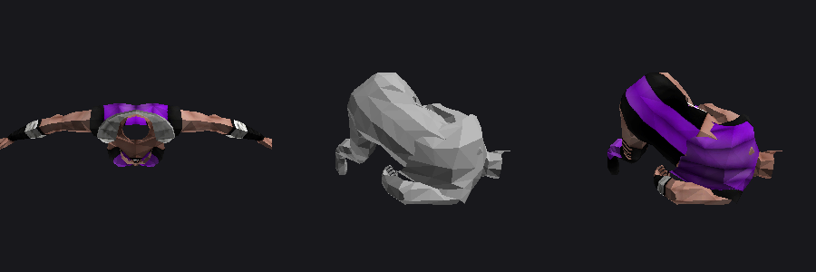

# Bugs in the shipped game

A port can be better than the original. This is the list of defects found in
EA's 2011 release that the native port should fix, with the evidence for each.

Everything here was found mechanically, by cross-checking what the data
references against what the data contains. None of it required running the game.

---

## Broken texture references

**Nine distinct texture names are referenced by meshes and do not exist in the
game.** They are art-pipeline typos: misspellings, truncations, and one stray
3ds Max "- Copy". In every case the *correct* texture ships — so these are
one-word fixes, not missing assets.

| Broken reference | Uses | The texture that actually ships | Match |
|---|---:|---|---:|
| `SINDEL_DIFF` | 25 | `SINDEL_DIFFUSE` | 88% |
| `CYRAX_DIFFUSE - COPY` | 19 | `CYRAX_DIFFUSE` | 79% |
| `SONIA DIFF` | 3 | `SONYA_DIFFUSE` | 70% |
| `NIGHTWOLF_DIFF` | 2 | `NIGHTWOLF_DIFFUSE` | 90% |
| `KITANA_DIFUSE` | 1 | `KITANA_DIFFUSE` | 96% |
| `WINDOW_GLOW` | 1 | `WINDOWGLOW2` | 91% |
| `PLAYERPORTRAITS` | 1 | — portrait atlas | 76% |
| `MKFIGHT_MESSAGES` | 16 | **nothing similar ships** | — |
| `WINDOWS` | 1 | uncertain | 67% |

`SONIA DIFF` is worth pausing on: the artist misspelled the character's name
*and* truncated "DIFFUSE", in a texture slot, and it shipped.

`NOTEXTURE` is excluded from the list — it is referenced 1,568 times and is the
engine's intentional placeholder. It has [its own defect](../../issues/7): the
fallback path builds a malformed filename, so the placeholder itself never
loads.

### What it looks like



<sub>Left: `sindel`, the base mesh, correct. Centre: `sindel001`, a morph target
of the same body, **as the game ships it** — untextured. Right: the same mesh
with `SINDEL_DIFF` corrected to `SINDEL_DIFFUSE`.</sub>

The base mesh names its texture correctly; **the morph sequence does not.**
Sindel's morph targets are her hair-whip fatality, so in the original game her
body loses its texture partway through her own finisher. Twenty-five meshes are
affected.

Cyrax is the same story with `CYRAX_DIFFUSE - COPY` across 19 meshes, in
`CUTUP1_CYRAX` — a fatality scene.

### How the port should fix it

Resolve texture names case-insensitively, then fall back to the nearest shipping
name when the exact one is missing. A fixed correction table is safer than fuzzy
matching at runtime, and the table is short — the nine rows above.

---

## Dead data: SINDEL's animation stream is stored twice

`SINDEL_STANDARD.skinanim` contains **844 frames while its header declares
422**. The two halves differ in 47 bytes out of 530,032, so they are two
near-identical takes rather than a duplicated buffer.

This project could not previously say which count was authoritative. The
[`.events` frame indices settle it](EVENTS-FORMAT.md): her highest event index
is 416, which is 98.6% of the declared 422 — exactly where every other
character's sits — and only 49.3% of 844, which would make her the sole outlier
in the corpus.

**The header is right and the second half is never read.** It is roughly 265 KB
of an app that shipped on a 2011 iPhone, wasted.

---

## Method

Both findings came from the same approach: take every name the data references
and check it against every name the data provides. `.events` track names came
out clean — **1,547 references, all resolving** — which is what makes the
texture failures stand out as real rather than as a parser artefact.

Reproduce with the checks in [`tools/`](../tools); the texture scan is a short
walk over every `.meshset`'s texture field against the file listing.


---

## The 256th transparent mesh locks the game

`AddToTranspMeshList` (armv6 `0x00081ab8`) collects transparent meshes into a
fixed 255-entry array. The bounds check is real, and this is what it does when
it fails:

```
add   r3, r4, #1
cmp   r3, #0xff
str   r3, [r5]
pople {r4, r5, r7, pc}      ; <= 255: return normally
b     #0x81b20              ; otherwise branch to ITSELF
```

The instruction at `0x81b20` **is** `b #0x81b20`. It branches to its own
address, with interrupts still enabled. So the 256th transparent mesh in a
single frame does not wrap the index, does not drop the mesh, and does not
crash — the game **hangs**, responsive to nothing, with the last frame still on
screen.

This is almost certainly a debug assert whose reporting half was stripped for
release, the same way `LIME_printf` and `RenderAxesLines` lost their bodies
while keeping their scaffolding. The check survived; the message that would have
told you why did not.

### Can it be reached on a real device?

Not established. Counting the transparent meshes a busy stage actually emits per
frame needs the render path traced end to end, which is not finished. What *is*
established is that the ceiling is 255, that the failure mode is a hard lock,
and that nothing between here and there reports anything.

### What the port should do

Raise the array and keep the check. A widescreen or higher-resolution port draws
**more** of a stage at once, so it moves toward this ceiling rather than away
from it. Deleting the check to be safe is the wrong instinct: if the limit can
be reached, the one thing worse than hitting it is hitting it silently.
