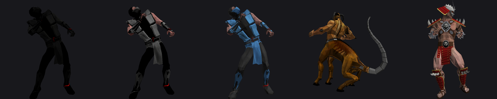
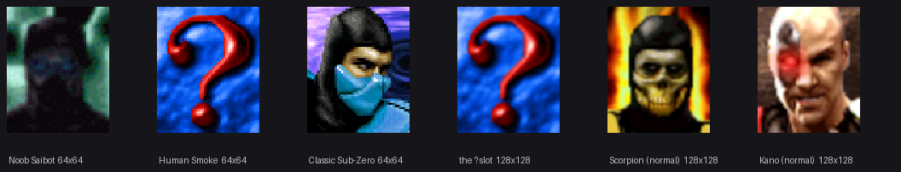

# Hidden and possibly unreachable content



<sub>Left to right: **Noob Saibot**, **Human Smoke**, **Classic Sub-Zero**,
**Motaro**, **Shao Kahn** — posed by [`tools/pose.py`](../tools/pose.py) from
their own `.bones`, `.skinanim` and `.skin`. Noob renders as a pure black
silhouette because that is his design, not because anything is missing.</sub>

---

## The roster table has a hidden tier

The binary carries the roster as a string table at `0x14ee34`:

```
KANO · SONYA · JAX · NIGHTWOLF · SUB-ZERO · STRYKER · SINDEL · SEKTOR · CYRAX ·
KUNG LAO · KABAL · SHEEVA · SHANG TSUNG · LIU KANG · SMOKE · KITANA · JADE ·
MILEENA · SCORPION · REPTILE · ERMAC · SUB-ZERO · SMOKE · NOOB SAIBOT ·
MOTARO · SHAO KAHN
```

Twenty-six entries, and **`SUB-ZERO` and `SMOKE` each appear twice**. The second
of each is Classic Sub-Zero and Human Smoke — the game ships them as
`OLDSUBZERO_STANDARD` and `OLDSMOKE_STANDARD`, and Human Smoke's versus art is
named `SMOKE_SECRET_VERSUS.PNG`.

So the last five entries form a distinct tier, and the game has UI for it:
**`HIDDENPORTRAIT.PNG`** ships alongside the normal character portraits.

## Noob Saibot is complete, not vestigial

Asked to check a forum rumour about leftover Noob Saibot assets, we found the
opposite of leftovers.

| | |
|---|---|
| Asset weight | **2,466,395 bytes** — within 1 KB of Scorpion's 2,465,648 |
| Animation | 347 frames over 48 bones |
| Full set | `.bones` `.skin` `.skinanim` `.scene` `.events` `.meshset` |
| Own stage | `NOOBS_DORFEN_LEVEL` + `NOOBSDORFEN_LEVEL_SCENE` |
| Own finishers | `BABALITY_NOOBSAIBOT`, `NOOBSAIBOT_DECAP`, `NOOBSAIBOT_FLOAT` |
| Deaths at others' hands | Cyrax, Kung Lao, Reptile, Jax, Mileena, Sheeva |
| Stage deaths | `LAIR_NOOBSAIBOT`, `SUBWAY_NOOBSAIBOT`, and `2` variants of each |
| UI art | iPad portrait, `NOOBSAIBOT_VERSUS`, `_VERSUS2`, `_LOW` |

The binary carries `NOOB SAIBOT WINS`, `_NoobSaibotIntroFrames`,
`_Player_NOOB_Idles`, `_t_noob_slam`, and at `0x162ea0` the pair `delete_slave`
and `noob_p` — his shadow clone.

### Why he looks cut, and is not

Searching `frames.x` and `moves_data.x` for "noob" or "saibot" returns **zero
hits**. That is the whole basis for thinking he was removed. He simply has his
own frame list, `res/framelists/noobsaibotframes.txt`, and its contents explain
everything:

```
SCBACKBREAK1 · SCBLOCK1 · SCBZZ1 · SCCOMBO1 · HALF_NJ · NJMOUTH7_KN
```

**`SC` is Scorpion's prefix and `NJ` is the shared ninja set.** Noob is built on
the male ninja rig and reuses Scorpion's frame naming, exactly as the 1995
arcade did with its palette-swap ninjas — his 347 frames over 48 bones match
Liu Kang's and Old Smoke's precisely. The naming convention hides him from a
text search; nothing is missing.

## The select-screen portraits give the tier away



Every one of the **24 normal selectable characters has a 128x128 portrait**.
Exactly five files are **64x64**, and they are precisely the hidden tier plus
the two non-combatants:

```
DUMMYPORTRAIT · ENDURANCEPORTRAIT · NOOBSAIBOTPORTRAIT ·
OLDSMOKEPORTRAIT · OLDSUBZEROPORTRAIT
```

Half the resolution of everybody else, with no exceptions in either direction.
That is not a coincidence of art budgets; it is a category.

### Human Smoke never got a portrait at all

Noob Saibot and Classic Sub-Zero have **real, drawn portraits** — a masked
ninja face on green and a blue-masked one on purple. `OLDSMOKEPORTRAIT.PNG`
is the **red question mark**: the same placeholder art as `HIDDENPORTRAIT.PNG`,
downscaled to 64x64 and shipped as his actual portrait.

Measured against `HIDDENPORTRAIT` resampled to 64x64:

| File | Mean pixel difference |
|---|---:|
| `OLDSMOKEPORTRAIT.PNG` | **3.65** — the same image |
| `NOOBSAIBOTPORTRAIT.PNG` | 53.05 — a different, real portrait |
| `OLDSUBZEROPORTRAIT.PNG` | 48.99 — a different, real portrait |

A factor of fourteen. So the character-select art for Human Smoke is
**unfinished**, and the placeholder went out in the retail build.

This is the one place so far where the evidence supports the word *unfinished*
rather than merely *hidden*. Noob Saibot, by contrast, has everything.

## What is genuinely unknown

**Whether the character select screen exposes any of this.** That logic lives in
`FrontEnd.cpp`, which is not decompiled, so we can state what ships and not what
is reachable. The honest summary:

- the **assets** are complete for all five
- the **roster table** lists them
- a **hidden-portrait** asset exists
- the **selection path** is unread

Calling them "unused" would overstate it. "Present, and not yet shown to be
reachable" is what the evidence supports.

## Genuinely unused: build leftovers

- **`res/framelists/subzeroframes.txt.tmp`** — a temp file that shipped. The
  binary contains zero occurrences of `.tmp`, so nothing loads it.
- **SINDEL's duplicate animation half** — ~265 KB never read; see
  [GAME-BUGS.md](GAME-BUGS.md).

---

## On restoring it later

This is a **post-playable** goal, deliberately. Restoration means changing
behaviour, and behaviour cannot be judged before there is a running port to
judge it against. It sits on the roadmap after the decompilation and a playable
build, not before.

One boundary to state in advance, because it will come up: reconstructing
arcade behaviour must come from **observing the arcade ROM** — which this
project has already done under MAME — and from **our own binary's symbol
table**, which names 4,342 functions. It must not come from leaked retail
source, or from third-party write-ups that are themselves readings of leaked
source. That rule is why this project's findings are reusable at all, and
restoration work does not get an exception from it. See
[METHODOLOGY.md](METHODOLOGY.md).
