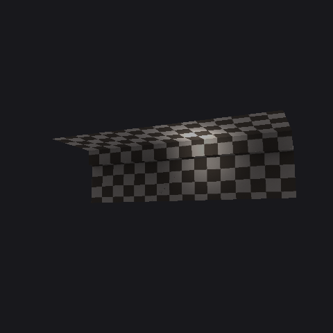

# The mesh viewer

`tools/meshview.py` renders a `.meshset` to a PNG. It is the first thing in this
project that produces a picture, and it exists to check the asset format work by
looking at it.

```bash
python tools/meshview.py res/GRAVEYARD_LEVEL.meshset out.png --size 560 --pitch 2 --fit 0.55
```

**Status: working.** Geometry, UVs, textures, depth and perspective all render
correctly. Skinned characters do not yet assemble — see the end.

---

## Why a software rasteriser and not a window

A GLFW window would look better and run in real time. It also cannot be looked
at from a script, and looking at the picture is the entire point.

Three times this project has burned hours on a problem that one glance at an
image ended: touchHLE's gamepad drawn off-screen, MAME's door interlock, and a
PVRTC "decoder bug" that turned out to live in the reference data. The rule that
came out of those — [numerical evidence sustains a hunt, visual evidence ends
one](METHODOLOGY.md) — argues for output you can actually open. So it writes a
file. numpy and Pillow, no OpenGL, no display.

## What it exercises

| Piece | Source | What a correct render proves |
|---|---|---|
| geometry, UVs | [`tools/meshset.py`](../tools/meshset.py) | the `.meshset` layout is right |
| PVRTC textures | [`tools/pvr.py`](../tools/pvr.py), [`tools/pvrtc.py`](../tools/pvrtc.py) | the decoder is right, end to end |
| projection | [`decomp/lime/Matrix.c`](../decomp/lime/Matrix.c) | the decompiled matrix code is right |

The projection is the engine's own `CreatePerspectiveMatrix`, not a textbook
one: `f = sin(fov) / (1 - cos(fov))`, which is `cot(fov/2)`, computed in double
and narrowed at the end. **`aspect` divides the X term only** — that single line
is the whole widescreen hook, and the viewer is the first place it has been
exercised outside a differential test.

Rotation uses `RotMatrixY`'s row-major convention, also from the verified
decompilation.

## Verified renders



`BALCONY_LEVEL.meshset` — one mesh, 24 triangles — was the control. It came out
as a clean platform with correct depth ordering, correct shading, and a
checkerboard texture whose squares shrink toward the back. **A wrong projection
does not produce a correct-looking checkerboard in perspective**, which is what
makes this small image worth more than its triangle count suggests.


`GRAVEYARD_LEVEL.meshset` — 3,618 triangles — then rendered as the recognisable
Graveyard stage: full moon, cloud band, mountain silhouette, and a floor with
gravestones and a front railing. That is EA's artwork coming through our own
PVRTC decoder onto our own rasteriser through the engine's own matrix. Every
step in that chain is code in this repository.

Roughly a third of triangles are dropped by back-face culling, which is expected
for closed geometry.

### Why these images are in the repo when assets are not

The [zero-assets rule](../README.md#legal) exists so that cloning this
repository does not hand anyone a playable copy of the game. Two 480-pixel PNGs
do not do that — nothing can be reconstructed from them, and they cannot be fed
back into an engine. They are documentation of our own tooling working, which is
what every comparable decompilation project ships, and they are the only way to
show the result to someone who does not already own the game.

The rule is about **not distributing the game**, not about never showing a
picture. The asset files themselves stay out, extracted at build time from each
user's own copy, exactly as before.

---

## What a `.meshset` does not contain: placement

The Graveyard render shows the sky backdrop and the ground plane far apart, with
a gap between them. That is not a bug. **A `.meshset` holds geometry in local
space and nothing else.** Where each piece goes is somewhere else:

- for a **stage**, in the [`.scene`](SCENE-FORMAT.md), whose 64-byte objects
  name a mesh via `LIME_FindMeshByName` and position it
- for a **character**, in [`.skin` and `.bones`](SKIN-FORMAT.md)

This is why `KANO_STANDARD.meshset` — 79 meshes, 19,533 triangles — renders as
scattered disconnected chunks. Every limb is sitting at its own origin because
nothing has posed it yet. The chunks themselves are correct; they are just all
in the same place.

It is a small result but a real one, and it was free: it fell out of looking at
a picture, having not been obvious from any amount of reading the loader.

## What is missing: skinning

To assemble a character the viewer needs to apply `.skin` and `.bones`, and that
needs `DrawSkinnedMesh2` decompiled. That function is one of the NEON-heavy ones
in `RenderSkinned.cpp`, so it is blocked behind the same
[armv6-slice route](LIME-ENGINE.md) as the rest of that file — the armv6 build
of the same function uses plain VFP and is readable.

The parsers are already there and validate cleanly: `.skin` gives 844 matrices
and 1,602 vertices for Kano, `.bones` walks 29 of 29 files exactly. What is
missing is not the data but the convention for combining it — which vertex range
each matrix pair drives, and how `matrices_a` and `matrices_b` compose.

`limeMatrix3x4RotateSkin` is already decompiled and verified, and gives the
rotation half of that convention: `out[j] = Σᵢ vin[i]·m[i*4+j]`, no translation
term. That is the piece to build on.

**When a character stands up in this viewer, four format specifications are
confirmed at once in a way no differential test can manage.** That is the next
milestone worth having.
