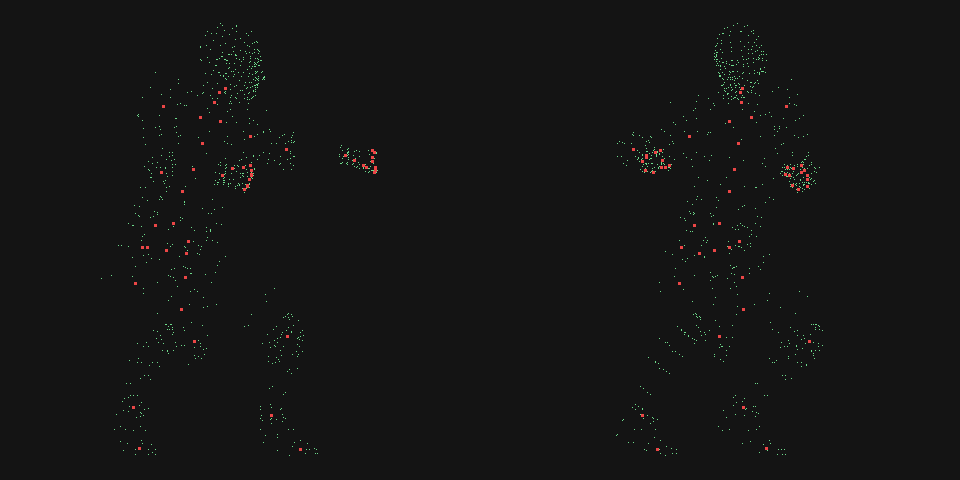

# The mesh viewer

`tools/meshview.py` renders a `.meshset` to a PNG. It is the first thing in this
project that produces a picture, and it exists to check the asset format work by
looking at it.

```bash
python tools/meshview.py res/GRAVEYARD_LEVEL.meshset out.png --size 560 --pitch 2 --fit 0.55
```

**Status: working.** Geometry, UVs, textures, depth and perspective all render
correctly. Skinned characters do not yet assemble — see the end.

---

## Why a software rasteriser and not a window

A GLFW window would look better and run in real time. It also cannot be looked
at from a script, and looking at the picture is the entire point.

Three times this project has burned hours on a problem that one glance at an
image ended: touchHLE's gamepad drawn off-screen, MAME's door interlock, and a
PVRTC "decoder bug" that turned out to live in the reference data. The rule that
came out of those — [numerical evidence sustains a hunt, visual evidence ends
one](METHODOLOGY.md) — argues for output you can actually open. So it writes a
file. numpy and Pillow, no OpenGL, no display.

## What it exercises

| Piece | Source | What a correct render proves |
|---|---|---|
| geometry, UVs | [`tools/meshset.py`](../tools/meshset.py) | the `.meshset` layout is right |
| PVRTC textures | [`tools/pvr.py`](../tools/pvr.py), [`tools/pvrtc.py`](../tools/pvrtc.py) | the decoder is right, end to end |
| projection | [`decomp/lime/Matrix.c`](../decomp/lime/Matrix.c) | the decompiled matrix code is right |

The projection is the engine's own `CreatePerspectiveMatrix`, not a textbook
one: `f = sin(fov) / (1 - cos(fov))`, which is `cot(fov/2)`, computed in double
and narrowed at the end. **`aspect` divides the X term only** — that single line
is the whole widescreen hook, and the viewer is the first place it has been
exercised outside a differential test.

Rotation uses `RotMatrixY`'s row-major convention, also from the verified
decompilation.

## Verified renders


`BALCONY_LEVEL.meshset` — one mesh, 24 triangles — was the control. It came out
as a clean platform with correct depth ordering, correct shading, and a
checkerboard texture whose squares shrink toward the back. **A wrong projection
does not produce a correct-looking checkerboard in perspective**, which is what
makes this small image worth more than its triangle count suggests.


`GRAVEYARD_LEVEL.meshset` — 3,618 triangles — then rendered as the recognisable
Graveyard stage: full moon, cloud band, mountain silhouette, and a floor with
gravestones and a front railing. That is EA's artwork coming through our own
PVRTC decoder onto our own rasteriser through the engine's own matrix. Every
step in that chain is code in this repository.

Roughly a third of triangles are dropped by back-face culling, which is expected
for closed geometry.

### Why these images are in the repo when assets are not

The [zero-assets rule](../README.md#legal) exists so that cloning this
repository does not hand anyone a playable copy of the game. Two 480-pixel PNGs
do not do that — nothing can be reconstructed from them, and they cannot be fed
back into an engine. They are documentation of our own tooling working, which is
what every comparable decompilation project ships, and they are the only way to
show the result to someone who does not already own the game.

The rule is about **not distributing the game**, not about never showing a
picture. The asset files themselves stay out, extracted at build time from each
user's own copy, exactly as before.

---

## What a `.meshset` does not contain: placement

The Graveyard render shows the sky backdrop and the ground plane far apart, with
a gap between them. That is not a bug. **A `.meshset` holds geometry in local
space and nothing else.** Where each piece goes is somewhere else:

- for a **stage**, in the [`.scene`](SCENE-FORMAT.md), whose 64-byte objects
  name a mesh via `LIME_FindMeshByName` and position it
- for a **character**, in [`.skin` and `.bones`](SKIN-FORMAT.md)

This is why `KANO_STANDARD.meshset` — 79 meshes, 19,533 triangles — renders as
scattered disconnected chunks. Every limb is sitting at its own origin because
nothing has posed it yet. The chunks themselves are correct; they are just all
in the same place.

It is a small result but a real one, and it was free: it fell out of looking at
a picture, having not been obvious from any amount of reading the loader.

## Skinning: solved, in `tools/pose.py`



**Kano stands up.** Front and side, vertices in green and bones in red — head,
torso, both arms with the finger bones clustered at each hand, both legs, feet
on the ground. `y` spans `-0.4 … 179.2`.

This is the payoff the viewer existed for. Four format specifications and three
decompiled functions all have to be right *simultaneously* or the output is a
blob, and there is no partial credit.

That the test has teeth is not a claim — two earlier attempts failed visibly:

| Attempt | Result | Why |
|---|---|---|
| sum `matricesA`, no palette | diffuse cloud | each `A[i]` is in its own bone's local space |
| palette with identity rotations | 146 units long, flat in Y | bone axes run along local X, so nothing bends |
| palette from `.skinanim` quaternions | **a standing human** | — |

The second failure is the informative one: it proves the rest pose is *not* in
`.bones`, and sent us to the animation frames for the rotations.

Full derivation in [SKIN-FORMAT.md](SKIN-FORMAT.md); the maths comes from
[`decomp/lime/RenderSkinned.c`](../decomp/lime/RenderSkinned.c).

```bash
UMK3_RES=/path/to/res python tools/pose.py KANO_STANDARD kano.png 0
```

### Textured


```bash
UMK3_RES=/path/to/res python tools/pose.py KANO_STANDARD kano.png 0 --render --angle 20
```

Everything this project has built, in one image: the bone tree from `.bones`,
the pose from `.skinanim`'s quaternions, the influences and weights from
`.skin`, its triangle indices and UVs, the texture through our own PVRTC
decoder, and `CreatePerspectiveMatrix` from the verified decompilation — with
the maths from `GetMFromQuat2`, `MatrixMul2` and `DrawSkinnedMesh2`.

### The skirt clips through the leg, and that is the model

Kano's hip cloth passes through his raised thigh in the fighting stance. It
looks like a skinning bug. It is not, and establishing that took five
independent checks — worth listing, because each one is a thing that *could*
have been wrong:

| Check | Result |
|---|---|
| `MatrixMul2`'s composition order (previously **assumed**) | decompiled: `out = a × b` row-major, `t_out = t_a·B₃ₓ₃ + t_b`. Matches. |
| animation frames indexed by visit order or array order? | depth-first order **equals** array order in every file. Either works. |
| mesh winding consistency | 98.6% of edges paired, **0 same-direction duplicates** |
| skin weights | sum to 0.99998 for **100%** of vertices, and **zero weight in any slot flagged `0xFF`** |
| influence assignment | colouring vertices by dominant bone gives clean anatomical regions — one colour per limb, no speckle |

And the decisive one: **render a frame where the legs are together**. The cloth
becomes a clean black skirt with a red trim border, hanging correctly, no
intersection anywhere. Same geometry, same code, different pose.

So the skirt is a rigid piece weighted to the pelvis, with no cloth simulation —
normal for a 2011 mobile game. Raise the leg and it passes through. The original
does this too; it just shows a small character at a distance, where nobody sees
it.

Recording it because "the render looks wrong" is the kind of report that sends
you hunting through correct code for days.

### Two real rasteriser bugs found while looking

Hunting for a bug that was not there did turn up two that were:

- **The inside-triangle test was hard-coded to one winding.** `w0,w1,w2 <= 0`
  only holds for negative-area triangles; a triangle wound the other way had
  every pixel silently rejected. It never showed because the cull happened to
  discard exactly those triangles — the two bugs were cancelling. Now normalised
  by the sign of the area.
- **Texture mapping was affine, not perspective-correct.** UVs interpolated
  linearly in screen space is the PlayStation 1 defect: the texture swims across
  large triangles. Barycentrics are now divided by `w` and renormalised.

### The mapping that closed the gap

The two per-vertex blocks in `.skin` had gone unidentified for the whole
project. They are indexed by **triangle**, not by vertex — `num_verts` in the
header is a triangle count, and it equals the `.meshset`'s face count for that
character exactly (Kano: 1,602 both, against 844 actual vertices).

```
vert_extra   6 bytes    three uint16 indices into the skinned positions
vert_data   24 bytes    three UV pairs, one per triangle corner
```

That also explains why the loader tags the 24-byte block `skin_uvs` when 24
bytes is far more than a UV pair needs: it is three of them.

Checked across all 30 skin blocks in the game — every index inside
`num_matrices`, the maximum always exactly `num_matrices - 1` so no vertex is
unused, and **not one degenerate triangle anywhere**. The UVs settle it: they
are stored per corner, yet triangles 0 and 1 of Kano both give index 4 the UV
`(0.513, 0.142)`. A wrong layout does not produce agreement like that.
