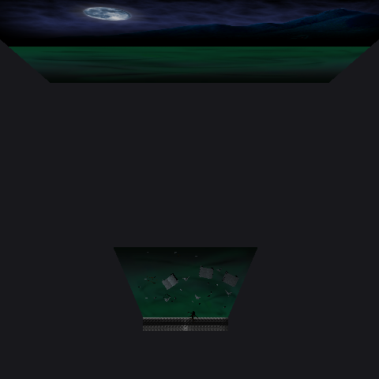
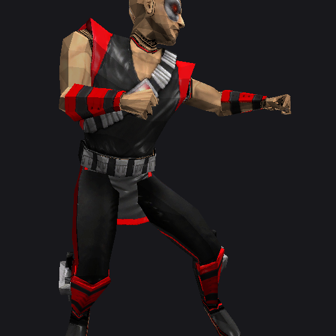
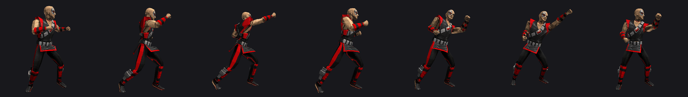

# Progress

Current state of the project. Written so that someone can pick it up with no prior context.

**Last updated:** 2026-09-02 — see [HANDOFF.md](HANDOFF.md) for the route and
[ENCARGO.md](ENCARGO.md) for the next task.

> Latest: **the decompiled main menu boots and runs.**
> `tests/test_menu_boot.c` exits 0 -- general data, the 88-step front-end
> loader, sixty ticks of `Task_FEMain` asking for 480 sprites and 89 fills
> a second, with the retail build's own diagnostics coming out on the way.
> Nothing is on screen yet: the platform layer counts draw calls rather
> than making them, which is what tests the transcription.
>
> Getting there was one fault repeated: two files describing the same
> object differently, each compiling alone. `tools/mkdata.py` recovers the
> initialised data every global was missing, and `tools/slotcheck.py`
> settles the declaration disagreements from the symbol table.
>
> Before that: **all 18 arenas render, textured, with their effects and an
> animated fighter standing in them.**

`tests/test_menu_boot.c` exits 0. It runs what the game runs: `Task_LoadGeneral-
Data`, then the 88-step front-end loader, then sixty ticks of `Task_FEMain`.
The menu asks for **480 sprites and 89 fills a second** and stays on
`FE_Task_Main_Menu`. Along the way the retail build's own diagnostics come out
-- the settings reset with its ten values, `Num Text strings Loading: 1022`, and
the bare `F` and `G` the loader prints.

Nothing is on screen yet: the platform layer counts draw calls instead of making
them. That is deliberate. It tests the transcription, which is the part that was
in doubt; a window would test the GL code, which is not.

### What it took, and it was all one thing

Two files describing the same object differently. Each compiles alone, so
nothing catches it until something reads through the wrong shape at run time.

**Values that were never there.** 498 of the 779 generated globals live in
`__DATA,__data` -- initialised in the image -- and had been given zeros.
`tools/mkdata.py` reads what the linker put there and emits C rather than a
blob, because a word is either a number or an address and a `memcpy` cannot tell
them apart across word sizes. 256 globals now carry their real contents, and 88
more symbols that nothing in the decomp declares -- the per-character idle lists
a table points at -- are recovered from the pointer's type, the symbol table's
extent and the image's bytes.

**Four bytes against eight.** The transcription is full of `def[0x30 / 4]`,
which is an addressing mode rather than a field and is only right while a
pointer is four bytes wide:

| | was | now |
|---|---|---|
| `PlayerDefs` | `char *` + `def[0x30 / 4]` | a `PLAYERDEF` struct, thirteen named fields |
| `ANIMATEDCHARACTER` | opaque, `((void **)c)[0x30 / 4]` | seventeen fields, 0x00 to 0x40 |
| `SKININFO` | `limeMalloc("skin", 0x30)` | `sizeof` -- 48 in the image, 72 here |
| `BONE` | `n * 56` | `n * sizeof(BONE)` -- 56 against 96 |
| `GAMEFONT` | padding to the image's offsets | lime's `FONT` fields |

**Signatures that disagreed.** `limeDrawSprite` takes a colour as its tenth
argument; lime's own transcription dropped it and the runtime was written to
match, so the two agreed with each other and with no caller in gamecode.
`limeDrawFONTAtAngle` had its last three parameters in the wrong order.
`limeGetLanguage` fills a buffer and was declared as returning one, which left
the language empty and the text table looked up under `LANGUAGE_TEXT_`.

**Declarations that disagreed.** 110 symbols were declared both as a pointer
slot and as a value. `tools/slotcheck.py` settles each from the symbol table --
a real GOT slot is in the 0x000f3xxx region, so an address outside it is the
data itself -- and corrects the ones it is sure of. 84 fixed mechanically, plus
four that contradicted a hand-written runtime definition.

### Two tools worth knowing about

- **`tools/mkdata.py`** -- the initial value of every global, out of the binary.
  Run through `tools/mkglobals.py`; it reports what it could not spell.
- **`tools/slotcheck.py`** -- `--fix` corrects slot/value disagreements. It reads
  one declarator per line, so `extern long *A, *B;` still slips past it; that is
  how `FE_CurrentTask` was missed.

### What is next

The menu runs headless. Three things follow, in this order:

1. **Draw it.** `runtime/platform/win32_gl.c` and `demo.c` already open a window
   and draw meshes; the menu needs `limeDrawSprite` and `limeDrawFONT` wired to
   it instead of to counters.
2. **`gamecode/logic`, 3 of 2,172.** The fight engine, and the largest block
   left in the project by a wide margin.
3. **Finish the type unification.** GameCode.c keeps its own copies of a dozen
   lime types and functions, which is why `GAMEFONT` had to be copied instead of
   included. Deleting the local copies and including `lime.h` is the real fix
   and removes the whole class of disagreement above.

## Overall progress

```
██████████████████████░░░░░░░░░░░░░░░░░░  54.70%
```

**54.70% of the total estimated effort. Nothing is playable yet.**

Weights are our judgement of how much of the total each area represents. The
three decompilation figures are **measured from the tree** by
`tools/progress.py` on every run; the other five are estimates a person
maintains. Two numbers are worth keeping apart:

- **35.90%** — share of the *whole project*, counting analysis, tooling and formats.
- **5.7%** — share of the *decompilation itself*: 147 finished functions of 2,572.

Both are true. The first says the foundations are in place and the engine core is
done; the second says the fight engine has barely been touched.

| Area | Weight | Done | |
|---|---:|---:|---|
| Binary analysis and source-tree mapping | 4% | 100% | `██████████` |
| Tooling and the verification oracle | 8% | 100% | `██████████` |
| Asset format specifications | 8% | 100% | `██████████` |
| `lime/common` — engine core (109 fn) | 12% | **100%** | `██████████` |
| `gamecode` — game logic (291 fn) | 18% | **100%** | `██████████` |
| `gamecode/logic` — fight engine (2,172 fn) | 28% | 10.73% (233) | `█░░░░░░░░░` |
| Native PC platform layer (161 fn to rewrite) | 17% | 10% | `█░░░░░░░░░` |
| EA SDK stubs (~1,412 fn) | 5% | 0% | `░░░░░░░░░░` |

**The platform layer shrank twice.** It used to read "229 fn rewritten".
**56** of those are `Finch/`, a vendored copy of MIT-licensed
[zoul/Finch](https://github.com/zoul/Finch); another **12** are
`ES1Renderer.m` and `ES2Renderer.m`, which are Apple's `GLES2Sample` template
with the method sets matching exactly. Both have published, readable, legally
reusable sources. **68 of 229 — 30% — need no reverse engineering**, leaving
161. The 10% reflects that those modules have known upstream sources, not that
any of the port is written.

### Milestones

| Milestone | Status |
|---|---|
| The binary is understood and mapped | ✅ done |
| A verification method exists and is proven | ✅ done |
| The game runs somewhere as a behavioural reference | ✅ done (touchHLE, no known crash) |
| Every LIME asset format | ✅ done — `.scene` was the last |
| **The engine core is decompiled** | ✅ **done — 109 of 109** |
| **The engine core is verified** | ✅ **all nine files** |
| Something renders on a PC screen | ⬜ not started |
| The game boots natively | ⬜ far off |
| The game is playable natively | ⬜ far off |

---

## At a glance

| Phase | Status |
|---|---|
| 0 — Binary analysis and source-tree mapping | ✅ complete |
| 1 — Asset formats | ✅ complete — every format read and validated against the shipped data |
| 2 — Verification oracle | ✅ complete and proven |
| 3 — Ghidra automation | ✅ headless pipeline working |
| 4 — Decompile `lime/common` | ✅ **complete — 109/109, every file verified** |
| 5 — Native PC platform layer | ⬜ not started |
| 6 — EA SDK stubs | ⬜ not started (scope reduced, see below) |
| 7 — Decompile `gamecode` | 🔄 35/291, every one verified |
| 8 — Decompile fight logic | 🔄 3/2,172 — `SwitchQueue`, `isp2`, `gup2` |
| 9 — Widescreen, gamepad, mods | ⬜ not started |

**Honest framing:** 147 of 2,572 functions are done, which is 5.7%. The
percentage is not the interesting number — the pipeline that produced them is,
and it now finds bugs on its own.

---

## Module status — `lime/common`

| Module | Body written | Differential test |
|---|---|---|
| `Matrix.cpp` (11 fn) | ✅ | **40,006 cases, 0 divergences** |
| `limeVector.cpp` (2 fn) | ✅ | **20,013 cases, 0 divergences** |
| `LIMEDS_Misc.cpp` (8 fn) | ✅ | **21,950 cases, 0 divergences** |
| `RenderSkinned.cpp` (20 fn) | ✅ | **18,780 cases, 0 divergences** |
| `Events.cpp` (22 fn) | ✅ | **2,224 cases, 0 divergences** |
| `RenderMesh.cpp` (19 fn) | ✅ | **590 files, 7,327 meshes, 0 divergences** |
| `RenderScene.cpp` (14 fn) | ✅ | ⬜ no test yet |
| `limeFont.cpp` (6 fn) | ✅ | ⬜ no test yet |
| `DS_DebugWin.c` (7 fn) | ✅ | ⬜ no test yet |

**Only the last column means verified.** A body that compiles and passes
`symcheck` is a strong claim about structure and no claim at all about
behaviour — `LIME_UpdateEvents` had a confidently wrong body for weeks and only
a differential test exposed it.

Several bodies are **structural**: the call sequence and field access are
recovered, and a branch condition or a GL enum inside them is marked in the
comment as not pinned down rather than guessed. Those markers are deliberate and
are where the next person should look.

---

## Module status — `gamecode`

**35 of 291, every one verified.** Plus 3 of 2,172 in `gamecode/logic`.

| file | done | total | test | checks |
|---|---:|---:|---|---:|
| `GameCode.cpp` | 9 | 79 | `test_gamecode_diff`, `test_gamecode3_diff` | 41 + part |
| `FrontEnd.cpp` | 19 | 126 | `test_frontend_diff`, `test_text_diff`, `test_gamecode3_diff` | 84 + 328 |
| `text.cpp` | 3 | 18 | `test_text_diff` | 273 total |
| `achievements.cpp` | 1 | 12 | `test_gamecode3_diff` | 328 total |
| `Particles.cpp` | 1 | 5 | `test_gamecode2_diff` | 158 total |
| `Players.cpp` | 1 | 28 | `test_gamecode2_diff` | |
| `sound.cpp` | 1 | 8 | `test_gamecode2_diff` | |
| `logic/other.c` | 2 | 333 | `test_switchqueue_diff`, `test_isp2_diff` | 500 + 205 |
| `logic/mkreact.c` | 1 | 207 | `test_gup2_diff` | 243 |

Zero divergences throughout.

### The test shape this module needs

`lime/common` was mostly maths, and maths compares by value. `gamecode` is
mostly **sequencing** — a function whose whole content is calling other
functions in an order — and almost none of those callees are decompiled.

The trick is that **a sequencer can be verified long before the things it
sequences exist.** Generate the oracle *without* `--with-deps`, let the callees
come out as plain externs, and define them in the test: once for the
register-file side, once for the native side, both recording into one log. What
then gets compared is exactly what the function under test decides — who it
calls, in what order, with what argument, and what it writes.

`recomp.py` needed one fix for that to work at all. Without `--with-deps` the
emitted C called functions nobody declared, which C99 rejects and which would
otherwise have been given implicitly wrong signatures. It now records internal
callees it does not generate and declares them in the header.

### Three rules these tests keep proving

- **Compare addresses by IDENTITY, never by value.** A native build has no
  binary code addresses and never will. Give both sides the same symbol table
  and check *which* entry was used. `gup2` pushes resume addresses into a
  coroutine stack; the raw values can never match and the choice always can.

- **Poison first, then ask what SURVIVED.** `InitParticles` clears one word per
  0x30-byte record across 512 records. A `memset` agrees on that word
  everywhere and destroys the other eleven — the difference is only visible in
  what was left alone. Make the sweep wide enough, too: one of these reported
  "wrote nothing" because the range stopped short of the global.

- **Drive the gates apart before trusting agreement.** `FE_X` and `FE_H` are
  indistinguishable while both scales hold `1.0f`, which is exactly what they
  hold in the shipped binary. Set them differently first.

### What was found on the way

- **The front end's widescreen hook.** `FE_X`, `FE_W` and `FE_H` are the
  coordinate scalers every menu goes through. X and W share `_FE_WidthScale`
  and H has `_FE_HeightScale` — two numbers, not three, and the sharing is
  load-bearing: stretching horizontally has to move a thing and its width by
  the same factor or the layout tears. `_CreatePerspectiveMatrix` is the
  corresponding hook for the game itself.

- **`gup2` is a coroutine, not a function.** It runs a little, writes a resume
  address into the switch stack at the head of PROC, and returns. Five entry
  codes; anything else returns -3. Every resume target resolved to a named
  thread function, three of them through pointer slots in `__DATA` rather than
  directly — which is why they first looked like offsets into a UTF-16 string
  blob.

- **`strLenUnicode` stops on a pair of zero bytes, not one.** So ASCII stored
  as UTF-16 — `41 00 42 00 00 00` — is two characters long and `strlen(s) / 2`
  returns **zero** for it. Every ASCII character has a zero high byte, so that
  mistake is not an edge case: it is wrong for almost every string the game
  holds.

- **`_G` confirmed from a second direction.** `getTransferableFlags` reaches
  the game state through a pointer slot at `0x000f357c` holding `0x0038c1fc`,
  which is exactly where `other.c` independently places it. Two functions, two
  routes, one address — the standard this project asks for before a name counts.

- **An oddity left standing.** `EndIntro` writes **10** to a symbol the table
  calls `_AxeTrailDisallowed`. Ten is not a boolean and the address is an exact
  symbol match, so something about that variable is not what its name suggests.
  Whoever finds its reader settles it in one step.

---

## `Matrix.cpp` — finished

`test_matrix_diff` → **40,006 cases, 0 divergences.**

Semantics derived from the **disassembly**, not the decompiler output — 5 of the 11 functions use NEON, where Ghidra's output is unusable for the arithmetic:

- `RotMatrixX`: `m[5]=cos, m[6]=sin, m[9]=-sin, m[10]=cos`
- `RotMatrixY`: `m[0]=cos, m[2]=-sin, m[8]=sin, m[10]=cos`
- `RotMatrixZ`: `m[0]=cos, m[1]=sin, m[4]=-sin, m[5]=cos`
- `limeScaleMatrixXYZ` scales **columns**, not rows
- `limeMatrix3x4RotateSkin(m, vin, vout)`: `out[j] = Σᵢ vin[i]·m[i*4+j]`, no translation. `RotVector` is an alias (tail call).
- **`CreatePerspectiveMatrix`**: `f = sin(fov)/(1−cos(fov)) = cot(fov/2)`, computed in **double precision** and narrowed to float at the end. `fov` is the full **vertical** field of view.
  **Widescreen: `aspect` divides the X term only.** That is the single point to modify.

Established facts:

- The matrix is **4×4 float, row-major**. Verified, not assumed.
- `limeMatrixCopy(src, dst)` — source is the first argument.
- `limeMatrixMult(a, b, out)` — output in the third argument (`r2`).
- `CreatePerspectiveMatrix(m, fov, aspect, zNear, zFar)` — fifth argument on the stack (AAPCS).
- The binary uses **AAPCS soft-float**: floats travel in integer registers. Confirmed by `blx _cosf` followed by `str r0, [r4]`.

One error cost an iteration: `_sin` and `_cos` had been swapped. The binary calls stub `0x000ddcd4` (`_sin`) first, then `0x000dd770` (`_cos`).

---

## `limeVector.cpp` — finished

`test_limevector_diff` → **20,013 cases, 0 divergences.** Named cases (zero, axes, negatives, 1e−20, 1e8) plus 20,000 deterministic pseudorandom vectors.

`test_limevector` → 10 assertions, 0 failures, including the zero-length path through the IT block — the riskiest part of the recompiler.

Both functions (`_Len`, `_Normalise`) are 100% NEON, and **Ghidra's output for both is wrong**. See [METHODOLOGY.md](METHODOLOGY.md).

---

## `RenderMesh.cpp` — loader finished

Two tests, both over the game's real data:

**`test_meshset_loader`** runs the original `_LIME_LoadMeshSet`, recompiled, and
checks what it leaves in memory against [MESHSET-FORMAT.md](MESHSET-FORMAT.md).
That validates the *specification*.

**`test_rendermesh_diff`** runs the hand-written `decomp/lime/RenderMesh.c`
against the same recompiled original and compares the results. That validates
the *reimplementation*.

```
files compared:          590
skipped (variants B/C):   14
meshes compared:       7,327
divergences:               0
```

Byte-for-byte agreement on `numMeshes`, copied names, `numVerts`, `numFaces`,
`boundsRadius`, the index buffer, the vertex buffer and per-vertex lighting.

Three findings came out of this, all now in MESHSET-FORMAT.md:

1. **`LIME_FindMeshByName` returns an index, not a pointer** — and matches by
   substring, not equality. Asking for `"SKULL"` finds `"SKULL3"`. The
   signature file had it wrong.
2. **The in-memory vertex has two undefined bytes.** The copy loop at
   `0x0005ebcc` writes x, y, z, u and v and nothing else, so the padding at
   offset 6 keeps whatever the allocator left there. Comparing the 16-byte
   struct with `memcmp` fails on 584 of 590 files for that reason alone.
3. **`KANO_STANDARD.lighting` is one byte short** — 42,867 bytes for 42,868
   vertices. The retail game reads one byte past the end of that buffer every
   time it loads Kano. Every other lighting file matches its vertex count
   exactly. This is a defect in EA's shipped data, not a misreading of the
   format; it took running both loaders side by side to tell those apart.

---

## `.skin` — format solved

`python tools/skin.py validate <res dir>` → **29 of 29 files, 0 mismatches**,
28,315 skinning matrices, 54,413 vertices. There is no length field anywhere in
the file, so walking every one of them to its exact last byte is what makes the
layout credible rather than merely plausible.

Derived from `LIME_LoadSkin` (`0x00060650`) and `LIME_LoadSkin1` (`0x000604c0`).
Full specification in [SKIN-FORMAT.md](SKIN-FORMAT.md). The short version:

```
int32   blockCount                  // 1 or 2
per block:
  int32  numMatrices (N), numVerts (M)
  uint32 indexes[N]
  uint16 weights[N*4]               // scaled by 1/65536 on load
  { MATRIX43 a; MATRIX43 b; }[N]    // 96 bytes each
  byte   vertData[M*24]
  byte   vertExtra[M*6]
```

Two things made this quick. First, `limeMalloc`'s debug tags survive in the
binary and name every buffer — `skin_indexes`, `skin_mweights`, `skin_normals`,
`skin_uvs`. Second, the decoded weights read `0.99998, 0, 0, 0`: one bone at
full influence and three unused slots, which is what skinning weights are
supposed to look like. That is semantic confirmation, not just arithmetic.

`ROBO1_STANDARD.skin` and `ROBO2_STANDARD.skin` omit the leading block count —
the same two files that use the unindexed `.meshset` variant. A reader should
try the counted layout and fall back to a bare single block.

**Still open:** what the 24 and 6 bytes per vertex contain, and why `indexes`
decodes negative. Those are questions of interpretation; the layout is settled.

---

## `.skinanim` — format solved

`python tools/skin.py validate-anim <res dir>` → **28 of 29 files**, 9,590
animation frames. From `UnpackAnimFrame` (`0x0006012c`).

```
float  scale          // always 1.0 in the shipped data
int32  numFrames
int32  frameSize      // == 16 + numBones*20
FRAME  frames[numFrames]
```

A frame is an `int32` tag, a `limeVECTOR3` root position, then one 20-byte
`BONEANIMFRAME` per bone. `GetSlerpedQ` and `GetMFromQuat2` operate on those,
so four of the five floats are a quaternion; the fifth is unidentified.

**Read `frameSize` from the header; never derive it from the matching
`.bones`.** Deriving it looks right on most characters and then fails on ROBO1
and ROBO2, whose animations carry a different bone count than their skeletons —
ROBO1's animation has 20 bones where its `.bones` declares 25. That cost an
iteration.

`SINDEL_STANDARD.skinanim` is the one file that does not fit: its header reads
a second float where the frame count belongs. A 16-byte header gives
`frameSize = 1256`, exactly `16 + 62*20` for Sindel's 62 bones, and
`16 + 844*1256` is exactly the file size — but the header's own count says 422,
half of 844. Two streams or one longer header; the arithmetic works either way.
**Unresolved.**

---

## Research contributed by DeepSeek, audited

A handover package arrived on 2026-08-14. Every symbol/address pair in it was
checked against `functions.txt` before anything was adopted:

```
pairs checked:  258
correct:        223
wrong:           15
non-existent:    20
```

The failures were not spread evenly. All twenty non-existent symbols — `_slave`,
`_him_x`, `_shake_ob_up`, `_a0_for_him`, `_rough_hypotenuse` and the rest — sat
in the notes that mapped iOS addresses onto names taken from other releases of
the game. Those notes were rejected. The material derived from disassembling our
own binary verified at essentially 100% and was kept.

**Adopted** (in `OUTPUT/research/`, verified):

- The cooperative process scheduler in `gamecode/logic/other.c`:
  `_StartThreadAt` (`0x56cac`), `_KillSThread` (`0x56cbc`), `_KillProc`
  (`0x56d14`), `_QueueAndJump` (`0x572b8`), `_SwitchQueue` (`0x55ed4`),
  `_DoSwitchJump` (`0x55efc`), `_UnstackSwitches` (`0x573e8`), `_clear_queues`
  (`0x58974`).
- `PROC` struct: 268 bytes (`0x10c`) of stride per player, with field offsets.
- Function-pointer dispatch tables. I confirmed the contents of both:
  `0xf3150` holds `_t_do_fatality_1`, `_t_do_stationary`, `_t_drone_animality`,
  `_t_do_friendship`, `_t_master_proc_mercy`, `_t_drone_babality`; `0xf3200`
  holds `_t_make_db_tone`, `_t_bonus_count`, `_t_do_shake`. Note they live in
  `__DATA,__nl_symbol_ptr` and the pointers carry the Thumb bit.
- An independent run of the differential tests on Linux — they pass off the
  machine they were written on.

This is why `gamecode/logic` moved from 0% to 2%: nothing is decompiled yet,
but the entry points into the fight engine are now mapped and verified.

---

## `gamecode/logic` — first function verified

`SwitchQueue` (`0x00055ed4`) → **500 pushes, 0 divergences**
(`tests/test_switchqueue_diff.c`).

A 20-slot circular buffer. Each entry packs the current PROC's counter, read
from `PROC+0xa8`, into the low 16 bits and the caller's value into the high
ones. The wrap is checked *after* the store, so the last slot is written before
`head` resets — reordering it would drop an entry.

It was picked because it is verifiable at all: pure data manipulation, no
function pointers and no indirect branches. Most of this file's dispatch code
will not allow that, which is why the entry points around it were worth mapping
first.

### Two recompiler bugs it caught

Both produced code that compiled, ran, and was wrong.

**Shift types.** Capstone orders them `ASR, LSL, LSR, ROR` — not the intuitive
`LSL, LSR, ASR`. The translator assumed the intuitive order, so every
`lsl #16` became `>> 16`. `SwitchQueue` packs its two halves with exactly that
instruction, which is how it surfaced. **Every shifted operand in the binary
was affected**; the previously verified modules happened not to use one.

**Literal pools decoded as code.** The linear sweep ran past the end of the
function into the constant pool and turned `0x0009d6a0` into a `bvs` branching
to a label that would never be emitted. Emission now stops at a terminal
instruction when nothing further is a branch target — a minimal form of the
recursive descent still owed.

All three finished modules were re-verified after the fixes: 40,006 / 20,013 /
7,327 cases, still zero divergences.

---

## The emulator prints its own event traces

Worth knowing before starting on `.events` or `.scene`: the running game logs
every event it triggers, with the source scene, the frame number and the
parameters.

```
- EVENT CAVE_LEVEL_SCENE.scene (fr 2) triggered event LENSFLARE.scene (FromGround 0, spd 1.00...)
- EVENT SEKTOR_STANDARD.scene (fr 356) triggered event PULSE_TRAIL.scene (FromGround 0, spd 1.00...)
```

That is ground truth for the event system, produced by EA's own code running on
EA's own data. A `.events` parser can be checked directly against it: parse the
file, predict which events fire on which frames, and compare with the log.

It also names fields — `FromGround`, `spd` — which is a head start on the struct.

`SEKTOR_STANDARD.scene` firing at frame 356 lines up with its `.skinanim`
declaring 356 frames, so the frame numbers in these traces are animation frames.

The full log of a session is 4,281 lines; the game's own output is 1,623 of
them, the rest being touchHLE's. Two other things visible in it:

- Hundreds of missing `*_LOW.PNG` textures. The game asks for a low-resolution
  texture set that is not in the bundle and carries on without it.
- 47 × `Failed to create OpenAL source, error code a005` — the source limit is
  exhausted. Sound is partially broken under the emulator.

---

## `.events` — format solved

`python tools/events.py validate <res dir>` → **544 of 545 files**, 1,547
tracks, walked to their exact last byte. From `LIME_LoadEvents` (`0x000a477c`).
Full specification in [EVENTS-FORMAT.md](EVENTS-FORMAT.md).

```
int32   numTracks
TRACK   tracks[numTracks]           // variable length
  268 bytes header, numEntries at +0x108
  numEntries * 56 bytes of entries
```

Both strides come from the loader's arithmetic, not from the walk: the entry
base is built as `(cursor+0x5c)+0xb0 = cursor+0x10c` at `0x000a4934`, and the
cursor advances by `numEntries*64 - numEntries*8 = numEntries*56` at
`0x000a49be`. The 268-byte header is then accounted for **byte by byte,
contiguously**, by the load sequence at `0x000a4876`–`0x000a490a` — a 64-byte
name, twelve int32s, a second 64-byte name, six int32s, a 64-byte slot name,
and `numEntries`.

The earlier note here said tracks divided as 324 for 125 files and 436 for 24
and "did not divide at all for the rest". That now resolves cleanly:
`324 = 268 + 1*56` and `436 = 268 + 3*56`, and the rest are files whose tracks
carry different entry counts.

### The 268-vs-216 gap is not discarded data

An on-disk header of 268 against a 216-byte in-memory struct looks like the
loader throws 52 bytes away. It does not. The 64-byte name at `+0x000` is
**used but never stored** — copied to the stack, uppercased in place, given a
7-byte suffix. That leaves 204 bytes reaching the struct, and the struct's
other 12 bytes are its own: a flag at `+0x04`, padding at `+0xc0`, and the
entries pointer at `+0xd4`. `204 + 12 = 216`, exact.

### An audit finding that turned out to be wrong

This format was audited as resting on **circular evidence**: `numEntries` was
reported as 1 in 211 of 212 tracks, which would make every track exactly 324
bytes and every file `4 + numTracks*324` — and against a fixed record size, any
split of 324 lands exactly, so the walk would prove nothing.

That was measured on a subset. Over the full corpus of 1,547 tracks,
`numEntries` takes **ten distinct values** and **103 tracks (6.7%) are not 1**:

| `numEntries` | 0 | 1 | 2 | 3 | 4 | 5 | 6 | 7 | 8 | 16 |
|---|---:|---:|---:|---:|---:|---:|---:|---:|---:|---:|
| tracks | 46 | 1,444 | 5 | 29 | 6 | 8 | 4 | 2 | 2 | 1 |

The `4 + numTracks*324` formula fails exactly where it should — the
`CUTUP_BY_LAO_*` family comes out 112 bytes larger, which is the two extra
entries. And brute-forcing every header size from 268 to 516 against every
entry size from 0 to 196 leaves **exactly one pair** that walks all 544 files:
`(268, 56)`.

So the walk is not circular, and the layout has two independent legs. The audit
was still right about the underlying principle, and about the `+0x108`
derivation being wrong as written — the old one indexed the wrong live range of
`r5` and produced `0x1b0`. `tools/events.py` now prints the `numEntries != 1`
count on every run so the distinction stays visible instead of being trusted.

**Still open:** `CUTUP_BY_REPTILE_STRYKER.events` (6,224 bytes, walk stops at
272). Its name field holds a single junk byte and its slot is empty, unlike
every other file, so it is probably not an events file at all. The earlier
"embedded SCENE" hypothesis is unproven either way.

Other names visible in this subsystem, not yet investigated:
`SCENEINFO`, `LIME_LoadMasterEventOffsets`, `FindIdInMasterOffsets`, and the
74 `.offsets` files in `res/`.

---

## The game prints its own dispatch indices

A play session through the menus produced this before dying:

```
#0:FE_Task_Main_Menu(0)
#1:FE_Task_Extras(6)
######################### (FE_Task_Select_Leaderboard)(49)
```

That is the front-end task stack, with **each task's name and its index**. All
three are real symbols — `_FE_Task_Main_Menu` at `0x0001ac64`,
`_FE_Task_Extras` at `0x0001962c`, `_FE_Task_Select_Leaderboard` at
`0x00013e6c` — and there are **53 `FE_Task_*` functions** in the binary.

**This is a general technique, not a one-off.** The engine dispatches through
numbered tables and prints the numbers. Walking the menus maps index → function
by observation, which is exactly the method needed for the tables behind
`_DoSwitchJump` ([#1](../../issues/1)) that no differential test can reach.
Reaching a state in the emulator and reading the index it reports is evidence;
guessing from a name is not.

Indices observed so far, 12 of the 53:

| Index | Task | | Index | Task |
|---:|---|---|---:|---|
| 0 | `FE_Task_Main_Menu` | | 9 | `FE_Task_Settings` |
| 1 | `FE_Task_Play` | | 10 | `FE_Task_Button_Config` |
| 2 | `FE_Task_Single_Player` | | 27 | `FE_Task_Character_Select` |
| 5 | `FE_Task_Options` | | 28 | `FE_Task_Tower` |
| 6 | `FE_Task_Extras` | | 29 | `FE_Task_Continue_Screen` |
| 7 | `FE_Task_About` | | 49 | `FE_Task_Select_Leaderboard` |

Filling the rest is a matter of walking the menus and reading the log.

### A second EA SDK blocker, at runtime this time

Entering the leaderboard kills the emulator:

```
UIAlertView: "¡ERROR AL CARGAR LA PÁGINA SOLICITADA! ¡COMPRUEBA TU CONEXIÓN A INTERNET!"
panicked at src/dyld.rs:811:9: Call to unimplemented function _CFRunLoopRun
```

The online layer fails to reach EA's servers, raises a modal alert, and the
modal needs a nested run loop that touchHLE does not implement.

**This refines the earlier conclusion about the EA SDK.** It remains true that
the SDK does not block *startup* — one function did, and patching it was
enough. But the online features still crash when *entered*. It also explains
the long-standing note that achievements crash the emulator in 1.0.4: same
layer, same modal path.

For the native port this means the leaderboard, achievements and any other
online menu entry need to be **removed or stubbed at the menu level**, not just
given neutral return values further down. A stub that returns "no connection"
still ends up in the alert.

### The EULA screen is a web view pointed at EA's servers

Opening the licence agreement produces:

```
UMK3[0] ASSIGNED:http://tos.ea.com/legalapp/mobileeula/US/es/OTHER/
touchHLE: TODO: [(UIWebView*) 0x3023be20 loadRequest:(null) ()]
UMK3[0] REQUESTED URL:http://tos.ea.com/legalapp/mobileeula/US/es/OTHER/
```

The screen renders empty because `UIWebView loadRequest` is unimplemented. It
does not crash — the interface is simply broken.

That maps to `WebViewController.m` (18 functions in `lime/iphone`), which the
port has to replace anyway. Worth noting for whoever writes it: **the bundle
already ships local copies** — `res/defaults/dmg/staticpage/dmg_staticpage_*.html`
in eight languages. The native version can serve those instead of reaching for
a URL that will not resolve, and the EULA screen works offline.

---

## Playing the game as an analysis method

Nine emulator sessions, culminating in a full arcade run — the tower, Shao Kahn
and Motaro, several characters and the unlockables. The largest log is **47,421
lines with 368 event traces**. Everything below came from playing, not from
static analysis.

### Gamepad mapping, and a bug in touchHLE's own defaults

touchHLE ships a recommended mapping for this game:

```
com.ea.umk3.bv: --dpad-to-touch=30,690,280,280 --button-to-touch=A,1020,900
                --button-to-touch=B,1215,900 --button-to-touch=X,1400,900
```

Its own `--help` states that in landscape the bottom-right corner is `480,320`.
**Those coordinates are far outside the screen**, so no press can ever register.
That is why a gamepad appears to do nothing with the defaults.

The working mapping, read off a screenshot of the running game, is in
`docs/TOUCHHLE-PATCH.md`. The on-screen layout is a joystick at `15,202` sized
`115×113`, and six buttons: `S` `P` `R` along the bottom at y≈285 and `K` `B`
along a second row at y≈235.

Worth noting for its own sake: **one screenshot settled in a single attempt what
four rounds of guessing had not.**

### Hidden characters need a hold timer, not a tap

Holding a finger on Smoke in the character select reveals Human Smoke. That
means `FE_Task_Character_Select` (index 27) measures *press duration*, and a
port that only implements "tap" loses the secret characters silently.

The binary has **`_secret_move_search` at `0x00053754`** — a dedicated system,
not a special case. Expect Kombat Kodes and other secrets to run through it.
The symbol name is EA's own, from the STABS table.

`_t_nj_smoke_slam` (`nj` = ninja) confirms robot and human Smoke are separate
entities in the engine, not a palette swap.

### The babality model sometimes fails to draw — and it is not the game's fault

Reported symptom: the baby model is invisible after a babality, but only
sometimes. It rendered correctly for Kabal on a different stage.

The logs rule out the obvious explanation. The texture *does* load:

```
loading scene: BABALITY_KUNGLAO.scene...
".../Textures/KUNGLAOBABY_LOW.PNG", returning nil      <- the _LOW variant is absent
*** Loaded KUNGLAOBABY.???, allocating ptr 36 [VRAM 6498k]   <- the .pvr loads fine
```

All 64 babality `.pvr` textures are present in the bundle, and the fallback from
the missing `_LOW` variant works.

What does fail is the upload:

```
Error uploading compressed texture level: 0. glError: 0x0500   (GL_INVALID_ENUM)
Error uploading compressed texture level: 0. glError: 0x0503   (GL_STACK_OVERFLOW)
```

Both on **compressed** texture upload, which is what PVRTC is. The model loads,
the texture is read, the upload to the GPU fails, and the geometry draws with no
valid texture. That it depends on the stage rather than the character fits: a
different stage means different textures uploaded beforehand and a different
VRAM state at the moment the baby is needed.

**This is a touchHLE limitation, not a game bug, and patching the IPA would be
the wrong fix.** EA's binary is behaving correctly. For the native port the
problem disappears on its own, because the port decodes PVRTC itself rather
than relying on a GL extension.

### Runtime blockers, in order of how much they matter

| Symptom | Cause | Patchable? |
|---|---|---|
| Emulator dies on any confirmation dialog | `-[modalAlertDelegate initWithRunLoop:]` (`0x000b53bc`) spins a nested run loop; touchHLE has no `_CFRunLoopRun` | **Yes** — neutralise `+[modalAlert confirm:]` (`0x000b54a0`) and `ask:` (`0x000b54e4`) |
| Leaderboard, achievements | same modal path, reached through EA's online layer | same patch |
| EULA screen blank | `UIWebView loadRequest` unimplemented; the bundle ships local HTML | port-side |
| Babality model invisible | PVRTC upload failing | no — emulator side |
| 47× `Failed to create OpenAL source` | source limit exhausted | no |

### The fight engine prints more than events

Mining the full arcade log (47,421 lines, 23,551 of them the game's own output)
turned up three more things the engine reports about itself.

**`seq_lookup` prints its arguments — 366 times:**

```
seq_lookup( 18, 0, 1 );
seq_lookup( 17, 3, 1 );
seq_lookup( 10, 1, 1 );
```

`_seq_lookup` is at `0x000adb80` in **`playback.c`**, a file with only four
functions. Structure of the 366 observed calls:

| Arg | Range | Distinct | Reading |
|---|---|---:|---|
| 1st | 1–18 | **5** | sequence set — likely character or move class |
| 2nd | 0–710 | 30 | sequence index within the set |
| 3rd | 1 | 1 | flag or mode; never varied |

Most frequent: `(18,0,1)` ×50, `(17,3,1)` ×42, `(1,0,1)` ×40, `(10,1,1)` ×34.

The function is **7,608 bytes with 3,964 undecodable as instructions** — about
4 KB of embedded data, consistent with the large lookup table its name promises.

**This makes `playback.c` the best first target in `gamecode/logic`:** four
functions, self-contained, and a printed oracle giving real inputs. Comparing
what a reimplementation would produce against what the game prints is
verification that needs no differential harness.

**Other engine output mapped to symbols:**

| Log line | Symbol | Address |
|---|---|---|
| `########## TASK_GAME_INIT: N` | `_Task_GameInit` | `0x0002e6f4` |
| `Tsound NxN N` | `_tsound_func` | `0x00057dd0` |
| `TRACK ALREADY CLOSED (setGain)!` | audio, `GBMusicTrack.m` | — |

`_Task_GameMain` (`0x0002afec`) and `_Task_GameDestroy` (`0x00022c74`) complete
the game task triple; only the init one announces itself.

### The moves list dumps the move input tables

Those 10,208 bare-number lines turned out to be the best find of the session.

They form **four contiguous runs**, and two of them start immediately after
`LOGGING (50016): INGAME MENU, MOVES INFO`. Each run is one integer per line,
values 0–22, and every run is **strictly periodic**:

| Run | Values | Structure |
|---|---:|---|
| 1 | 1,128 | period 6, `14 0 4 13 22 3` × 188 |
| 2 | 6,240 | period 6, same cycle × 1,040 |
| 3 | 318 | period 6, same cycle × 53 |
| 4 | 2,522 | five different cycles, **in the same order twice** |

Run 4 is the informative one:

```
period 6  x15   14 0 4 13 22 3
period 6  x25   22 21 22 3 1 0
period 5  x34   2 2 10 3 0
period 5  x94   12 2 0 3 14
period 7  x29   0 4 3 1 12 5 11
period 6  x44   14 0 4 13 22 3     <- the same five again
period 6  x11   22 21 22 3 1 0
period 5  x10   2 2 10 3 0
period 5  x27   12 2 0 3 14
period 7  x132  0 4 3 1 12 5 11
```

Five cycles, traversed twice in the same order: that is somebody scrolling down
the moves list and back. So the screen **reprints the displayed move's input
sequence every frame**, the period is the number of inputs in that move, and
the values are icon indices — directions and buttons, which is the right size
for a range of 0–22. Runs 1–3 are the same screen left open on one move for
188, 1,040 and 53 frames.

**This is a free dump of the move input tables**, which are exactly the fight
engine data that matters and exactly what static analysis handles worst. Nobody
has to find and decode the tables in `__DATA`: open the moves list, scroll
through every move of every character with the log running, and the game
prints them.

That experiment is written up as the first item in [HANDOFF.md](HANDOFF.md).
It needs no tooling, no decompilation and no Ghidra — only patience with a
controller — and it would produce the input table for all 24 characters.

The 184 lines of 32 numbers remain unidentified.

---

## Recursive descent: 852 silently wrong becomes 822 honestly incomplete

The recompiler walked each function linearly. Thumb-2 literal pools sit **in
the middle of functions** (the `ldr rX,[pc,#N]` reach is only ±4 KB), so the
sweep decoded constants as instructions and desynchronised — **852 of 4,342
functions (19.6%)** had bytes it could not decode, and an unknown number more
were misread without complaint.

It now follows control flow from the entry point and decodes only what is
reachable. Anything unreached is data.

| | linear | recursive |
|---|---|---|
| desynchronises | 852 fn (19.6%) | — |
| every byte accounted for | — | 3,520 fn (81.1%) |
| >25% unreached (indirect branch) | — | 822 fn (18.9%) |
| bytes decoded | 87.6% | 80.0% |

**The headline number dropping is the improvement.** The bytes no longer
decoded were never code.

**Jump tables are followed.** A dense `switch` compiles to `tbb`/`tbh`, which
stops recursive descent dead — but GCC's idiom is fixed (`cmp rN,#limit` /
`bhi` / `tbh [pc,rN,lsl #1]` / table of halfword offsets) and can be resolved.
`_seq_lookup` went from **38 bytes of 7,608** to 906 bytes across 315
instructions. 28 functions carry such tables.

Incidentally this confirms a reading from the play logs: `_seq_lookup` is
bounded by `cmp r4, #0x16`, so its first argument dispatches 23 ways — and the
366 logged calls used values 1 to 18, inside that range.

### The oracle's limit, stated as a limit

`blx <reg>`, `bx <reg>` and computed branches cannot be resolved statically.
`gamecode/logic` is cooperative multitasking with a process dispatcher and
per-process stacks inherited from the arcade TMS34010; dispatching through
function pointers *is* its architecture. **The oracle will never cover the
fight engine, structurally rather than for want of work.** That is not a
backlog item, and it is why [#5](../../issues/5) and [#6](../../issues/6)
attack that code by observing the running game instead.

### Coverage, measured rather than estimated

`recomp.py --all` now runs over the **whole binary**:

| | |
|---|---:|
| functions recompiled | **4,342** (all of them) |
| instructions translated | **274,240** |
| untranslatable | **49 — 0.02%** |
| functions affected | **24 — 0.6%** |
| literal-pool loads resolved | 25,331 |

Measuring first is what made this cheap. The owed work was listed as "import
shims, and six missing instructions: `adr`, `uxtb`, `sxtb`, `smull`, `vmrs`,
`vcmp`". **None of those six even appear in the failure list** — they were
already handled, and the list was stale. What actually failed:

| | before | |
|---|---:|---|
| `blx` | **9,001** | 93% of all failures |
| `ldrex` / `strex` | 478 | |
| everything else | 163 | |

**`blx` was the whole problem, and it was a policy error rather than a missing
instruction.** Any import without a hand-written shim aborted *generation* —
which contradicts the recompiler's own stated principle of failing loudly at
*runtime* and never blocking on code that may never execute. It now emits a
call to an auto-named shim and writes `<name>_shims.c` with default bodies that
call `arm_unimplemented()`. Generation succeeds; anything actually executed
aborts and names itself; you write only the shims your tests reach. That single
change took untranslatable instructions from 3.52% to 0.23%.

`ldrex`/`strex` follow next: the guest is single-threaded and uncontended, so
the pair is a plain load/store with the exclusive always granted. Then `mla`,
`mls`, `addw`, `subw`, `smulbb`, `sxtah`, `rev`, scalar `vmla`/`vmls`/`vnmls`/
`vnmul`, and `tbb`/`tbh` — which can now be emitted as an explicit `switch`
because recursive descent has already resolved the table.

### The 49 that remain, and why 38 of them should

**38 are packed `vmla`/`vnmls` on D registers** — 2-lane NEON. A scalar
translation would look right and be wrong, so it is refused. This is the same
rule that made the project distrust Ghidra in the first place; the oracle does
not get an exemption. Where those matter, the **armv6 slice** carries the same
functions in scalar VFP.

The other 11 are genuine oddities: `vcvt` (2), `andeq`, `adc`, `svc`, `vld1`,
`smmla`, `cdp2`, `bxns`. Several look like literal-pool bytes in the handful of
functions where recursive descent still mis-steps.

### What "100%" means here

Not that the oracle covers all 4,342 functions in a way that could verify the
whole game. It means **it does everything it can do, and what it cannot do is
written down as a limit rather than a to-do**:

- Indirect branches (`blx reg`, `bx reg`) cannot be resolved statically, and
  `gamecode/logic` dispatches through function pointers by architecture. The
  oracle will never verify the fight engine.
- Packed 2-lane NEON is refused rather than approximated. Use armv6.
- Import shims are generated as loud stubs, not implemented. Implement the ones
  your test executes.

No regression: `_Len`, `_Normalise`, `_RotMatrixZ`, `_limeMatrixMult`,
`_SwitchQueue`, `_LIME_LoadMeshSet` and `_LIME_LoadEvents --with-deps` all
recompile with zero unsupported instructions.

---

## A PVRTC decoder that works — and a bug that was in the test data

`tools/pvrtc.py` decodes all 1,400 shipped textures. Against the textures EA
ships twice (`NAME.PNG` *and* `NAME.pvr` — a free reference that made
downloading Noesis unnecessary):

| | independent assets | mean error | |
|---|---:|---:|---|
| PVRTC **2bpp** | 2 | **1.59 / 255** | 0.6% |
| PVRTC **4bpp** | 2 | **6.07 / 255** | 2.4% |
| **overall** | 4 | **3.83 / 255** | **1.5%** |

**The residual is compression, and there is a test that proves it.** Binning
error by the reference image's local gradient: flat areas score 4.75–4.79 and
hard edges 30.33–50.89. A 4×4 block blending two colours cannot hold an edge
inside itself, so that is exactly how block compression fails. A *decode* bug
would track block **position** instead — measured separately, and flat at
74.8–75.5 across all sixteen positions. Two independent measurements agreeing.

### Three rounds were spent hunting a bug in the references

The decoder scored 19.0%, then 12.2%, then 5.5% after two real fixes. Five
further rounds of hypothesis-and-measure found nothing: **fourteen variations,
every one worse.** Then the reference images were rendered side by side and
looked at, and **three of the thirteen pairs turned out not to be pairs**:

| Pair | Scored | What it is |
|---|---:|---|
| `FE_METAL_BG` | 74.98 | PNG frames the art differently — content in the top ~60%, PVR fills the square |
| `MYBLOOD1` | 34.89 | PNG is the unprocessed source with a **magenta chroma key** |
| `MYBLOOD2` | 22.89 | same |

`FE_METAL_BG` alone pulled the overall figure from 3.83 to 14.00. **The decoder
had been essentially correct since the second fix.**

This is the third time this project has paid for not looking at the picture —
after touchHLE's gamepad coordinates and MAME's door interlock. Each time the
numbers sustained an open-ended hunt and one glance ended it. `pvrtc_diff.py`
now carries the invalid pairs in an `INVALID` table with reasons.

### What the fourteen eliminations bought

They are kept in [PVR-FORMAT.md](PVR-FORMAT.md) and still worth having: Morton
order, endpoint colour unpacking, the bilinear offset convention, the weight
table and the modulation bit ordering are all **confirmed correct** by being
worse every other way. That is real knowledge even though the residual error
was not theirs.

The two fixes that did matter: **colour B is the low 16 bits unshifted** (the
modulation flag shares bit 0 with blue's LSB rather than displacing the field),
and **the blend direction was inverted**.

### Caveat

Four independent assets — two per bit depth — is thin next to the 1,400-file
exhaustive check the container and block geometry got. Widen the corpus before
shipping a C port: the 25 `*_VERSUS` pairs are 512×512 PNG against 256×256 PVR
and become usable if the PNG is downscaled.

---

## `.pvr` — measured, and narrower than expected

1,400 texture files, surveyed rather than assumed. Full note in
[PVR-FORMAT.md](PVR-FORMAT.md).

| | |
|---|---:|
| PVRTC **2bpp** | 725 (51.8%) |
| PVRTC **4bpp** | 675 (48.2%) |
| Any other pixel format | **none** |
| Mipmap levels | **0 in every file** |
| Non-power-of-two | **none** |

The container is **legacy PVR v2** — 52-byte header, `PVR!` tag — not the v3
format modern tooling defaults to.

**Block geometry verified**: `python tools/pvr.py validate <app dir>` →
**1,400 of 1,400 exact, 0 mismatches**. PVRTC1 packs 8-byte blocks covering
4×4 pixels at 4bpp and 8×4 at 2bpp, so the payload must be
`ceil(w/bw) * ceil(h/bh) * 8` and the header's `dataLength` has to agree. It
does for every file at both depths. Same standard `.meshset` and `.skin` were
held to — exact across the corpus, not approximately right on most of it. A
decoder can now be built on this layout without wondering whether the layout is
the bug.

`tools/pvr.py` stops there on purpose: it reads headers and establishes
geometry, and does **not** decode pixels, because decoding is the part that
needs an independent reference and there is nothing yet to check against.

**This turns "support PVR" into a small, closed job**: PVRTC1 at two bit
depths, square, power-of-two, one surface, no mipmaps. Anything else can be
rejected loudly instead of guessed at.

It also has to be a **CPU** decoder. PVRTC is a PowerVR hardware format and
desktop GPUs lack the extension — which is precisely what fails inside touchHLE
(`glError 0x0500`/`0x0503` on compressed upload, the cause of the babality
model sometimes not drawing). Decode on the CPU, upload plain RGBA, problem
gone.

**Noesis converts these**, which ermaccer's write-up recommends alongside the
mesh converter, and it batch-converts so the whole 1,400-file set becomes PNGs
in one pass.

**It is also the oracle for our own decoder** — the same method this project
runs on everywhere else. Convert with Noesis, decode with ours, diff per pixel.
PVRTC is a lossy block format with non-obvious corner interpolation, so "looks
about right" is exactly the judgement that hides a bug for a year; 1,400 files
across two bit depths, 320 with alpha, is a real corpus to hold a decoder to.
Noesis scripts in Python, so the reference pass can be automated.

It is a development tool rather than a dependency — closed-source and
Windows-only, so it ships with nothing, the same way Ghidra does. The decoder
in the repository has to be ours.

Asset formats 80% → 85%.

---

## Asset formats: complete

Every format the game ships is now read and validated against the shipped data.

| Format | Result |
|---|---|
| `.meshset` | 590 files, 7,327 meshes, 0 divergences — three variants |
| `.lighting` | documented |
| `.skin` | 29/29 — two variants |
| `.bones` | **29/29** — two variants, 24 and 25 bytes per bone |
| `.skinanim` | **29/29**, 10,434 frames — two header layouts, 12 and 16 bytes |
| `.events` | **545/545**, 1,547 tracks — two variants |
| `.scene` | 545/547, 7,254 objects — the two exceptions are the ROBO export variant |
| `.pvr` | 1,400/1,400 block geometry; decoder at 1.5% mean error |
| `frames.x`, `moves_data.x` | **plain text** — nothing to reverse |

### `frames.x` and `moves_data.x` were never binary

Both sat on the unsolved list for the entire project. They are **text**, shipped
readable in the app bundle. `frames.x` is 6,831 quoted animation frame names.
`moves_data.x` is **144 secret-move tables written as C array declarations** —
25 characters, eight move classes, and a ten-symbol input alphabet
(`sw_down`, `sw_run`, `sw_block`…).

**And it names the binary's functions.** It references **90 distinct `q_`
predicates and 92 `t_` move handlers by name** — `q_ermac_fatal`,
`t_do_fatality_1`, `t_do_animality`. Those are functions this project already
has addresses for; `t_do_fatality_1` is one of the six verified in the dispatch
table at `0xf3150`. For `gamecode/logic`, which the oracle can never reach
because it dispatches through function pointers, that is a hand-written map from
move semantics to function names covering 182 of them.

Full note in [X-TABLES.md](X-TABLES.md), including how the port should treat
source-form data that ships inside the IPA: the **values** are extracted at
build time from the user's own copy like every other asset, and the **C text**
stays out of this repository.

### The pattern that closed the last four

Four of the remaining holdouts were the same mistake, made four times:
treating a **variant** as corruption.

| File | Looked like | Was |
|---|---|---|
| `ROBO1`/`ROBO2` in four formats | four separate bugs | one export variant |
| `SINDEL_STANDARD.skinanim` | a corrupt header | a 16-byte header layout |
| `CUTUP_BY_REPTILE_STRYKER.events` | not an events file | a bare-entry variant |

The tell is always the same, and it is worth stating plainly: **the alternative
reading divides exactly rather than nearly.** `.bones` at 24 bytes leaves no
remainder across two files while 25 leaves none across twenty-seven. `SINDEL` at
`16 + 844×1256` lands on the last byte. `CUTUP` at `8 + 111×56` lands on the
last byte. None of those is a fit — they are identities.

---

## `SINDEL_STANDARD.skinanim` — a second header layout

The last `.skinanim` holdout, and it was not corrupt. `python tools/skin.py
validate-anim` → **29 of 29 files, 10,434 frames, 0 mismatches**, up from 28.

Its count field read `1065353216`, which is `0x3F800000` — **1.0f**. The file
was being parsed four bytes out of step, because it uses a **16-byte header**
where every other file uses 12:

```
28 files:  float scale; int32 numFrames; int32 frameSize;
SINDEL:    float scale; float scale2; int32 numFrames; int32 frameSize;
```

Reading it correctly gives `(1.0, 1.0, 422, 1256)` — and 1,256 bytes per frame
works out to exactly **62 bones**, which is a plausible skeleton.

### And it holds twice the frames it claims

`16 + 844 × 1256` lands exactly on the file's last byte. The count field says
**422**; the file holds **844**.

The two halves are not a duplicated buffer: they differ in **47 bytes out of
530,032**, 0.01%, first diverging at offset 71,608. Two near-identical takes of
the same animation, one very slightly edited.

Whether that doubling is deliberate or a build accident is **not established**.
The reader trusts the file size over the field and `validate-anim` prints the
discrepancy rather than hiding it — the same treatment `KANO_STANDARD.lighting`
got when it turned out to be one byte short.

---

## ROBO1 and ROBO2: one export variant, not four parser bugs

Two files had been failing in four different formats, and each had been filed as
its own oddity. They are the same thing.

| Format | ROBO1 / ROBO2 | Everyone else |
|---|---|---|
| `.bones` | **24 bytes per bone** | 25 bytes per bone |
| `.skin` | **no leading block count** | `int32 blockCount` first |
| `.scene` | stub — 8 bytes, or a header that does not describe the file | full scene graph |
| `.events`, `.lighting` | **absent** | present |

Both bone strides divide **exactly**, with no remainder, across the whole
corpus: 27 files at 25 bytes, 2 at 24, 29 of 29 explained. That is the signature
of a **second format variant**, not of a parser that nearly works — the same
conclusion `.meshset` reached with its three variants.

The `.skin` evidence is stronger still. `ROBO2_STANDARD.skin` is 126,638 bytes
against `SEKTOR_STANDARD.skin`'s 126,642 — **exactly four bytes**, the missing
count — and its header reads `(765, 1467, -227, -227, -58339, -227)`, which is
`SEKTOR`'s header verbatim once its `blockCount` is removed. The first **1,276
bytes are byte-identical**; they diverge after that, so the two share a rig and
topology while carrying different data.

`python tools/skin.py validate-bones <res dir>` → **29 of 29 files, 1,407
bones, 0 failures**, up from 27 of 29.

**What this closes:** four separate "known exceptions" collapse into one
statement — those two characters were exported by a different or older pipeline.
It also means a reader must accept both variants rather than treating 27 of 29
as good enough.

---

## `.scene` — solved

`python tools/scene.py validate <res dir>` → **545 of 547 files** walked to
their exact last byte. 7,254 objects, 1,664,493 track records, 152,306 tail
records. Full specification in [SCENE-FORMAT.md](SCENE-FORMAT.md).

```
int32   numObjects
int32   count2
per object, numObjects times:
    byte  object[64]            // begins with a name string
    byte  track[count2][12]     // three floats each
int32   count3
byte    tail[count3][40]
```

**Every stride comes from the loader**, which is what makes it credible:

| Stride | Instruction |
|---|---|
| object = 64 | `add.w fp, fp, #0x40` at `0x0005f28e` |
| tracks = `count2*12` | `c*16 - c*4` at `0x0005f3a0` |
| tail record = 40 | `ldr r3, [r1, #0x28]!` at `0x0005f444` — pre-indexed, with writeback |

That last one was the piece that had been missing. A pre-indexed load with
writeback advances the cursor as a side effect of reading, so the stride is in
the addressing mode rather than in an obvious `add`.

**And the walk is real evidence**, by this project's own rule. Three
independently varying counts govern three different arrays:

| | distinct values | range |
|---|---:|---|
| `numObjects` | 63 | 0 – 201 |
| `count2` | 74 | 2 – 4,802 |
| `count3` | 175 | 0 – 9,068 |

### What it turned out to be

Scene graph nodes exported from a modelling package. `BALCONY_LEVEL_SCENE`
holds `Plane002`, `Box004`, `Box03` — 3ds Max defaults — and others carry
authored names like `Text001` and `Helix001`. The loader passes each name to
`LIME_FindMeshByName`, which is how a node binds to geometry.

The 12-byte tracks are three floats, mostly `1.0, 0.0, 0.0`. `AXEFIRE.scene`
shows a live one: `(5, 0.7209), (6, 0.6903), (7, 0.6606), (8, 0.6309)` — an
index rising as a value falls, a keyframed fade.

### The earlier near-miss, and why it was rejected

A formula fitted to file sizes matched **71 of 92** single-object files and was
*not* published as a solution. It was wrong: it assumed objects were followed by
a single shared array, when in fact each object carries its own tracks and a
third array follows them all.

That instinct — refusing a 77% fit — is the same one that has now paid off four
times. The right move was to keep reading the loader until the arithmetic fell
out of it.

### The two that do not parse

`ROBO1_STANDARD.scene` (8 bytes, header only) and `ROBO2_STANDARD.scene`.

**This is the same pair that breaks every other format.** `.bones` reads a
24-byte bone for them rather than 25; their `.meshset` uses the unindexed
variant. Four formats, one anomaly, consistently — which makes it a single
question about Cyrax and Sektor's assets rather than four parser bugs.

---


## A name we had no business using

Checking the LIME reference against the binary turned up an error in our own
committed code.

`decomp/gamecode/logic/other.c` declared `extern uint16_t
proc_switch_counter(void)` and called it. **There is no such function in the
binary, and no such name in its symbol table.** What `_SwitchQueue`
(`0x00055ed4`) actually does is read a field:

```
ldr    r2, [pc, #0x20]     ; literal -> 0x0009d6a0
add    r2, pc              ; -> 0x000f357c in __DATA,__nl_symbol_ptr
ldr    r2, [r2]            ; -> _G, the global state struct at 0x0038c1fc
ldrh.w r2, [r2, #0xa8]     ; a uint16 field
```

No call. A global pointer, dereferenced, and a `uint16` read at `+0xa8`. The
symbol at the end of that chain is **`_G`**.

The differential test passed anyway — 500 pushes, zero divergences — because
the test supplied the same value through the invented function. **Behaviourally
equivalent, structurally wrong**, and the differential test cannot tell those
apart: it compares outputs, not shapes. That is a real limit of the method and
worth stating alongside its successes.

The name came from third-party notes derived from a source this project does
not use. `other.c` and its test now describe what the binary does, and
[LIME-ENGINE.md](LIME-ENGINE.md) records that `process_sleep` and
`proc_switch_counter` are absent from this binary.

The architecture those notes describe **is** correct, and is independently
established from our own symbols: 1,172 `t_` functions, 139 `q_`, 105 `c_`,
plus `_reset_proc_stack`, `_UnstackSwitches`, `_stack_switch_bits`,
`_DoSwitchJump` and `_SwitchQueue`. The conclusion stands on its own evidence;
only the borrowed names had to go.

---

## Two NEON figures, and the difference between them

- **32 of 109** `lime/common` functions (29%) use packed `.f32` NEON — the set
  where Ghidra's output cannot be trusted.
- **25 of 109** (23%) are the ones the armv6 slice fixes; the other 7 use
  packed SIMD in both slices.

An earlier entry here reported 23% as the affected figure and called the
long-standing "29 of 109, 27%" an overstatement. That was wrong: 27% was
essentially right, and 23% is the fixable subset. Both numbers are useful, but
they answer different questions.

Per-file counts for `lime/common` were checked against the binary at the same
time and **all nine match exactly** — 109 functions total.

---

## The armv6 slice is a second opinion on every NEON function

The fat binary carries **armv6 and armv7**. The project has always worked on
armv7 — and for the NEON problem that has been costing us.

ARMv6 has no NEON, so the armv6 slice is an independent compilation of the same
source in plain scalar VFP, which Ghidra decompiles correctly. `_Len`, the
function that started the whole "never trust a decompiler" rule, reads as nine
plain instructions there:

```
vldr      s15, [r0, #4]        vmul.f32  s15, s15, s15   ; y*y
vldr      s13, [r0]            vmla.f32  s15, s13, s13   ; += x*x
vldr      s14, [r0, #8]        vmla.f32  s15, s14, s14   ; += z*z
                               vsqrt.f32 s15, s15
```

`python tools/slices.py neon <armv7> <armv6> <func-to-file.txt>`:

| | functions with packed `.f32` on D/Q |
|---|---:|
| armv7 | 153 |
| armv6 | 58 |
| **armv7 only** | **107** |

**The problem is mostly not in the engine.** `FrontEnd.cpp` (39) and
`GameCode.cpp` (22) hold 61 of the 107 between them — more than all of
`lime/common`, which measures 25 of 109 (23%) rather than the 27% quoted until
now.

This does not replace the oracle: armv6 is still machine code, and a readable
decompilation still has to be proven equivalent. What it removes is the case
where the decompiler is *silently wrong* rather than merely ugly.

Two traps, both already cost time once. Much of armv6 is built as **ARM, not
Thumb**. And the Thumb flag (`N_ARM_THUMB_DEF`, `n_desc` bit 3) is set on the
**STABS** symbol entry and not on the plain one — reading only one of them
disassembles Thumb as ARM and produces confident garbage. `tools/slices.py` ORs
the flag across every entry for an address.

---

## The audio engine is not EA's code

**`lime/iphone/Finch/` is a vendored copy of
[zoul/Finch](https://github.com/zoul/Finch), MIT-licensed.** All seven source
files appear in the STABS paths and all seven classes are in the binary with
their pre-refactor names — `Finch` (11 methods), `Sound` (15), `Sample` (14),
`RevolverSound` (6), `Reporter` (5), `Decoder` (2), `PCMDecoder` (2), plus the
`_FinchEngine` symbol. That is 56, matching the count attributed to `Finch/`.
Upstream now uses `FI` prefixes, so this is roughly the 2010 version.

**56 of the 229 platform-layer functions — 24% — do not need reverse
engineering.** The upstream source is readable, documented and legally
reusable. Provenance is clean: public repository, MIT, unrelated to any leaked
source.

`GBMusicTrack.m` was checked the same way and **could not be confirmed**. The
class name and its 11 methods match a compressed-music AudioQueue player that
circulated on iOS game-development forums around 2009-2010, but no canonical
repository or licence turned up. That puts it in a different category from
Finch: probably third-party, which is a reason to understand it quickly, not a
licence to copy it. Those functions still need a native reimplementation.

**The general technique**, and the reason this is worth writing down: before
decompiling any platform-layer module, check whether the class name belongs to
a known third-party library of the period. `Reachability.m`, `SBJSON.m` and the
whole `FB*` Facebook Connect family are already visible in the source tree and
are all well-known public code.

Full reference: [LIME-ENGINE.md](LIME-ENGINE.md).

---

## The verification oracle

**Verdict: it works.** `test_matrix` → 22 assertions, 0 failures.

`tools/armrecomp/recomp.py` translates ARM/Thumb to C literally, one instruction at a time, with CPU state in an explicit `arm_ctx`. Faithful by construction — it transcribes rather than interprets. Unreadable as a product, ideal as a behavioural reference.

### Recompiler coverage

- The binary is **100% Thumb** — only 2 ARM functions out of 4,342. No mode switching needed.
- **94.9% of instructions translated**; 2,109 functions (48.6%) translated completely.
- The remaining 5.1% is mostly mechanical, not fundamental:
  - `blx` (9,700) → calls to imported functions with no shim written yet. 689 stubs resolved, 9 shims written.
  - ~~conditional-suffix dispatcher bug~~ → **fixed**. The suffix is now separated using Capstone's `ins.cc` before dispatch, so `movs` is no longer parsed as `mov`+`vs`, nor `lsls` as `lsl`+`ls`. Unsupported instructions: 5.15% → 4.55%.
  - `cdp`/`stc`/`ldc`/`udf`/`svc`/`bkpt` (~250) → literal pools misread as instructions, not real code.
  - `adr`, `uxtb`, `sxtb`, `smull`, `vmrs`, `vcmp` → trivial, not yet implemented.

### Infrastructure added to unblock `RenderMesh`

1. **Guest heap** (`guest_malloc`/`guest_free`, first-fit with free coalescing) at `GUEST_HEAP_BASE = 0x00800000`, 24 MB — above the binary image, which occupies `0x1000`–`~0x6bd000`.
2. **`arm_load_image()`** — maps the armv7 slice into guest memory. Essential: recompiled code references string literals and static data by original address, and without the image mapped those reads return zeros and produce wrong results **silently**. Convenient property: in this slice `vmaddr == fileoff + 0x1000` for `__TEXT` and `__DATA`, so dumping the whole file at `0x1000` is sufficient.
3. **Shims**: `strlen`, `strcpy`, `strcmp`, `strstr`, `sprintf` (`%s %d %u %x %c %f`), `printf`.
4. **`OVERRIDES`** — *internal* binary functions replaced by host implementations: `limeMalloc`, `limeFree`, `limeLoadFile`, `limeFileSize`. The last two go through Objective-C/NSFileManager internally — iOS platform layer, pointless to recompile.
5. **`--with-deps`** — transitive closure of calls, so helper functions no longer have to be listed by hand until it links.

### A recompiler bug worth knowing about

`ldr r3, [r1], #4` is **post-indexed**: access `[r1]`, *then* `r1 += 4`. Capstone does **not** put that 4 in `mem.disp` (which reads 0) — it appears as a **third operand**. The code was reading `mem.disp` and incrementing by zero, corrupting the pointer with no error anywhere.

The loader test caught it: `boundsRadius` came out as `0x00000004` instead of `0x4261fe6b`. Exactly the class of silent failure that justifies having an oracle — it would otherwise have shown up much later as corrupted geometry.

### Structural limitations

1. **Literal pools inside functions.** Thumb-2 PC-relative loads reach ±4 KB, so the compiler embeds constants inside large functions. A linear sweep derails there: 852 of 4,342 functions contain bytes Capstone cannot decode. **Fix:** recursive descent from the entry point following branches; anything unreached is data. Partially mitigated already — literal loads are resolved at recompile time (24,314 resolved).
2. **Indirect jumps** (`blx reg`, `bx reg`, `tbb`/`tbh`). Need a runtime address→function lookup table. None appear in `Matrix.cpp`, but the fight logic is full of them.

---

## Ghidra automation

```bash
python tools/decomp_driver.py --all-lime
```

Chains three pieces:

1. **`tools/rank.py`** — scores each function by difficulty (instruction count, conditional branches, loops, calls, IT blocks, indirect jumps, undecodable bytes) and emits a work list ordered easy-to-hard.
2. **`tools/ghidra/DecompileList.java`** — headless Ghidra. Reads the work list, **applies signatures** from `tools/signatures/`, writes C to `decomp/lime/_raw/`.
3. **Differential tests** — verify behaviour against the oracle.

### Why signatures matter

```c
/* without */
void _limeMatrixLoadIdentity(undefined4 *param_1)
{ *param_1 = 0x3f800000; param_1[1] = 0; ... }

/* with */
void _limeMatrixLoadIdentity(float *m)
{ *m = 1.0; m[1] = 0.0; m[2] = 0.0; ... }
```

Declaring `MESHINFO`, `MESHSETINFO` and `LIMEVERTEX` turned `_LIME_LoadMeshSet` from pointer arithmetic into ordinary struct access. An unexpected bonus: Ghidra recovered the `_limeMalloc` tags as readable strings — `"meshsethandle"`, `"meshset_meshes"` — independently confirming the field naming we had deduced.

### GhidraMCP — partial, not blocking

The extension is installed and `.mcp.json` is written, but GhidraMCP is a **GUI plugin**, not a headless service. Activating it requires opening Ghidra, loading the program, enabling `MCPServerPlugin` under *File → Configure → Miscellaneous*, and restarting the client.

**Decision: not worth blocking on.** The headless path is built, tested and automated, and is *better* for batch-processing 109 functions than going one at a time through MCP. GhidraMCP will earn its place for interactive work — renaming, typing structs, exploring cross-references.

---

## Critical finding: Ghidra mis-decompiles 2-lane NEON

**Ghidra's output for `_Len` is wrong.** It returns an uninitialized variable, losing the `vsqrt.f32` entirely, because EA's compiler used **2-lane NEON instructions for scalar maths** and Ghidra models those as opaque vector operations.

**Scope: 29 of 109 functions in `lime/common` (27%)**, concentrated in the maths-heavy modules — `limeVector` 100%, `limeFont` 67%, `Matrix` 45%, `RenderSkinned` 45%, `LIMEDS_Misc` 50%.

Operational rule:

> No NEON-marked function is considered correct until it passes the oracle. For those 29, Ghidra's output is a sketch of the control flow, not of the computation.

The other 80 (73%) come out clean and are directly usable.

Full analysis in [METHODOLOGY.md](METHODOLOGY.md).

---

## touchHLE — 1.2.59 runs

Version 1.2.59 boots and plays after a **2-byte patch** to `LocaleManager::setLocale`. Nobody had this version working before; the app database lists only 1.0.4 and 1.0.49.

The most useful consequence for the port: **the EA SDK does not block startup.** Exactly one function did. `Mayhem`, `EASDK_Handler` and even achievements initialised fine, which means Phase 6 stubs can be trivial — with the exception of `LocaleManager`, which must be implemented properly, and the rule that **no stub may use `assert()`**.

Full write-up: [TOUCHHLE-PATCH.md](TOUCHHLE-PATCH.md).

---

## Decisions and rationale

1. **Headless Ghidra over GhidraMCP** for batch work. Processing 109 functions one at a time through MCP is slower and more fragile than a script. MCP is for interactive work.
2. **Signatures in text files**, not embedded in code. They grow without touching Java, and double as documentation of what has been learned.
3. **Verify with mathematical invariants**, not only against a reference implementation. Invariants do not depend on having guessed the internal convention correctly.
4. **Resolve literals at recompile time** rather than mapping `__TEXT` into guest memory. They are immutable constants; folding them yields simpler code.
5. **gcc/MinGW over MSVC Build Tools.** Self-contained, far lighter, and matches the compiler used for the Linux side of the port.
6. **Raw Ghidra output is never the product.** It lives in `_raw/`, is regenerated when signatures improve, and serves as a draft only.

---

## The mesh viewer — the first picture

`tools/meshview.py` renders a `.meshset` to a PNG. Full write-up in
[MESH-VIEWER.md](MESH-VIEWER.md).

It is a software rasteriser on purpose. A window would look better; a window
also cannot be read from a script, and this project's own rule is that
[visual evidence is what ends a hunt](METHODOLOGY.md). So it writes a file.

**It works.**



`BALCONY_LEVEL.meshset` renders as a clean textured platform with
correct depth ordering and a checkerboard that shrinks toward the back.
`GRAVEYARD_LEVEL.meshset`, 3,618 triangles, renders as the recognisable
Graveyard stage — moon, cloud band, mountain silhouette, gravestones, railing.

That single image is simultaneous confirmation of three things that until now
had only been checked numerically:

- the `.meshset` layout, including UVs
- the PVRTC decoder, end to end, on real shipped textures
- `CreatePerspectiveMatrix` and `RotMatrixY` from the verified decompilation,
  **including the `aspect`-divides-X-only convention that is the widescreen
  hook** — first time it has run outside a differential test

### What looking at it taught us

**A `.meshset` contains no placement.** The Graveyard's sky and floor render far
apart because each piece sits at its own local origin. Stages get their layout
from the [`.scene`](SCENE-FORMAT.md); characters get theirs from
[`.skin`/`.bones`](SKIN-FORMAT.md). This is the explanation for something that
looked alarming an hour earlier — `KANO_STANDARD.meshset`, 79 meshes and 19,533
triangles, rendering as scattered disconnected chunks. The chunks are correct.
Nothing has posed them.

Not a deep result, but it cost nothing and no amount of reading the loader had
made it obvious.

**And it caught a stale claim of our own.** The README still described
`pvrtc.py` as wrong. That note predated the finding that the error was in three
reference images, not in the decoder, which measures 1.5% mean error against
EA's own PNGs. Corrected.

### What it cannot do yet

Assemble a character. That needs `DrawSkinnedMesh2`, which is NEON-heavy and
sits behind the same [armv6-slice route](LIME-ENGINE.md) as the rest of
`RenderSkinned.cpp`. The parsers are ready — `.skin` gives Kano 844 matrices and
1,602 vertices, `.bones` walks 29 of 29 files exactly — what is missing is the
convention for combining them.

`limeMatrix3x4RotateSkin` is decompiled and verified and supplies the rotation
half: `out[j] = Σᵢ vin[i]·m[i*4+j]`, no translation. That is where to start.

**When a character stands up in this viewer, four specifications are confirmed
at once in a way no differential test can manage.**

### And then a character stood up

The viewer's stated purpose was to validate four format specifications by
looking at one picture. It did, and the route there is worth recording because
**two attempts failed visibly before the third worked** — which is what makes it
evidence rather than a demo.

| Attempt | Result | What it proved |
|---|---|---|
| sum `matricesA`, no palette | diffuse cloud | each `A[i]` is in its own bone's local space |
| palette, identity rotations | 146 units long, flat in Y | bone axes run along local X; **the rest pose is not in `.bones`** |
| palette from `.skinanim` quaternions | a standing human, y 0…179 | — |
| + `.skin` topology and UVs | **Kano, textured, in his stance** | — |



Tools: [`tools/pose.py`](../tools/pose.py). Full derivation in
[SKIN-FORMAT.md](SKIN-FORMAT.md), maths in
[`decomp/lime/RenderSkinned.c`](../decomp/lime/RenderSkinned.c).

#### What got settled on the way

Recovered from the **armv6 slice** — the first serious use of that route, and it
worked exactly as documented: the same source that is packed NEON in armv7 comes
out as plain scalar VFP and reads straight off the disassembly.

- **`SKINMATRIX43` is 9 + 3**, rotation at stride *3*, not 4×3 as the name says.
- **Quaternions are `(x, y, z, w)`**, w last — from matching `GetMFromQuat2`'s
  nine outputs against the standard conversion.
- **`Xform2` accumulates**, applies rotation only, and tests its weight against
  zero without ever multiplying by it. The vectors arrive pre-weighted.
- **`indexes` is four packed bytes**, `0xFF` for an empty slot. The values were
  never negative — an unused fourth influence sets the word's sign bit.
- **`matricesA` is positions, `matricesB` normals**, four `vec3`s each.
- **`num_matrices` is a vertex count**; Kano's "844 matrices" are 844 vertices.
- **`.bones` is `int32 word0; float x,y,z; int8 child[9]`** — a bone has up to
  *nine* children, which is what makes the in-memory record 56 bytes. Verified
  across all 29 files: one root, every index in range, no bone claimed twice.
  It reads as anatomy, with one bone carrying five children for a hand.
- **`num_verts` in `.skin` is a triangle count**, matching the `.meshset`'s face
  count exactly. The two long-unidentified per-vertex blocks are per *triangle*:
  6 bytes of `uint16` indices, 24 bytes of three UV pairs. Verified across all
  30 blocks — every index in range, maximum always exactly `num_matrices - 1`,
  and **not one degenerate triangle in the game**.
- **Vertex colour is the lit skinned normal.** There is no per-pixel lighting in
  this engine anywhere.

Still open: what `word0` of a bone counts, and the fifth word of an animation
frame entry. Neither is needed for anything.

### Every character has its own animation stream, and frame 0 is not a pose

All 29 characters ship their own `.skinanim`. Each is **one long stream holding
every animation that character has**, so frame 0 is simply whatever comes first
— a knockdown for Sub-Zero, a flying kick for Scorpion and Sonya. Rendering it
looks like a skinning bug and is not one.

`pose.py` now defaults to finding the stance. The heuristic that works is the
**medoid**: every animation departs from the stance and returns to it, so
stance-like frames are heavily over-represented and the frame nearest the mean
lands inside that mass. Scoring by "most upright" fails — it picks whichever
frame has the arms highest overhead.

Verified on humans, on four-armed Sheeva, and on Motaro, who is a centaur.

#### The animation budget confirms the arcade roster

| Group | Characters | Frames |
|---|---:|---|
| Playable | 24 | 341 – 844, mean 409 |
| **Bosses** — Motaro, Shao Kahn | 2 | **167 and 122** |
| Non-combatants — Dummy, ROBO1 | 2 | 33 each |

The playable roster has a hard floor at **341 frames** and both bosses sit well
below it, carrying **35% of the mean playable budget**. That is exactly what
AI-only opponents look like: no fatalities of their own, no friendships, no
babalities, a short move list. The data reproduces the 1995 roster distinction
without being told about it.

Skeletons are shared by archetype the same way — Cyrax, Sektor and Smoke all run
501 frames over 58 bones; Liu Kang, Noob Saibot and Old Smoke all run 347 over
48. The palette-swap ninjas are palette swaps down to the rig.

### The tool gap that was blocking the renderer

`disasm.py` never resolved import stubs, so every call to GL or libc printed as
a bare address — `macho.py` had `stub_map()` all along and it was simply not
wired in. `LIME_RenderMeshSingleIndexed` went from **0 named calls to 39**.

That was blocking exactly the wrong thing: the renderer must be read from armv6,
and the renderer is almost entirely calls out to GL.

**And it hands us the platform layer's target, read off the binary rather than
guessed:** GL ES 1.1 fixed function — `glShadeModel`, `glActiveTexture`,
`glClientActiveTexture`, `glEnable`/`glDisableClientState`, `glScalef`,
`glBindTexture`, `glVertexPointer`, `glColor4f`, `glTexEnvf`, `glDrawElements` —
with three consecutive activate/bind/texenv blocks, so **three texture units**.

### Where the zero-assets line falls

Two 480-pixel renders live in `docs/img/`. The rule exists so that cloning this
repository does not hand anyone a playable copy of the game, and a documentation
screenshot does not do that. The asset *files* stay out, extracted at build time
from each user's own copy as before.

See [MESH-VIEWER.md](MESH-VIEWER.md) for the reasoning in full.

---

## The asset work is finished

Everything the game's data holds is now readable, demonstrated visually, and
moving. What follows is the closing summary; the details are in the linked docs.

### `res/framelists/` — the animation stream is named frame by frame

A directory nobody had opened. 28 per-character frame name lists, and **the line
number is the frame index** — frame `N` is line `N+1`. See
[FRAMELISTS.md](FRAMELISTS.md).

Proved against the `.events` frame indices found separately: Kano's babality
fires at frame 311 and line 312 reads `BABKANO//doFatal`; frame 340 → line 341
`CUTUP_BY_REPTILE_KANO`, a literal string match with the event track name. The
event `nailscared_X` lands on the frame named `NAILSCARED` for **twelve
characters at twelve different indices**.

Frames carry `//doFatal` annotations, so the stream is not merely ordered with
finishers at the end — it is **labelled**.

### `.events` entries are frame indices

The first `int32` of an entry indexes that character's own `.skinanim`. **26 of
26 characters in range, correlation r = 0.9993** between frame count and highest
index. See [EVENTS-FORMAT.md](EVENTS-FORMAT.md).

This also resolved SINDEL, open since the `.skinanim` work: her file holds 844
frames against a declared 422, and her highest event index of 416 is 98.6% of
422 but only 49.3% of 844. The header is right; **the second half is never
read** — 265 KB of dead weight.

### The catalogue, and the stages

[`tools/finishers.py`](../tools/finishers.py) extracts **313 events** — 217
fatality/death, 24 babality, 56 effect, 16 victory — with the frame each fires
on. Stage fatalities turned out to be per-victim scene pairs rather than stage
events: `LAIR_KANO` + `LAIR_KANO2`, 96 scenes across two stages. Animated stage
elements are stage `.events` tracks: `Pit_Blades`, `newspaper1` ×20,
`lavapulse` ×29. See [STAGES.md](STAGES.md).

### Two animation systems, not one

Characters have a **rig** and **shape keys**. 115 numbered mesh sequences across
25 characters, 80 with byte-identical topology — `SmokeBull`, `JadeCat`,
`SharkCyrax`. A skeleton cannot turn a man into a bull, so anything the rig
cannot express is done by swapping whole meshes frame by frame.

### And it moves



[`tools/animate.py`](../tools/animate.py) resolves Kano's 362 frames into **54
named clips** and plays them. `KNHIPUNCH` reads as a punch — guard, wind-up,
full extension, retraction, recovery. **A wrong clip boundary produces a
sequence that jumps**, so this is the segmentation proving itself.

### Along the way: bugs in the shipped game

Nine texture names are referenced and do not exist — art-pipeline typos like
`SINDEL_DIFF`, `KITANA_DIFUSE`, and `SONIA DIFF`, which misspells the
character's name *and* truncates "DIFFUSE". The correct texture ships in every
case. Sindel's morph targets are her hair-whip fatality, so **in the original
her body loses its texture partway through her own finisher**. See
[GAME-BUGS.md](GAME-BUGS.md).

Confidence comes from the contrast: the same cross-check on `.events` track
names returned **1,547 references, all resolving**.

### And a hidden tier

Noob Saibot, Human Smoke and Classic Sub-Zero sit in the roster table with
half-resolution select portraits — 64×64 against everyone else's 128×128, with
no exceptions either way. **Human Smoke's portrait is the question-mark
placeholder itself.** Noob Saibot is complete, not vestigial: 2.47 MB of assets,
within 1 KB of Scorpion's. See [HIDDEN-CONTENT.md](HIDDEN-CONTENT.md).

---

## The vertical slice: a native executable

```bash
cmake -S . -B build -G Ninja && cmake --build build
./build/umk3 <file.meshset>
```

On Windows that configures the Win32/WGL backend; anywhere else it configures
the SDL2 one. `-DUMK3_BACKEND=sdl2` selects SDL2 on Windows too.

Opens a window and draws UMK3 geometry, textured and lit, through the engine's
own decompiled maths. **The first native executable in the project.**

| Piece | State |
|---|---|
| Window + GL context | Win32/WGL (no dependencies) or SDL2 (portable) |
| `.meshset` loader in C | counts match `tools/meshset.py` exactly |
| PVRTC decoder in C | **bit-identical** to `tools/pvrtc.py` |
| Matrices | from the verified decompilation |
| Lighting | the engine's real model, monochrome, MODULATE |

### The slice is no longer Windows-only

`runtime/platform/sdl_gl.c` implements the same six-function interface over
SDL2, and CMake selects it everywhere that is not Windows. The GL headers moved
behind `runtime/platform/gl.h` because `main.c` was including `windows.h`
directly, which was the only other thing tying the executable to one OS.

The context is asked for as **compatibility**, deliberately: the engine is ES
1.1 fixed function end to end, so the slice draws with `glMatrixMode` and
`glVertexPointer`, which a core profile does not have. That is a property of the
slice, not of the eventual renderer.

Verified on Linux against a generated `.meshset` rather than a shipped one —
the game data is not in the repository, and the point of the test was the
window, the context and the event loop, not the geometry. The loader reported
the same counts the file was built with, the window opened with the mesh lit and
rotating, and Esc closed it cleanly.

Why this before finishing the decompilation: everything up to now was validated
in Python with no executable anywhere. From here each newly decompiled function
can be tested *in situ*, drawing, instead of in a harness.

Three things it pinned down that only building could:

- **The engine stores matrices row-major.** `CreatePerspectiveMatrix` puts the
  perspective term at `m[11]` and the `-1` at `m[14]`; `glLoadMatrixf` expects
  those two swapped. Passing an engine matrix straight to GL draws nothing.
- **But not all of them.** `LIMEDS_SetObjectOrientation` hands its matrix to
  `glMultMatrixf` with no transpose. So the engine does not use one convention
  for every 4x4, and a port cannot apply a blanket rule.
- **The geometry is Z-up.** A character body measures ~0.75 wide, 0.20 deep and
  1.00 tall along X, Y and Z -- the 3ds Max convention, which survived export.
  GL is Y-up, so without a -90 degree rotation about X the fighters lie on their
  backs.

That last one cost a wrong fix first: the symptom was misdiagnosed as a texture
flip, which broke textures that were correct. The bounding-box extents answered
it in one line and were available the whole time. **Measure before changing.**

## `lime/common`: 21 -> 69 of 109

The decompilation is the product, and this is the row that moves the overall
bar. It went 21 -> 33 -> 40 -> 46 -> 47 -> 53 in six batches, all from the
**armv6 slice**, which is now the default route for anything NEON-heavy.

| File | Done |
|---|---|
| `Matrix.cpp` | **11/11** |
| `limeVector.cpp` | **2/2** |
| `RenderSkinned.cpp` | 10/20 |
| `RenderMesh.cpp` | 8/19 |
| `Events.cpp` | 7/22 |
| `RenderScene.cpp` | 5/14 |
| `LIMEDS_Misc.cpp` | 4/8 |
| `limeFont.cpp` | 1/6 |
| `DS_DebugWin.c` | 5/7 |

### Structures confirmed a second and third time

The pattern worth noticing is that small functions keep re-confirming layouts
derived from the loaders. That redundancy is most of the value:

- **`SKINMATRIX43` is 9 + 3 at stride 3.** `MatrixIdentity2` writes 1.0f at
  `m[0]`, `m[4]`, `m[8]` -- the diagonal of a 3x3 identity only lands there at
  stride 3; a genuine 4x3 would use 0, 5, 10.
- **`SKININFO` owns exactly six arrays.** `LIME_FreeSkin` frees six and then the
  struct, and all six offsets match the documented table. A missed field would
  leak; a phantom one would crash.
- **`SCENEEVENTTRACK` is 216 bytes in memory.** `FindEventOffsets` steps 0xD8.
- **The scene tail record is 32 bytes in memory.** `GetMatrixFromPalette`
  indexes at that stride.
- **`SCENEINFO` begins with its name string.** Two functions hand the struct
  pointer straight to `strcmp` and `strstr`.

### The event manager is a fixed pool

192 slots of 248 bytes, 47,616 bytes, walked from a global base. **No allocation
anywhere on the event path**; `GetFreeEvent` returning -1 is the only failure
mode. Killing is a state change in place (-2), never a free, which is what lets
a fatality cancel its own particle swarm by group without tracking slots.

### Two traps for a reimplementation

- **`LerpVector3` runs backwards from its argument order**: `out = a*t + b*(1-t)`,
  so `t = 0` gives `b`. Reading it as `a + (b-a)*t` inverts every interpolation.
- **`IsWhirlwindScene` is `strstr(name, "WHIRLWIND.scene")`** -- an effect
  identified by a filename substring, with nothing in the data declaring it.
  Repacking assets breaks it silently.

---

## `gamecode` 190 of 291 (65.29%)

Nineteen more since the last entry. The theme of this block is **cross-
confirmation**: functions written years apart agreeing on numbers neither of
them states.

### One table geometry, three functions

`PopulateTower` writes the arcade ladders with a 44-byte row stride.
`FE_Task_VS_Screen_Init` reads `OpponentTowerList[Destiny * 11 + Stage]`.
`InitEnduranceMatch` reads `EnduranceTowerList[Stage + 11 * Destiny]`. Eleven
words a row, from three directions, with none of them saying so.

`Load_SaveData` then clamps `Stage` to at most `Destiny + 8` -- and the ladders
hold 6, 7, 8 and 9 random opponents plus two fixed bosses, which is 8, 9, 10 and
11 fights for Destiny 0 through 3. The validation encodes the ladder length.

### Rotations, not draws

Three separate systems pick their content by **walking a table from a random
starting point**, never by rolling per slot:

- `PopulateTower` walks `TowerRand` forwards or backwards with wraparound.
- `FE_Task_VS_Screen_Init` takes `TowerRand[|limeRand()| % 22]` -- and 22 is
  that table's row width, recovered from the reciprocal-multiply magic
  `0x2e8ba2e9`.
- `InitEnduranceMatch` reads three consecutive entries of a four-wide row,
  wrapping, so the same three opponents always appear together and only their
  order rotates.

Whatever ordering the designers put into those tables survives. A port that
"simplifies" any of the three to picking at random loses it silently.

### The shadow renderer exists, and this repo said it did not

`RenderAnimatedCharacter` paints the body pass's own vertices black and flattens
them with `glScalef(1, 0, 1)`. There is no shadow mesh because there was never
meant to be one.

`runtime/demo.c` guessed that approach correctly and then asserted in its own
header that no such renderer existed. **A conclusion written into the code that
turns out to be false is worse than no conclusion** -- it reads as already
checked. Corrected in place, with the two real differences (the height rule
scales by -100 from `_ShadowOffset`; the original is opaque, not blended at
0.45) filed as [#21](../../issues/21).

### The save format, both ends

`Write_SaveData` and `Load_SaveData` between them give the whole 172-byte
layout, including **the four hidden-roster flags as their own words**:
`ClassicSubZeroUnlocked`, `ErmacUnlocked`, `MileenaUnlocked`, `JadeUnlocked`.
So the hidden characters are persisted state, not a derived condition -- what
remains is finding who writes them.

The checksum is a plain unsigned sum, verified on load, and failing it calls
`Reset_SaveData` and carries on. A corrupt save is silently replaced, never
rejected.

### The UTF-16 system, closed

`processString` completes it. `usprintf` runs it twice with `initArguments`
between; the token count from the first pass is the loop bound the second
needed. `getToken` produces the type numbers `initArguments` dispatches on, and
`limeUC` explains why `getToken` starts at `s + 2` -- it writes the `FF FE` BOM
that `LoadTextData` bakes into every shipped string.

That chain also caught two real errors of mine: `initArguments`' jump table read
as though it were in address order (it is not -- type 4 is the eight-byte case,
not type 3), and `processString`'s last two parameters declared in the wrong
order.

### Smaller things worth not re-deriving

- **`TheFECharacters` is 26 slots, not 25.** Measured: 0x0020e634 to
  0x00218cc4 is 0xa690, which is 26 * 0x668 exactly. `AnimateFECharacters`
  compares after its body, so it processes slot 25 -- which would have been a
  one-entry overrun in shipping code under the old figure.
- **`RenderAMesh` flips `glCullFace` to `GL_FRONT`** with its mirrored X scale.
  Mirroring without it turns the fighter inside out ([#20](../../issues/20)).
- **`TouchAreaWH` returns 2 for held and 1 for released**, looks at touch slot
  zero only, and clicks only on release.
- **`CheckLeftDial`** quantises to eight directions with
  `(((int)((1-t)*256) + 16) & 0xFF) >> 5` -- the mask is what makes sector 7
  and sector 0 meet without a special case. Its outer radius is `FE_W(80)`
  except under P2 controls, where it is a raw unscaled 96.
- **Blood colour comes from the model id**, hardcoded: 7, 8 and 14 bleed black,
  11 and 19 green. `Settings[0]` suppresses the drawing but the event still
  ages and expires.
- **`AnimateIntroCharacterPlayers1Frame` clamps its counter UP**, so an intro
  longer than 120 entries never plays anything before its last 120.
- **`DrawOptionAsText` calls `limeUC` three times a line** for a width it then
  discards -- six lines exhaust the sixteen-buffer ring while the function is
  still running.
- **`preprocessPreloadKode`** maps kode to level through a hand-written,
  non-monotonic table, and in two-player the host overwrites the guest's choice
  with `requestedLevel`.
- The per-character frame exceptions are now at **three** functions: 3/290 and
  6/365 in `IsAFrameVisible`, 12/295 in `IsFrameVisible`, and 6/365 again in
  `RenderAnimatedCharacter`.

### `annotate.py` resolves GOT-style slots now

`add rN, pc` followed by `ldr rN, [rN]` was being resolved by hand in every
function. The tool now names the pointee when the target has no exact symbol but
the word it holds does -- safe in a way chasing a real symbol is not, because no
variable is being read, only a relocation followed. It named the four hidden-
roster flags the moment it was switched on.

## `gamecode` 250 of 291 (85.91%)

Four more, chosen to unblock open issues rather than by size, and then the
biggest function in the module.

### The roster, settled six ways

`GameInit_LoadABit` contains four 24-way switches picking a per-character
stage-death scene, and all four order the characters identically.
`_CharacterNames` names them and runs to 26 -- exactly the
`FE_CHARACTER_SLOTS` that `Players.c` and `Task_FEDestroy` had each measured
from a different symbol gap.

The whole table, and everything that follows from it, is in
[ROSTER.md](ROSTER.md). The short version: **5 is Stryker, 25 is Shao Kahn**,
so `winningStryk` and `defeatedBySK` were named for the characters they count
and both now check out against data rather than against a guess. And **bit 7 of
a model index is "this side is the CPU"** -- the three states `ShowDebugInfo`
prints as Human vs Human / Human vs CPU / CPU vs CPU are literally `P1 | 0x80`
and `P2 | 0x80` at the `mk3_init` call.

### `GameInit_LoadABit` is the asset manifest for a fight

11,700 bytes, 53 steps, and only step 52 returns 1. Read in order it is the
complete list of what entering a fight loads -- ten separate steps for ten
fatality HUD frames, which is the clearest statement of what the counter is
for. `Task_GameInit`'s "52 steps" progress bar is a budget derived from that
count, not a measurement of progress.

It also finished the `LEVEL_INFO` map that `RenderLevelBG` started, and
answered the last open question in [issue #17](../../issues/17): **the second
background scene is enabled by the stage record carrying two filenames and by
nothing else.** A two-scene stage also switches to a different pair of ground
offsets and an 800-unit lift, which is what makes `SceneY2 = -978` an ordinary
number rather than an outlier.

### `RenderLevelBG`: the port is drawing one pass of one scene

Two findings that matter more than the missing second layer:

- **each scene is drawn twice**, with one argument differing -- the opaque pass
  and the transparent pass. A stage that looks thin is more likely missing its
  transparent pass than its second scene.
- **the two scenes are alternatives, not layers.** `CurrentScene` picks between
  them; both are drawn only during a blast. That is why the demo looks right on
  some stages and empty on others.

Level 1's glass is 32 additive draws of one mesh, each 40 units lower and one
thirty-second fainter, with the position restored exactly afterwards.

### `DrawMoveListIcons`: the alphabet for [issue #5](../../issues/5)

Values 1 to 15 are cells of a 4x4 atlas; **16 to 22 are text** -- brackets, a
slash and four translated words. Anyone decoding a captured input sequence has
to split the alphabet at 15.

And the `printf` that issue was built on prints **`seq[0]` only**, once per
frame. The periodicity in the log is the screen redrawing, not the sequence
being walked -- so the capture yields the first input of each move, repeated,
not the input list.

### Smaller things worth not re-deriving

- **`LEVEL_INFO` is nearly mapped**: `+0x0c..+0x18` placement, `+0x1c`/`+0x50`
  the two scene filenames, `+0x20`/`+0x54` their loop flags, `+0x24`/`+0x28` and
  `+0x58`/`+0x5c` two pairs of ground offsets, and four eight-entry arrays at
  `+0x74`, `+0x94`, `+0xb4`, `+0xd4` -- names, texture names, texture indices,
  enable flags. `0xd4 + 32 = 0xf4`, the stride, so the flags close the record.
- **Stryker costs three extra character loads.** Step 50 preloads Jax,
  Nightwolf and Liu Kang whenever either fighter is character 5.
- **Cyrax's self-destruct is loaded only when one of Kano, Cyrax or Sheeva is in
  the fight** -- the scene is Cyrax's and the other two are who it is used on.
- **`RealBGSceneMatrix`'s second half is computed and then overwritten** with a
  copy of the first, in `RenderLevelBG`. `AnimateBG` computes it correctly every
  frame, so which one a reader sees depends on the order the two run in.
- **All four `LIME_RenderScene` calls use `BGSceneFrame[0]`** although
  `AnimateBG` maintains two counters with independent loop flags.
- **`FE_Task_Character_Select`**: arcade is the only mode that does not start a
  fade on confirm -- it pushes the tower task instead, and it writes the save
  *before* repopulating the tower, which is the order that makes an interrupted
  new game keep the old ladder rather than half a new one.
- **`FE_Task_Stats` scans 23 play counters**, so characters 23, 24 and 25 are
  counted and never ranked. Noob Saibot is countable and unrankable.

## `gamecode` 246 of 291 (84.54%)

Forty-five left. This block was the front-end task functions plus the two
boot-time builders, and the pattern held: the small functions keep settling
questions the big ones could not.

### Seven types were wrong, and the call sites are what proved it

None of these was findable from inside the function that declared them. Each
was settled by reading a caller.

| Declared | Actually | What proved it |
|---|---|---|
| `limeCreateFONT(..., int arg8)` | `float scale` | `Task_LoadGeneralData` passes `0x3ea66666` and `0x3f800000` -- 0.325f and 1.0f |
| `long *SFXHandle` | `long SFXHandle[]` | the slot holds the array's ADDRESS; `long *` dereferenced once too many |
| `float *MusicVol` | `float MusicVol[]` | same |
| `void *NameFont` | the FONT itself | every site does `add r0, pc` and passes the address |
| `long *exitTimeout`, `long *KontinueTime` | `float *` | the stored words are `0x44160000` and `0x419ffdf4` -- 600.0f and 19.999001f |
| `EASDK_LogEventEnumEnumStringNum(..., float n)` | `long n` | `vstr` after a `vcvt.s32.f32`; the callee `ldr`s it into `numberWithInt:` |
| `EASDK_LogEvent(..., long c)` | `const char *s2` | `FE_Task_Main_Menu` passes `"OPTIONS"`, `"PLAY"`, `"MORE GAMES"` |

`LIME_Slider` went the other way. `decomp/lime/DS_DebugWin.c` could see it took
seven arguments and said plainly that what they meant was not established,
because the values only pass through it. `RenderFECharacters` makes seven calls
in a row with names and ranges, and settles the whole signature.

### G+0x368 and G+0x36c are the health bars, at 1.66 units per point

`ResetFightData` writes a pair of numbers beside every health it sets:

```
health 100 -> 166      health 50 -> 83      health 25 -> 41
```

and the survival branch computes its own openly as `Health[0] * 166 / 100`.
Five constants written separately and one open-coded multiply all agreeing is
what makes it a fact. From any single branch they are just numbers.

### The completion percentage adds up to exactly 100

`FE_Task_Stats`:

```
10 treasures x 3.7  +  23 endings x 1  +  20 achievements x 2
     = 37           +       23         +        40            = 100
```

The odd-looking 3.7 is exactly what makes ten treasures carry 37% of the total,
and it is a **double** in the constant pool while the accumulator is a float, so
each of the ten additions round-trips. The clamp to 100 at the end cannot fire
on a legitimate save; it is there for a hand-edited one.

### Four handicap kodes that are really two

`ResetFightData` again. `0x0d` and `0x0f` are identical branch for branch, and
`0x10` is `0x0e` with the two sides swapped. Which player gets the short bar is
decided by `isParent() != isParentBasedOnSpeed()` for three of them and by
`isParent() == isParentBasedOnSpeed()` for `0x10` alone.

Two predicates rather than one is how both machines in a network game reach the
same answer without exchanging anything: their agreement is a value both ends
compute identically.

### `gamecode/logic` is reached through a function pointer

`mk3_init`'s third argument is a slot holding `0x0001c675`, and `0x0001c674` is
`FrameID_GetBBox` with the Thumb bit set. The fight logic does not call the
bounding-box lookup -- it is handed it at init. That boundary being a function
pointer already is good news for the port, and it is worth knowing before
[issue #1](../../issues/1) is attacked.

### Twenty-six characters, confirmed a third time

`Task_FEDestroy` walks `CharacterVSTexture` from 1 to 25 after doing 0 by hand,
and the array is `0x68` bytes -- 26 pointers. `Players.c` had measured 26 from
the gap between symbols and from `AnimateFECharacters` comparing after its body.
Three unrelated places agreeing is what turned a reading into a fact.

The same function measures `FireLogo` (10), `TowerPortraitTexture` (28) and
`SpotlightTextures` (2) the same way, and leaves one open question: sound
handles 1, 2, 3 and 26 are never released. Handle 26 is the "Gstart" click
`Task_LoadGeneralData` loads at boot.

### Dead code, and code that was half-removed

- **`FE_Task_Main_Menu` carries a complete level-cycler** guarded by `sel == 5`.
  `sel` is only ever -1, 0, 1, 2, 3 or 4. It is transcribed and marked rather
  than dropped, because it is the only place in the front end that walks
  `Level_Info` looking for a free slot -- and it contains a second dead branch
  inside the first.
- **The Facebook feed post is gone but its remains are live.** Both summary
  screens still format the message text every frame into a buffer nothing
  reads -- a kilobyte of stack in the survival one -- and both still set
  `feedPosted`. Karnage sets it unconditionally; survival sets it only when the
  stage is not positive. The inconsistency is the evidence that the feature came
  out piecemeal. See [GAME-BUGS.md](GAME-BUGS.md).

### Two new entries in GAME-BUGS.md

- the name font's character table is copied with a **hard-coded** `0x58` into an
  allocation sized by the `.ft2` file;
- the loading screen's percentage buffer is eight bytes and the clamp only
  guards the top end, so a negative percentage would format twelve characters
  over the line count sitting next to it.

### Smaller things worth not re-deriving

- **The loading bar is 52 steps.** `Task_GameInit`'s percentage is
  `GI_LoadCount * 100 / 52`, derived from an expectation about
  `GameInit_LoadABit` rather than from its progress -- which is why state 2
  redraws at a literal 100 before deleting the texture.
- **Twenty-five intro frames run back to back** at the end of `Task_GameInit`,
  before the first drawn frame. A visible load cost and a place a port can stop
  early.
- **`TrainingData` is `character * 288 + category * 96 + move * 24`** and the
  notation string is at `base - 12 + Settings[4] * 4` -- so an entry is the move
  name plus its notation written three times, one per button layout. Training
  mode's own strings are compiled-in English: it is not translated.
- **`ACHIEVEMENTDESCR + 0x04` is a second GameText id**, the description line.
  `achievements.c` had left it unread.
- **The achievement page arrows disable with 2, not 0**, because the same number
  divides the label colour: `1.0f / enabled`. Zero would have divided by zero.
- **`Task_LoadGeneralData` chooses the language by whether a `TOS_URL_<lang>`
  property exists**, falling back to `"EN"` before anything else reads it. The
  supported-language list is not in the code at all.
- **`mkunicode.txt` replaces the game font's code table** after `limeCreateFONT`
  built it from the `.ft2`: plain UTF-16LE, BOM skipped, one code unit per glyph.
  That is what makes a translation possible without touching the atlas.
- **The game mutes its own music if the player is already playing some**, once at
  boot and again on every press of the music setting, and it writes the setting
  rather than overriding it -- so it survives into the next launch.
- **`FE_Task_Continue_Screen` counts down at -1/60 per frame divided by
  `limeFPSScaleFactor`**, so it is wall-clock seconds; `QuitAsLose` starts it at
  19.999001f, so "ten seconds" is twenty. Declining **rebuilds the tower**, so a
  refused continue cannot be resumed by going back in.
- **`FE_Task_Multiplayer_Summary` sends its keep-alive on `sendInd % 60 == 22`**
  -- offset 22, not 0, so it cannot collide with anything firing on a round
  multiple of 60. Its menu packet is sent three times in a row, written out
  three times with no loop.

## `gamecode` is 291 of 291 (100.00%)

The last twelve were all `FrontEnd.cpp`: `FE_Task_Endings`, `FE_Task_VS_Screen`,
`FE_Task_Treasure`, `FE_Task_Enter_Kode`, `FE_Task_Multiplayer`,
`drawCharacterSelection`, `EditButtons`, `FE_Task_Select_Treasure`,
`FE_Task_Multiplayer_Versus_Screen`, `FEInit_LoadABit`, `FE_Task_Tower` and
`FE_Task_About_Help` -- the largest function in the module at 10,360 bytes.

**Eight declarations were corrected, every one of them by reading a caller.**
That remains the single most reliable way this project finds its own mistakes,
and six of the eight were invisible until a *read* appeared:

| symbol | was | is | what settled it |
|---|---|---|---|
| `limeGetStringWidth` | `long` | `float` | `vmov s10, r0` used as a float with no `vcvt` |
| `VSWait` | `long` | `float` | `vcmpe.f32` against 30.0 |
| `Character_SelectWait` | `long` | `float` | `vldr` + `vcmp.f32 s14, #0` |
| `KodeSelectorParticle[]` | `int[]` | `float[]` | advanced by `0.05 / limeFPSScaleFactor` |
| `EASDK_LogEventEnumEnum` | four args | five | the callee reads `[sp, #0x34]`, past its own 52-byte frame |
| `peerNames` | `[5][64]` | `[8][64]` | the symbol table's extent: `_peerNamesFlags` is 0x200 bytes along |

A `= 0` store can never tell an `int` from a `float`. Four of these were sitting
behind exactly that.

### The hidden roster is settled

`drawCharacterSelection` and `FE_Task_Enter_Kode` between them answer the
question [HIDDEN-CONTENT.md](HIDDEN-CONTENT.md) had left open since the roster
work. **Smoke** is a three-second hold on Human Smoke: the code turns cell 14
into character 22 and writes `limeLastTouchScreenX = -1`, *fabricating a release*
so the hold completes through the ordinary tap path. **Ermac**, **Mileena** and
**Classic Sub-Zero** are the three ten-digit kodes `1234444321`, `2226422264`
and `8183581835`. And every highlight test matches against **two** tables --
`CS_Layout` and `CS_Layout2` -- so one grid cell can stand for two fighters.

### Debug output shipped in retail, in four places

`printf("limeFPSScaleFactor:%f
")` fires **every frame** the endings text is
scrolling. `printf("%d TOUCHED
")` is in the multiplayer lobby's touch path.
`puts("PRESSED EXIT!")` is on the network versus screen. `puts("F")` and
`puts("G")` bracket the character-model load inside `FEInit_LoadABit`.

### FE_WidthScale and FE_HeightScale are interchangeable on 480x320 and only there

Four screens mix them, and every case is invisible at 4:3 and wrong at any other
aspect ratio. A widescreen port has to decide each one deliberately:

- `FE_Task_VS_Screen` pulls the right-hand portrait back by a **height**-scaled
  256 while drawing it **width**-scaled 256 wide.
- `EditButtons` uses `FE_W(48)` for the vertical origin of its right-hand
  forbidden band where the top band uses `FE_H(48)`.
- `FE_Task_Select_Treasure` passes **`FE_WidthScale` itself** as the red
  component of a `limeFillRect` -- 1.0 on a 480-wide screen and not otherwise.
- `FE_Task_Endings` lays its text out in width units and fades it in height
  units.

### Other findings worth keeping

- **`EditButtons`' four red bands always measure against `CustomButtonsPos4[0]`**
  whatever layout is being edited, and its drop test uses `ButtonSize - 2`, so
  two buttons may end two units closer than touching.
- **`FE_Task_Multiplayer` calls `getNumberOfPeers()` five times a frame** and its
  selection veto reads `peerNamesFlags[-1]` whenever nothing is selected.
- **`FE_Task_About_Help`'s spacing was hand-tuned block by block**: twenty-three
  of its thirty-seven blocks advance the line counter by `lines + 0.5` and the
  rest by `lines + 1`, the half-line gaps computed in double precision and the
  whole ones in single. `GameText` 906 is missing from the sequence.
- **`FEInit_LoadABit` kicks the heartbeat eight times during the load** so a
  connected peer does not time out, and its 89-case jump table is laid out
  backwards -- highest case at the lowest address.

## Next up

**`gamecode/logic` -- the fight engine.** 3 of 2,172, and the only module left.
`lime/common` is complete at 109/109 and verified against the oracle, and
`gamecode` is complete at 291/291, so both of the modules that stand between
here and a build that boots into a menu are finished.

The plan of record is to **automate the loop** rather than read 2,169 functions
by hand: `tools/decomp_loop.py` scores the pending list by complexity and works
smallest-first, which is the order that has paid off in every module so far.
`tools/pending.py` still produces the list.

The boundary with `gamecode` is already a function pointer: `mk3_init`'s third
argument is `FrameID_GetBBox`, handed in at init rather than called directly.
Any indirect call inside the logic module that takes a frame id and returns a
box is almost certainly that callback.

The method is unchanged and works: disassemble by name through
`tools/annotate.py`, fall back to `tools/disasm_range.py` the moment its output
stops where a branch says it should not, read every branch before writing
anything, land each function with `check.sh` at zero errors **and** zero
warnings in `decomp/gamecode`, `symcheck` at zero unknown callees, then
republish the figures with `tools/sync_figures.py`. Smallest first has been the
right order --

## `gamecode` past the halfway mark: 146 of 291 (50.17%)

Nine files now, the last three arrivals being `FrameID_GetBBox`, `initArguments`,
`InitKodeScreen` and `dumpMem`.

### Two tables of frames, not one

`FrameID_GetBBox` reads `_FrameInfo2` for a frame's `{x, y, w, h}` and writes the
box out through up to four optional pointers -- a caller can ask for any subset.
**If that record's height is zero it falls back to a SECOND table, `_FrameInfo`,**
with the same layout. Nothing else in this tree mentions a second frame table.

Its range guard is `fid > 7244`, and 7244 is one less than the 7,245 entries
`ClearAnimRemapTables` walks. Two functions, opposite ends, same length.

`fid == -1` is not a frame at all: it builds a 400x200 box from `_Camera` and
`_WorldScaleAdjust`, centred on `Camera[0] * 64` horizontally and on
`-(Camera[2] * 64) + 196` vertically. Note the vertical reads **Camera[2]**,
negated -- the Z-up world arriving in a 2D box.

### The double, confirmed from the other side

`initArguments` is `usprintf`'s varargs marshaller, and its `tbb` gives the four
token types outright: 1 and 2 take one word, **3 takes TWO** and steps the cursor
by eight, 4 stores a halfword with `strh` and steps by four.

Case 3 is the double. That a double arrives as a register PAIR under this
binary's soft-float ABI was established from the calling side; here is the
receiving side agreeing.

Case 4's `strh` leaves the upper 16 bits of its slot holding whatever the
previous call left there. Transcribed, not tidied.

### `KodeSelector` is ten words, measured twice

`resetKodeSelector` writes six of them, which only ever established a floor.
`InitKodeScreen`'s loop runs its byte cursor to 0x28 for both kode arrays, so
ten is the answer -- and it sets `_KodeTime` to the literal `0x419ffdf4`,
19.999001 as a float. A port writing `20.0f` would be making a decision rather
than transcribing one.

### A bug in our own tooling, found and fixed

`tools/annotate.py` tracked a register's literal from `ldr rN, [pc, ...]` and
**never cleared it**. A register reloaded by anything else still carried the old
value, so the next `add rN, pc` resolved against it -- and the tool printed
`ADDRESS ... _KodeSelector+0x8 (near)` for something that is really
`_KodeSelectorParticle`. A wrong name is worse than no name: it reads like an
answer.

It now clears every instruction's destination register and follows a literal
across `mov rD, rS`, which also closes the gap its own docstring had described
as open. Both loop bases in `InitKodeScreen` resolve to exact symbols now, and
they match the addresses worked out by hand.

Anything decompiled before this commit that leaned on a `(near)` label deserves
a second look.

## `gamecode` 171 of 291 (58.76%)

Twenty-eight more functions since the halfway mark, across nine files. The
findings that change what a port has to do, rather than just filling in a name:

### The UTF-16 pipeline, all four halves

`getToken`, `initArguments`, `usprintf` and `limeUC` turn out to be one system,
and none of them is readable alone.

`usprintf` runs `processString` **twice** with `initArguments` between:

    n = processString(dst, fmt, len, 1, &varargs)   <- collects tokens
    initArguments(n, &varargs)                      <- pulls the values
    processString(dst, fmt, len, 0, &varargs)       <- emits

That `n` is the loop bound `initArguments` needed and could not explain on its
own. `getToken` produces the type numbers `initArguments` dispatches on, and
`f` produces type 4 -- **which caught a real error in this tree**: the `tbb`
table `{3, 3, 20, 14}` is not in address order, and reading it as though it
were swapped the halfword case with the eight-byte one. Type 4 is the double,
arriving as a register pair under the soft-float ABI. Corrected, with the table
written out so nobody re-derives it wrong.

`limeUC` explains the last loose end. It converts nothing -- it copies a string
that is **already UTF-16LE** and prefixes the BOM `FF FE`. That is why
`getToken` starts scanning at `s + 2`. `LoadTextData` bakes the same prefix into
every shipped language string, so anything reading `LanguageTextPtrs[i]` gets a
pointer **at** the BOM, not past it.

### The arcade ladder is walked, not rolled

`PopulateTower` builds the four ladders as 6, 7, 8 and 9 random opponents
followed **always** by characters 24 and 25. The last row uses all eleven words
of its 44-byte stride exactly, which is where that stride comes from.

The random ones are not drawn per slot. One `limeRand()` picks a starting
column, another picks a direction, and the row then **walks** `_TowerRand`
forwards or backwards with wraparound between columns 0 and 0x15. Whatever
ordering the designers put into that table survives -- and is lost immediately
by a port that simplifies this to picking each slot at random.

### Mirroring is two operations, and we do one

`RenderAMesh` mirrors player 2 with a negative X scale **and** `glCullFace(GL_FRONT)`,
restoring `GL_BACK` unconditionally on the way out. `runtime/demo.c` enables
culling and never calls `glCullFace`, relying on the GL default. Correct today
because the demo draws one fighter; wrong the moment it draws two. Filed as
issue #20 rather than fixed here, because it belongs with the renderer work.

### `_SceneRenderAlwaysTrans` -- answered

`HUDANIM_Render` is the writer, and the only one. It raises the flag for exactly
one draw call -- the FIGHT / FINISH HIM / FINISH HER overlay -- and lowers it
immediately. So it is a property of that scene, never a mode the game sits in,
and it does not touch stage or fighter geometry. Issue #18 closed.

Its camera is three literal vectors independent of the game camera: eye
`(0, -5, 0)`, target `(0, 0, 0)`, up `(0, 0, 1)`. The orientation is set
**before** every early-out, so a frame that draws nothing still moves it.

### Smaller things worth not re-deriving

- **Two frame tables.** `FrameID_GetBBox` falls back from `_FrameInfo2` to
  `_FrameInfo` when the first record height is zero. `fid == -1` is not a frame
  at all -- it builds a 400x200 box from `_Camera` and `_WorldScaleAdjust`.
- **7244 turns up three times**, from three directions: the guard in
  `FrameID_GetBBox`, the fill count in `LoadAllFramesTXT`, and 7245 in
  `ClearAnimRemapTables`. The table has 7245 slots and the loader fills 7244 of
  them. The difference is recorded, not smoothed.
- **`KodeSelector` is ten words**, and `checkIfKode` compares indices 0-2 and
  7-9 -- exactly the six `resetKodeSelector` clears. The four-word gap that was
  an open question in that function comment is answered: they are not part of a
  kode.
- **`achievementsUnlock` writes one of three values**, not a boolean. `Settings[7]`
  at zero unlocks silently and returns 0; with the achievements screen already
  open it writes 4 instead of 1, deliberately keeping the entry out of the count
  `areAchievementsViewing` makes. The two only make sense read together. Its
  forward declaration said `void`; it returns `int`.
- **Per-character frame exceptions.** `IsAFrameVisible` hides frame 290 for
  character 3 and forces frame 365 for character 6; `IsFrameVisible` hides 295
  for character 12. None is derivable from data. `Load1Character` is where the
  character id at `+8` of an ANIMATEDCHARACTER is written.
- **`drawPage2x2BigForSettings` lies to its own button**: it saves `Settings[3]`,
  writes zero over it, draws, and restores. Drop the save/restore and it
  corrupts the setting; drop the zeroing and it draws the wrong thing.
- **`MaintainFESlide` is already frame-rate independent** -- `0.1 / limeFPSScaleFactor`
  computed in double precision. A 60 fps port must not "fix" it.
- **`drawSingleButton` samples V backwards** (v0 0.5, v1 0.25) and U across one
  eighth: the button atlas is eight wide and sampled bottom-to-top.
- **`Error()` never returns.** It ends in a branch to its own address, which is
  what makes `LoadAllFramesTXT`'s apparent fall-through past a failed load
  unreachable rather than a crash.

### A bug in our own tooling

`tools/annotate.py` tracked a register literal from `ldr rN, [pc, ...]` and
never cleared it, so a register reloaded by anything else still carried the old
value and the next `add rN, pc` resolved against it -- printing a confident
`_KodeSelector+0x8 (near)` for an address that is really `_KodeSelectorParticle`.
A wrong name is worse than no name: it reads like an answer.

It now clears every instruction destination register and follows a literal across
`mov rD, rS`, closing the gap its own docstring described as open. Anything
decompiled before that commit which leaned on a `(near)` label deserves a second
look.

## Toolchain

**MinGW-w64 gcc 16.1.0** (UCRT) and **clang 22.1.8**. gcc is used because clang targets `windows-msvc` and there is no MSVC on the machine.

```bash
# build a differential test
gcc -std=c11 -O1 -Wall -Wextra -I runtime -I recompiled \
    tests/test_matrix_diff.c decomp/lime/Matrix.c recompiled/matrix.c runtime/arm_runtime.c \
    -o build/test_matrix_diff -lm

# regenerate the oracle for a module
python tools/armrecomp/recomp.py UMK3.armv7 --file Matrix.cpp --out recompiled --name matrix --with-deps
```
